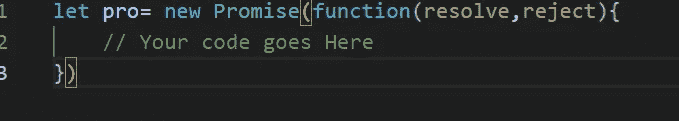

# JAVASCRIPT 中的承诺

> 原文：<https://medium.com/codex/promises-in-javascript-e577ca256e72?source=collection_archive---------19----------------------->

承诺是一个特殊的对象。无论异步操作是否成功完成，它都会产生值。如果成功，则执行定义为解决部分的任务。另一方面，操作不成功的代码将从 reject 部分执行。

**Simply Promises 是一个链接生产代码和消费代码的 JavaScript 对象。**

正如你在上面的例子中看到的，第一行我们正在生产一个承诺，这一行有一个叫做执行者的功能。并且在成功完成之后进行呼叫，然后是函数，然后是消费者函数。

# 理解承诺状态

可以使用如下的构造函数语法创建承诺:_ _ _ _

构造函数将一个叫做执行函数的函数作为参数。

一个承诺有以下内部属性:
**状态:这个属性有三个值。待定、已完成和已拒绝。**

1.  **待定-
    -**当执行程序功能开始执行时。
2.  履行-当承诺被解决。
3.  拒绝-当承诺被拒绝。

**结果——这个属性又有三个值。**

1.  未定义—当状态为待定时。
2.  价值——承诺兑现时(价值)称为价值。
3.  错误——承诺被拒绝时(错误)称为错误。

**如何处理曾经许下的诺言**

promise 使用一个 executor 函数来完成一个任务(大部分是异步的)。当执行函数完成时，消费者函数应该得到通知。处理程序方法`.then()`、`.catch()`和`.finally()`有助于创建执行者和消费者功能之间的链接，这样当承诺`resolve`或`reject`发生时，它们可以同步

如果承诺实现了，那么响应将转到。then()方法进行进一步的操作。承诺被拒绝回应去。catch()函数。

请给予您宝贵的反馈和建议。
谢谢。