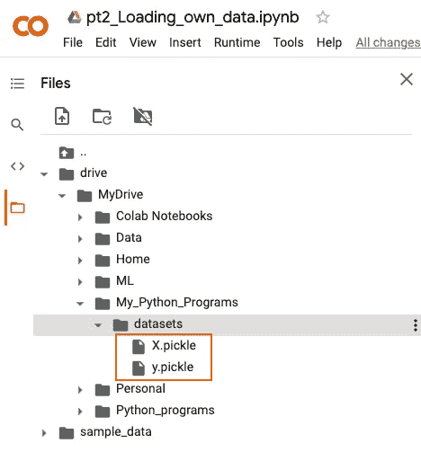

# 当使用 Google Colab 时，正确地挑选出 Python 中的路径

> 原文：<https://medium.com/codex/properly-pickle-out-to-a-path-in-python-when-using-google-colab-741f0905e68b?source=collection_archive---------4----------------------->

在你使用 Google Colab 学习机器/深度学习的旅程中，在某些时候，你需要保存你的训练模型，以便在以后使用。在 Python 的世界里，这被称为“酸洗”(查看官方 Python 文档的详细描述:[https://docs.python.org/3/library/pickle.html](https://docs.python.org/3/library/pickle.html)))。

如果您正在使用 Google Colab，并且您想要将腌制的对象保存在您的 Google Drive 中，您需要指定您想要保存模型的确切路径。

请允许我演示…

我们来看一个 YouTuber sentdex 的示例代码:加载自己的数据—深度学习基础用 Python、TensorFlow 和 Keras([https://Python programming . net/Loading-custom-data-Deep-Learning-Python-tensor flow-Keras/？已完成=/简介-深度学习-python-tensorflow-keras/](https://pythonprogramming.net/loading-custom-data-deep-learning-python-tensorflow-keras/?completed=/introduction-deep-learning-python-tensorflow-keras/) )

在教程的最底部，显示了以下代码:

如果我们照这样做，Python 会创建两个 pickle 对象:X.pickle 和 y.pickle，但是它会保存在 Colab 的什么地方呢？

首先，点击最左边的底部图标，然后点击右边的图标，安装 Google Drive:

点击“连接到 GOOGLE DRIVE”:

**边注:**

我在我的 Google Drive 中创建了一个名为“丑陋图片”的新文件夹，它与狗和猫的文件夹在同一个位置:

然后我创建了这个小函数来移动任何被异常子句捕获的图像；任何出现在猫狗文件夹中的丑陋图片。这有助于清理狗和猫文件夹中的图像。

我还创建了一个计数器变量，看看这个循环对 Dog 和 Cat 文件夹执行了多少次:

不要忘记在 import 语句的顶部包含 import shutil:

注意:这个脚本最初执行了 1 个多小时，所以请耐心等待。随后的处决只进行了不到 2 分钟。

**回到主文:**

让我们运行代码，看看它将腌制文件放在哪里:

执行这个“单元代码”会导致 X.pickle 和 y.pickle 出现在根目录中。注意:它并没有放在你已经挂载的 Google Drive 里面。

那么我们能做什么呢？

选项 1:通过拖放将 pickle 文件手动移动到 Google Drive 的数据集目录中:

这种方法确实有效:

选项 2:最佳方法:在 pickle 时，在代码中指定目录的路径:

右键单击您想要放置 pickle 文件的文件夹，然后单击“复制路径”:

向下滚动到 Python 脚本的底部，在那里显示 import pickle。创建一个名为“path”的新变量，并将复制的值粘贴到剪贴板。确保路径末尾有一个正斜杠(非常重要，否则不起作用！).在两个 pickle_out 语句中包含了“path +”

运行时->全部运行:

瞧，腌制的文件正好出现在我想要的地方:

在最后一个“代码单元”中，声明 path 变量并将其分配给数据集位置，如下所示。在两个 pickle_in 语句中包含“path +”(如上)。当这个“代码单元”独立运行时，它不会显示任何错误消息，这意味着它可以无缝运行:

快乐可乐泡你训练过的对象…

如有任何问题或意见，欢迎在回复区留言…