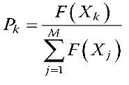
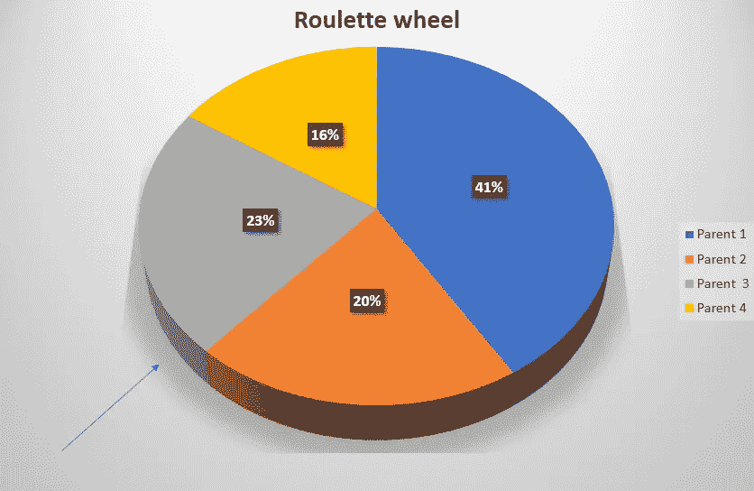

# 比例选择——轮盘赌概述

> 原文：<https://medium.com/codex/proportionate-selection-an-overview-of-the-roulette-wheel-6f08a5a1f3b7?source=collection_archive---------16----------------------->

# **简介:**

进化算法(EA)的性能在自然启发的计算中至关重要，这在很大程度上取决于相应算法中使用的算子函数。这里，我们将讨论一种比例选择算法，特别是基于轮盘赌的选择。在我们进一步讨论轮盘赌之前，我们需要理解比例选择。我们将考虑上述选择策略。

# **遗传算法中亲本选择的影响:**

当我们想在遗传算法中选择亲本来参与后代的繁殖时，我们考虑这样一个事实，即最适合的亲本经历了变异，然后继续下去。这种方法用于亲本选择。基本上，有三种亲本选择技术，即。比例选择、锦标赛选择和随机选择。在这里，我们将讨论选择程序之一，即比例选择，并通过一个例子，我们将了解一个相关的比例选择，这是轮盘赌选择。

# **什么是比例选择？**

选择解决方案的概率可由下式给出:

。确定选择比例值的数学公式

该函数表示第 k 个解被选为最适合解的概率，其中函数 F(X)是适合函数。

# **轮盘赌轮盘:**

在评估每个解决方案的选择概率之后，已经观察到作为该函数中的利益相关者的 k 个解决方案中的每一个都属于父群体。并且基于上述数据，我们生成一个轮盘赌轮盘。

为了选择亲代，我们将随机旋转上面的轮盘赌轮盘，并且箭头所指的部分将被选择作为亲代。这里，例如，在该图中，我们可以看到父母 3 已经被选择，被选择为父母的概率为 0.23。在该图中，我们还可以看到，如果在该轮盘赌轮盘上执行无偏旋转，则父代 1 具有最高的被选中概率。因此，我们在这里可以看到，在这个图中亲本 1 的有偏选择概率中，轮的无偏旋转余数是有关的。

# 结论:

在这里，我们看到了一个非常重要的选择过程，基本上是在自然启发计算中使用的进化算法的保护伞下的遗传算法中使用的。这是计算的一个快速增长的维度，让位于如何通过自然元素的帮助实现计算的许多方面。正如我们从达尔文的理论中所知，适者生存更多，那些容易适应的人有更好的机会。这是从自然中得到的启发，并在计算自动化领域中被采用，并被认为是解决 NP 难题的工具包，这可以随后为计算领域带来另一个维度的视角。