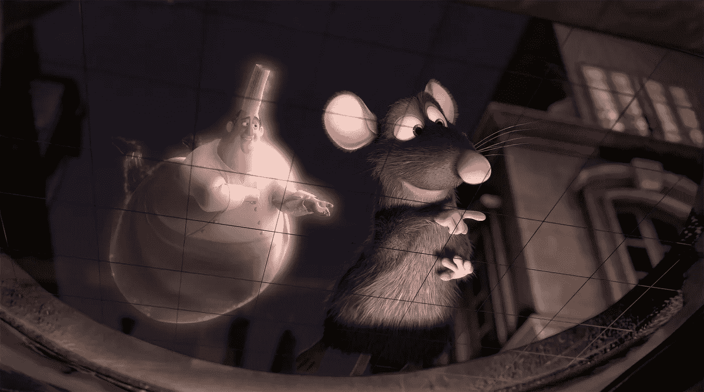
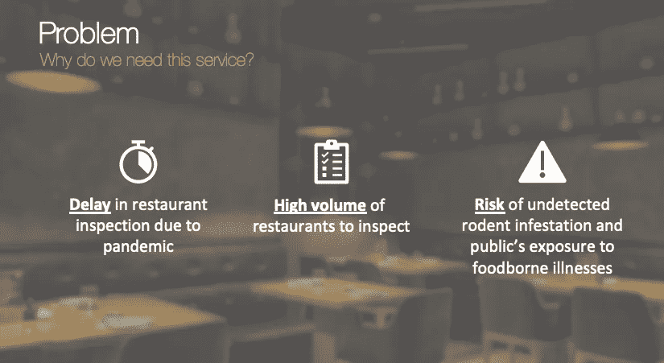
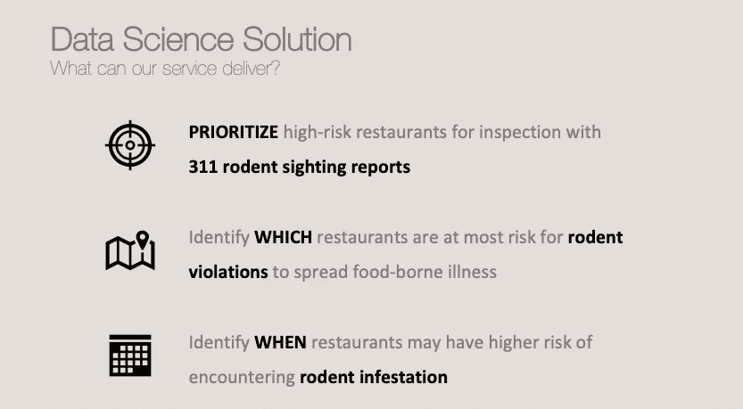
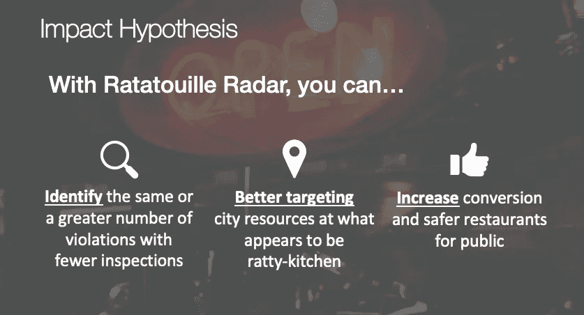
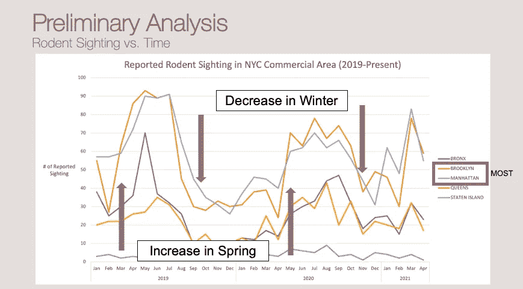
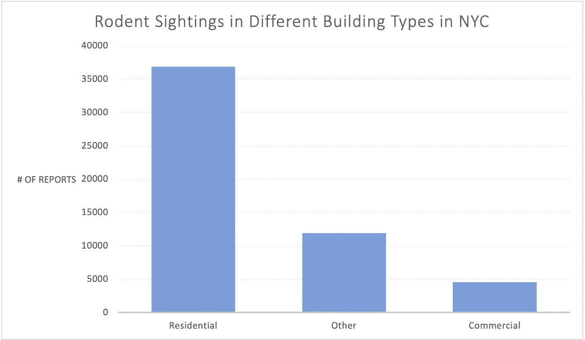
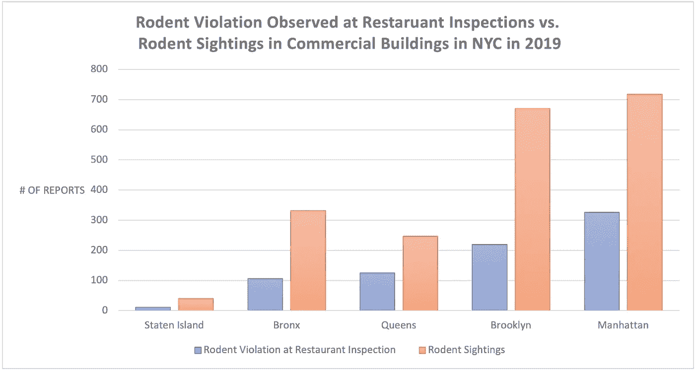
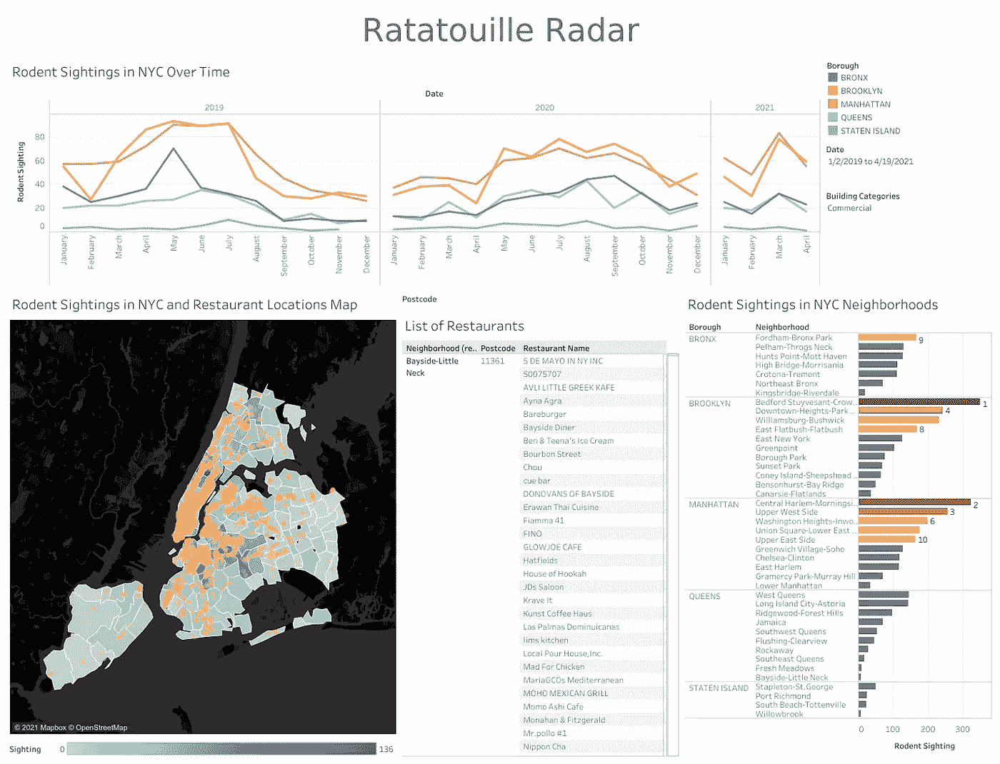

# 针对现实生活中的问题提出数据科学解决方案

> 原文：<https://medium.com/codex/proposing-a-data-science-solution-to-a-real-life-problem-b7668719da4e?source=collection_archive---------3----------------------->

在 [Unsplash](https://unsplash.com?utm_source=medium&utm_medium=referral) 上由 [Carlos Muza](https://unsplash.com/@kmuza?utm_source=medium&utm_medium=referral) 拍摄的照片

数据科学家被称为“21 世纪最性感的工作”的原因之一是，它可以有效地利用收集的数据来创造变革性的产品和服务，这可能是解决企业/组织极端挑战的最可行和最有效的方式。

在 Metis Bootcamp 的第 5 周和第 6 周，我们深入研究了数据科学的“业务”方面，即如何识别、设计和界定数据科学项目。实践这些概念的最佳方式是什么？你猜对了——项目！

对于商业项目，我们必须向我们的目标组织(“客户”)提交一份范围明确的项目建议书和初步分析(探索性数据分析)，以尝试通过使用 Excel/Google Sheets 和 Tableau 打开我们的大门。

没错。你没看错… Excel/Google sheet！

但是等等。我们刚刚在 Jupyter 笔记本上用 Python 做了一个 EDA 项目和一个回归项目…为什么要回到 Excel？

在老师讲了一些故事后，我开始理解学习一种最古老的分析工具的原因。对于数据科学家和商业领域来说，这是一个很好的搭建桥梁的平台，而不必解释我们工作的复杂性。它也是一个有用的工具，我们可以通过领域专家的简单输入来理解一些领域知识。玩了两周 Excel 之后，我开始相信——“Excel 是数据科学的强大工具。”

回到项目…

> “起步是最难的。”

对于开始一个数据科学项目来说，这是绝对正确的。找到我们感兴趣的话题或者我们想解决的问题是一回事。但是找到数据集(或网站进行数据搜集)是另一个具有挑战性的部分。

如果你在寻找项目的数据集或想法方面也有困难，这里有一些我认为非常有用的资源:

1.  [UCI 机器学习知识库](https://archive.ics.uci.edu/ml/index.php)
2.  [卡格尔](https://www.kaggle.com/)
3.  [超赞的公共数据集](https://github.com/awesomedata/awesome-public-datasets)
4.  美国主要城市开放数据— [NYC 开放数据](https://opendata.cityofnewyork.us/)、[费城开放数据](https://www.opendataphilly.org/)、[旧金山开放数据](https://datasf.org/opendata/)等。
5.  [美国政府公开数据](https://www.data.gov/)
6.  [五三八](https://fivethirtyeight.com/)
7.  [数据是复数](https://docs.google.com/spreadsheets/d/1wZhPLMCHKJvwOkP4juclhjFgqIY8fQFMemwKL2c64vk/edit)
8.  [迈向数据科学](https://towardsdatascience.com/)文章([更多来源](/@ODSC/25-excellent-machine-learning-open-datasets-940ca2124dfc)，灵感)

这还不是一个详尽的列表，但是它是一个很好的起点！

***免责声明* :** *我是机器学习和博客的新手。因此，如果有任何错误，请让我知道。感谢所有反馈。*

# 商业项目:料理鼠王雷达

《料理鼠王》(电影)

去年，当疫情袭击的时候，餐馆在三月份被关闭，检查也是如此。2020 年 6 月，餐厅重新开放，提供室外餐饮。但直到 10 月，餐馆检查才恢复。今年 3 月，纽约市遇到了另一个问题——随着 COVID 限制的取消，该市的啮齿动物目击事件激增。纽约市卫生部门现在面临的主要挑战是餐馆检查的延迟，以及大量餐馆需要检查。未被发现的啮齿动物感染和公众暴露于啮齿动物可能携带的食源性疾病的风险也增加了。

对于这个项目提案，我的目标受众是**纽约市卫生局**。我看到了**的机会**通过使用**数据科学解决方案**来帮助纽约市 Heath 餐厅检查员有效地识别违反餐厅卫生法规的行为——使用啮齿动物目击报告的 311 呼叫数据来优先检查高风险餐厅，识别哪些餐厅面临最大的鼠患风险，以及何时餐厅可能面临更高的鼠患风险。

**影响假设**是使用预测模型，纽约市健康餐馆检查员可以通过更好地将城市资源瞄准看起来破旧的厨房，以更少的检查发现相同或更多的违规行为，因此他们可以通过教育处于鼠患高风险区的餐馆来增加转化率和更安全的餐馆。

# 数据

本项目中使用的数据集包括来自纽约市开放数据的[纽约市餐馆检查结果](https://data.cityofnewyork.us/Health/DOHMH-New-York-City-Restaurant-Inspection-Results/43nn-pn8j)、[纽约市 311 呼叫](https://data.cityofnewyork.us/Social-Services/311-Service-Requests-from-2010-to-Present/erm2-nwe9)和[纽约市餐馆](https://data.cityofnewyork.us/Transportation/Open-Restaurants-Inspections/4dx7-axux)。这些数据集太大，无法直接在 Excel 中读取。所以我创建了一个 SQL 数据库来存储数据集，并使用 sqlalchemy 来访问 Python 中的数据。然后，我提取了与熊猫相关的数据子集，并将其存储为 csv 文件，以便在 Excel 中访问。

数据子集:

*   纽约市 311 电话-商业建筑内发现啮齿动物的报告
*   2019 年纽约市餐馆检查与啮齿动物违规

风险和假设:

*   大多数啮齿动物的发现都是通过 311 电话报告的
*   大多数餐馆都在商业大楼里
*   大部分违规行为都是在这一年不间断的检查中被发现的

# 工具

*   用于创建数据库的 SQLite
*   用 Python 访问 SQL 数据库的 sqlalchemy
*   Numpy 和 Pandas 用于数据操作
*   用于探索性数据分析的 Excel
*   用于绘制数据可视化和交互式仪表板的 Excel 和 Tableau
*   用于时间序列空间可视化的叶子

# 初步分析

在啮齿动物目击事件的时间序列图中，有一个趋势显示目击事件在春天前后增加，在冬天附近减少。比较纽约市各区的目击情况，该模式显示布鲁克林区是纽约市目击啮齿动物最多的地方。

进一步调查不同类型建筑中的视线，发现居住建筑中视线最多。由于纽约市的大多数餐馆都在商业建筑里，我选择了商业区的子集，并比较了各个区的景点。

一个成对的条形图显示，曼哈顿是纽约市商业区中发现啮齿动物最多的地方，这与过去在餐馆检查中观察到的啮齿动物违规模式相关。布鲁克林的住宅建筑比曼哈顿多，这就是为什么布鲁克林在整体比较中展示出最高的观赏性。

# 分析外卖+交互式仪表盘

项目的主要收获是:

*   311 个啮齿动物发现电话显示了与 2019 年餐馆检查期间看到的啮齿动物违规类似的模式
*   在纽约市的商业建筑中，曼哈顿和布鲁克林的啮齿动物出现率较高
*   这一趋势表明，目击数量在春季增加，在冬季减少。

[交互式 Tableau 仪表板](https://public.tableau.com/profile/crystal.huang2109#!/vizhome/shared/TBDSBF44Z)可用作该项目的原型，根据观察模式识别啮齿动物侵犯行为的高风险区域中的餐馆。

交互式 Tableau 仪表板

# 未来潜力

展望未来，我相信这个项目可以发展成为一个预测模型，通过时间序列对纽约市的餐馆进行啮齿动物违规的可能性排名，并通过 yelp 评论识别脏厨房热点。

# 外卖食品

永远保持开放的心态！不要低估一个工具能做什么。即使是从最古老的分析工具中，我们也总是有更多的学习和进步。此外，画面很有趣！我喜欢你用它释放的视觉和创造力。

总而言之，我仍然喜欢这个模块，从不同的角度看待数据科学。我希望这个项目和这篇文章中的一些见解会让你感兴趣。感谢阅读:)

你可以在我的 Github [回购](https://github.com/crystal-ctrl/ratatouille-radar)上找到我的项目详情。