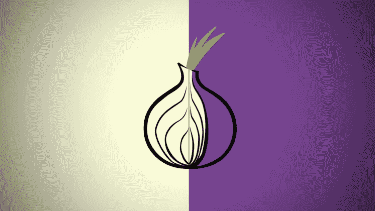

# 保护 Linux 上的 Tor 免受恶意退出中继的攻击

> 原文：<https://medium.com/codex/protecting-tor-on-linux-from-malicious-exit-relays-1f28635ba2c9?source=collection_archive---------6----------------------->

## Tor 受到攻击，它影响到所有用户

# 出口继电器的问题

已观察到相当一部分 Tor 出口中继在流量上执行恶意活动。这主要是以 MITM 代理攻击的形式。nusenu 在 Tor 上写了几篇关于恶意退出中继的文章，我…