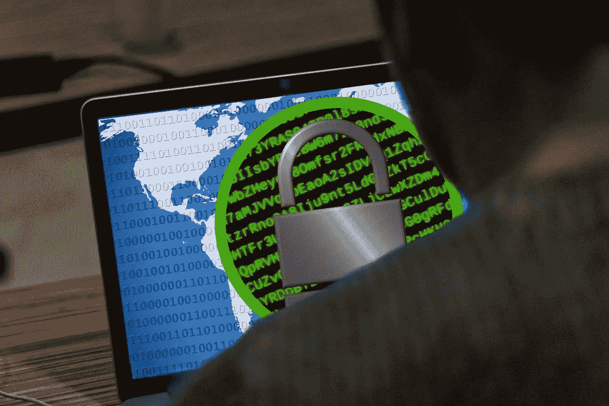

# 保护自己免受勒索软件攻击

> 原文：<https://medium.com/codex/protecting-yourself-against-ransomware-542436ff9283?source=collection_archive---------8----------------------->

## 如何从入侵中恢复并保护您的设备

[数码师](https://pixabay.com/users/thedigitalartist-202249/)在 [Pixabay](http://www.pixabay.com) 拍摄的照片

T 勒索软件攻击迅速增加，特别是由于全球疫情带来的经济僵局。一份[全球网络安全报告](https://www.statista.com/statistics/494947/ransomware-attacks-per-year-worldwide/#:~:text=According%20to%20an%20annual%20report,638%20million%20attacks%20in%202016.)披露，2020 年全球范围内发生了 3.04 亿次勒索攻击——比上一年增长了 62%。