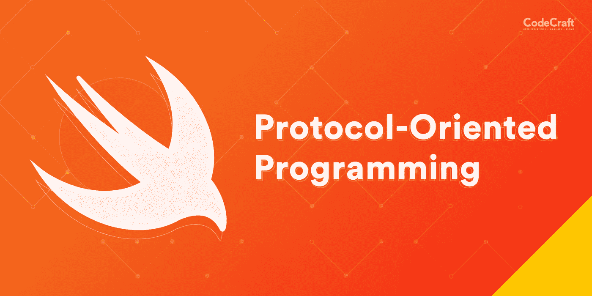
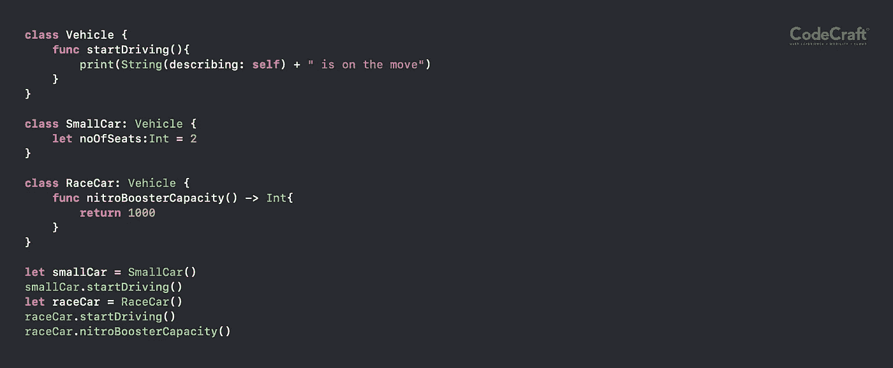
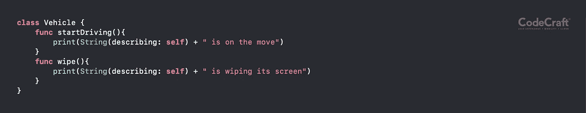
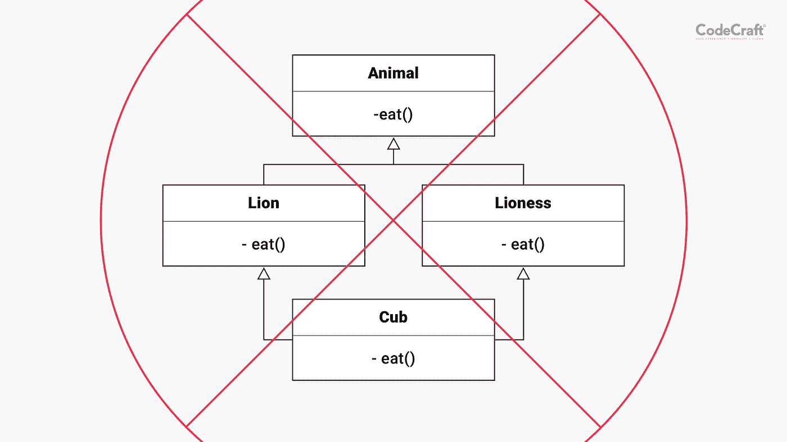
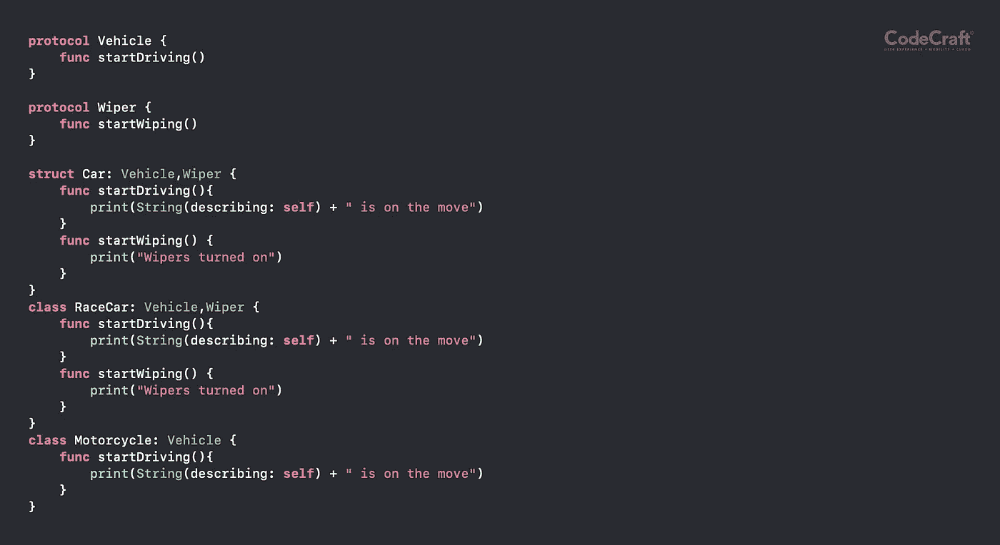
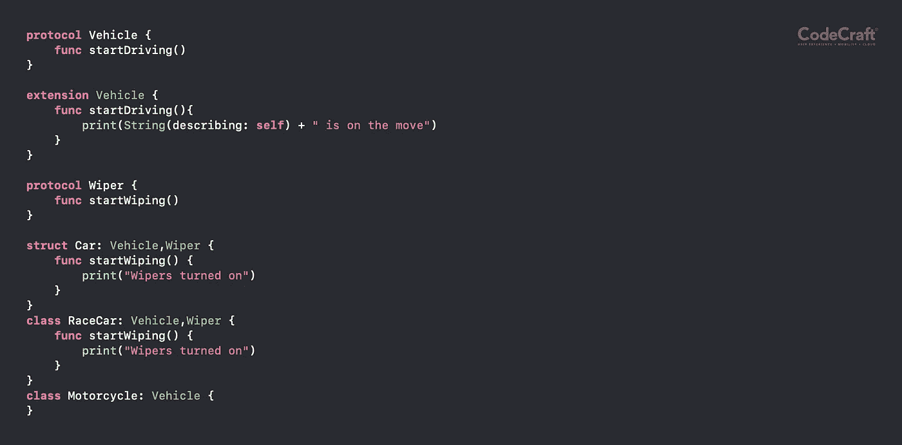

# 面向协议的编程

> 原文：<https://medium.com/codex/protocol-oriented-programming-a566054c0fae?source=collection_archive---------2----------------------->

面向协议的编程( **POP** )是一种随着 Swift 的出现而备受瞩目的范例。不同时期的不同语言都有一些流行的味道，但是 Swift 的流行中心有一些独特的特征，这使它们比 [OOP](https://www.geeksforgeeks.org/object-oriented-programming-oops-concept-in-java/) 有明显的优势。这并不是说 OOP 有缺陷，或者 POP 是穿着闪亮盔甲的骑士。POP 只是用一些新的东西扩展了 OOP，从而有助于编写更好的代码，更好的系统

***内容***

**a .现有系统示例**

**b .继承问题**

**c .输入协议**

**d .协议扩展**

**e .协议&值类型**

## **1。现有系统示例**

让我们举一个简单的例子来看看 OOP 和 POP 是如何处理同一个问题的。考虑到我们签订了建造一辆可以驾驶的汽车的合同。要求是，我们将被要求制造许多车辆，这些车辆将具有不同的颜色、车轮数量、不同的发动机容量等。从面向对象的世界来看，解决方案的核心应该是这样的

一切正常。 ***小型车*** ， ***赛车*** 都可以驾驶。他们也可以有自己独特的特质。( ***noOfSeats()*** ，***nitro booster capacity()***等)。没有一个范例像 OOP 那样有效地映射真实世界，因此我们可以在对象建模中应用真实世界的原则，如[继承](https://www.webopedia.com/TERM/O/object_oriented_programming_OOP.html)。这就是它的美妙之处。

然而，现实世界远非完美，这渗透到它的衍生物如 OOP 中。考虑上面的同一个例子。客户现在已经与您签订合同，让您为现有类别的车辆开发雨刷。所以现在车辆可以被改装成能够擦拭

礼貌，继承，迄今为止创造的所有类别的车辆可以擦它的屏幕。 ***赛车*** 或 ***小型车*** 可以简单地叫 ***擦()*** 和***start driving()***安全在雨中！客户现在很高兴，因为你在构建系统方面如此出色，他现在要求引入一种新的交通工具，一种被称为摩托车的两轮车。第一反应会是将[子类](https://www.geeksforgeeks.org/referencing-subclass-objects-subclass-vs-superclass-reference/) ***摩托车*** 从 ***车辆*** 。在这种情况下，**车辆*车辆*车辆**就没用了。为什么？从语义上来说，摩托车是一种交通工具，所以我们应该能够使用 ***交通工具*** 类。但问题是如果一辆 ***摩托车*** 继承了 ***车辆*** 它也会继承*的能力。不必要的和荒谬的！所以如果我们不把 ***摩托车*** 从 ***车辆*** 中扩展出来，那么 ***车辆*** 中所有复杂的逻辑和业务规则，也就是说***start driving()***中的逻辑和业务规则，对于一辆 ***摩托车*** 都是不可用的。我们可以简单地争辩说，忽略一辆*摩托车中的 ***wipe()*** 的能力，但那是故意在系统中引入一个不需要的关联。那么**我们的设计有什么问题？****

## ****哎呀，OOP 又来了！****

**子类可能不需要父类的所有特性。如果一个孩子有一个富有的酗酒的父亲，他会很高兴地选择继承他的财富，但会远离他父亲的酗酒恶习(但愿如此！).类似地，子类可能不需要其超类的所有特征。由于大多数语言不支持多重继承，我们不能将超类特性分成多个更小的类，并让子类继承所需的类。**

****

**OOP 在这方面做得并不好。**

## ****2。继承问题****

**继承是重用代码和构建软件的一个很好的机制，但是当涉及到选择性关联时，它就不是特别好了。 ***无论喜欢与否，被继承的类都被吸取在子类的 DNA 中*** 。这就像一个移动数据计划，它有很多你感兴趣的功能，但也有一些不足之处！如果单独出售，您可能不想要的功能。但既然这是计划的一部分，你就无法逃避。**

## ****3。输入协议****

**自 OOP 本身以来，协议就已经存在，它提供了另一种设计和建模类的方法。让我们考虑上面的交通工具的例子，以及我们如何使用协议来设计同样的交通工具**

****

**正如我们所看到的，通过协议，我们已经能够在类 ***【摩托车】*** 继承 ***车辆*** 时，打破继承所强加的依赖性。现在任何不需要雨刷的 ***车辆*** 新品类都不会有同样的负担。它根本不符合它。不需要它，不要求它，所以不要背负它！例如用于小型摩托车。Swift 中使用的协议通常在许多其他语言中作为抽象 *(虚拟类、接口等等)*来实现。没什么新东西。读者会注意到，现在需要定义驾驶逻辑的是实现 ***车辆*** 的具体类，即 ***赛车*** 和 ***小型赛车*** 现在必须定义如何 ***启动驾驶*** ()。这可能导致代码和逻辑的重复。此外，如果协议已经在许多其他语言中可用，那么 Swift 中的 POP 有什么特别之处呢？答案是协议扩展。**

## ****4。协议扩展****

**POP 的基础是协议扩展。 ***Swift (v2.0 及以后)允许一个协议有一个通用的行为，也可以被覆盖*** 。默认情况下，这种通用行为允许每个实现“继承”它。如果他们不喜欢通用行为，那么很简单，改变它，即覆盖它。**

***例如，上面的例子现在可以写成***

****

**这就像继承与 ***startWiper()*** 的额外关联现在被分解为一个需要的基础。车辆的每个实现现在都具有默认可用的复杂的***start driving()****逻辑，即它从协议“继承”了相同的逻辑。此外，摩托车与雨刷没有任何关联。因此，协议扩展有助于实现具有从协议“继承”的能力，并将依赖性保持在原子级别。也就是说，协议应该只包含实现或具体对象必须实现的那些契约。否则，它会出现胖接口问题。例如， ***Vehicle*** 是一个 fat 接口，因为它包含了并非所有子类都需要的 ***startWiper()*** 。***

****5。协议&值类型****

**Swift 提倡尽可能使用值类型而不是引用类型。两者的使用案例和优点都有很好的记录，在本文中不做讨论。像 ***struct*** ， ***enum*** 这样的值类型也可以扩展协议，从而将使用协议设计的好处扩展到偶数值类型。这是苹果鼓吹使用协议而不是类的主要原因之一。**

## ****底线****

**POP 扩展了 OOP 以提供另一个抽象层次，帮助开发人员编写更好的代码和设计可重用的组件。在阳光下，每样东西都有它的位置，OOP 当然不能完全被 POP 取代。仅在需要时。决定使用 POP 还是 OOP 可能是特定于上下文的**