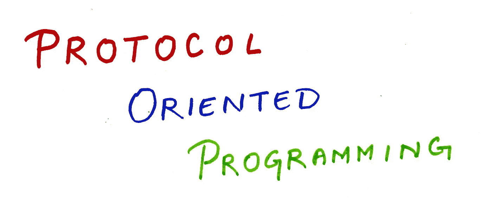

# Swift 中面向协议的编程——保持简单。

> 原文：<https://medium.com/codex/protocol-oriented-programming-in-swift-keeping-it-simple-c485cf550918?source=collection_archive---------7----------------------->

在模块化代码中，抽象一直扮演着重要的角色。一段代码，它抽象了所有的复杂性，只显示了需要的内容。Swift 称之为*协议*，其他流行语言称之为*接口*。

Swift 中面向协议的编程是由苹果在 2015 年[WWDC](https://developer.apple.com/videos/play/wwdc2015/408/)推出的，他们说—

> **不要从一个类开始，从一个协议开始**。

它基本上定义了面向协议编程的方法。— *首先，定义功能，然后，创建采用这些功能的类型。*

苹果还定义了协议的命名惯例——协议应该以大写字母开头，要么用名词描述它是什么，要么用名词后跟后缀描述它做什么。前者的一个例子是 *UITableViewDelegate* ，后者的一个例子是 *Codable* 。

这就是我们在这个阶段需要的足够的背景。让我们跳到编码。

# 定义协议—定义协议的行为。

在下面的代码中，我们首先定义了一个名为 Flyable 的协议。它基本上定义了在我们的应用中任何类型都可以采用的飞行行为。

可飞行协议将速度和最大速度定义为*属性*(属性)，将 fly、flyWithSpeed 和 land 定义为任何飞行物体都可以采用的*能力*(功能)。

可以设置和读取下面代码中定义的 speed 属性，但是只能读取 maxSpeed 属性。它基本上是一个只读属性。这解释了属性名旁边的**获取集**和**获取**的定义。

# 符合协议—采用协议的行为。

在下面的代码中，Bird 采用符合协议的飞行行为。任何符合可飞行协议的鸟都必须定义协议所定义的属性和功能。

# 扩展协议—定义协议的默认行为。

在下面的代码中，我们扩展了协议，Flyable 定义了它的默认实现。我们提供了默认的 maxSpeed 为 20，还提供了 flyWithSpeed 和 land 函数的默认实现。

> 这里要注意的一点是，如果我们以后创建另一个符合协议的类型，Flyable，它可以修改默认行为，以具有更好的速度和着陆能力。

# **为什么是协议，为什么不是继承**。

当我们讨论定义任何类型都可以遵循的标准行为时，我们首先想到的是继承。

> 难道就不能创建一个基类，给它添加一个结构，子类可以继承并添加它们的实现吗？

是的，我们可以。继承是伟大的，但它肯定有自己的局限性。

1.  ***像在许多编程语言中一样，Swift*** 不支持多重继承——如果我们采用继承方法，然后我们想在我们的基类中添加我们认为对所有子类都有用的行为，那么基类将最终拥有太多它应该拥有的代码。使用协议的方法，我们可以为每组行为定义多个协议，并且*该类型可以同时符合多个协议*。
2.  ***继承只支持类类型，不支持值类型*** —使用继承是为了让子类可以继承其基类的行为，并拥有自己的行为/实现。但是如果我们想对结构做同样的事情呢？如何才能实现？**协议在这里起了作用，它支持类和值类型**。

# 这就是本文的全部内容。

这就是我们在本文范围内的全部内容。协议比我们在这里讨论的有更多的功能。本文旨在概述 Swift 中面向协议的编程。如果你想了解更多，我强烈建议你参加 [WWDC 2015](https://developer.apple.com/videos/play/wwdc2015/408/) 会议，在会上苹果介绍了面向协议的编程并解释了其在 Swift 中的实施。

希望你觉得这篇文章有用，请在评论中发表你的问题/反馈，我将很乐意回应。如果你喜欢这篇文章，你可以考虑在[媒体](/@dwivedi.2512_6282)上关注我，并在 [LinkedIn](https://www.linkedin.com/in/abhishek-dwivedi-25a45b225/) 上联系我。