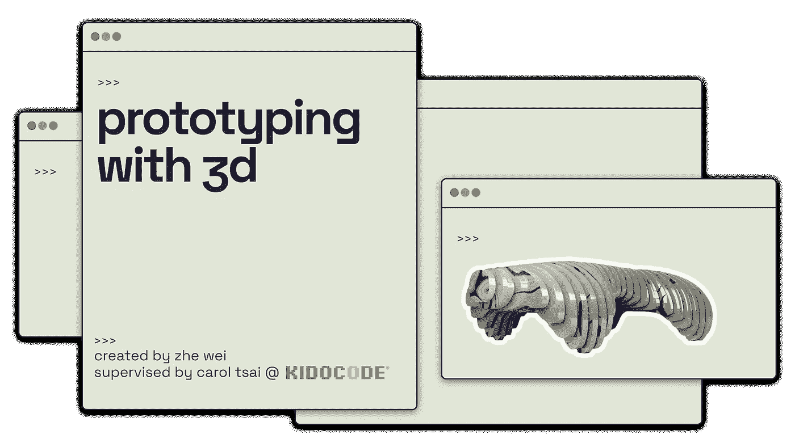
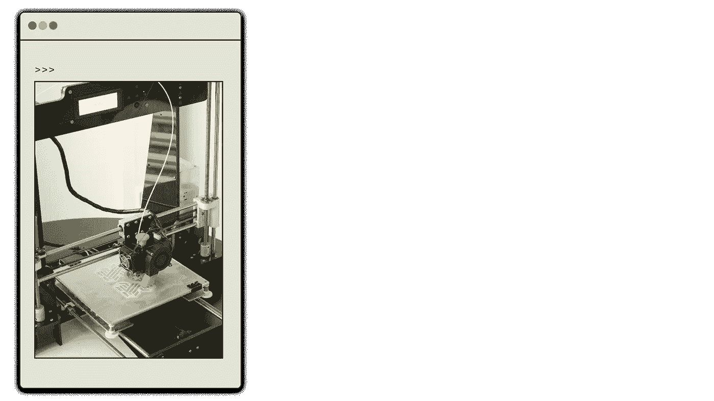
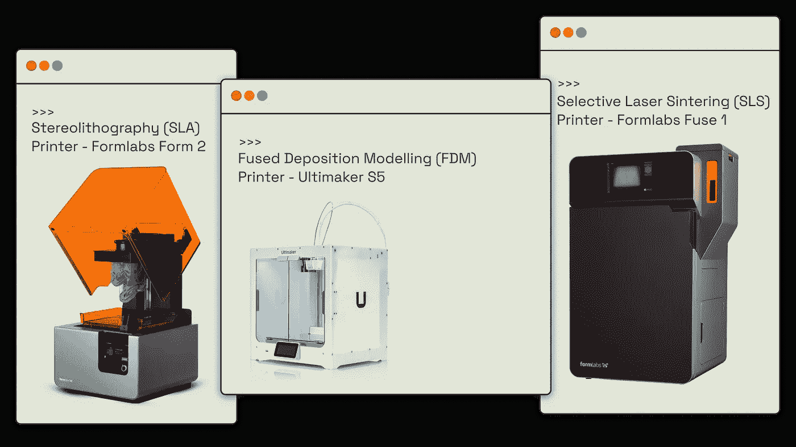
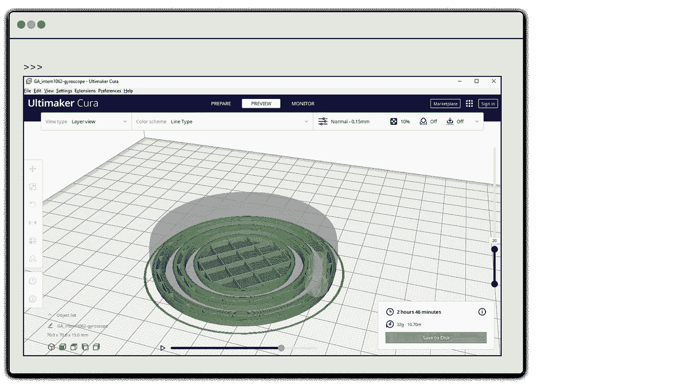
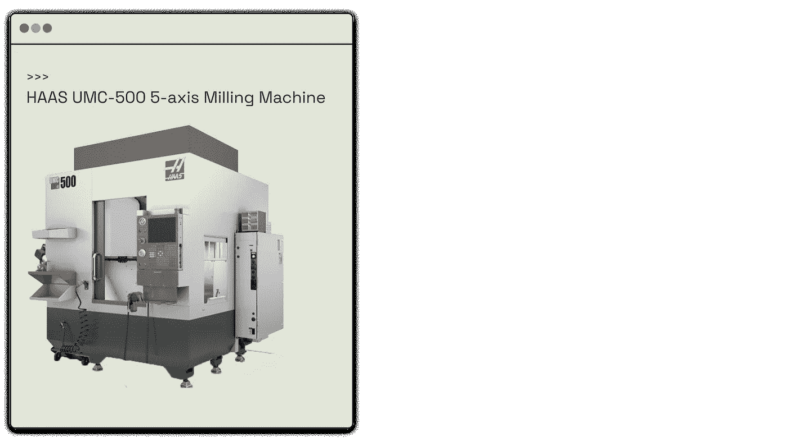
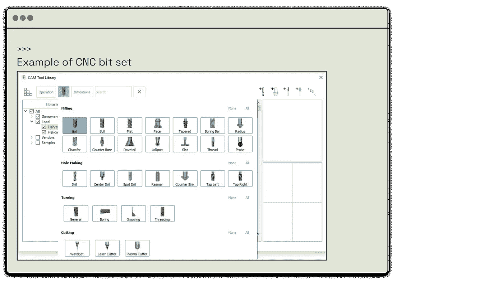
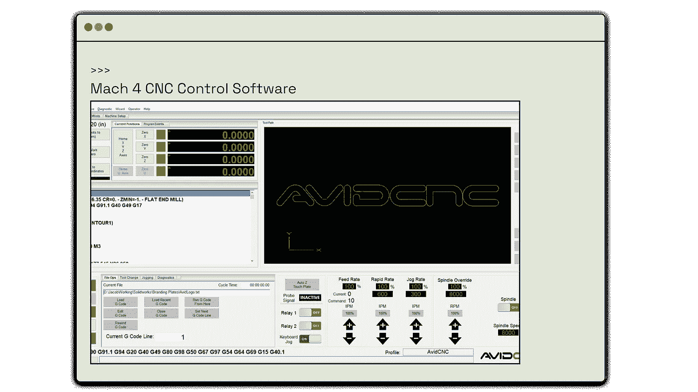
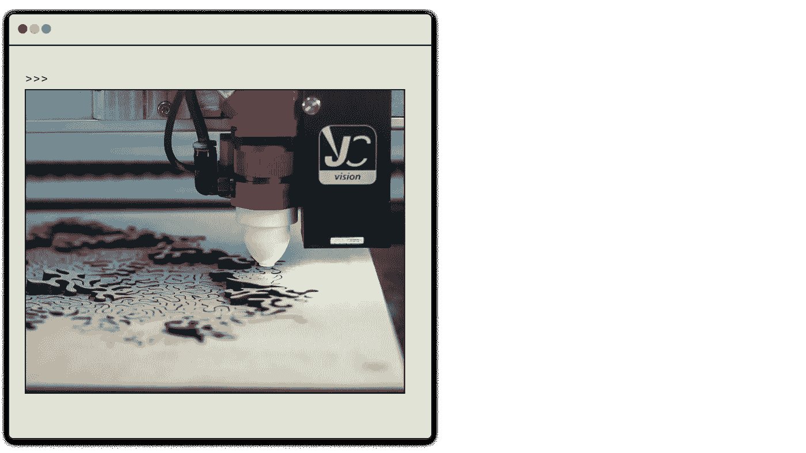
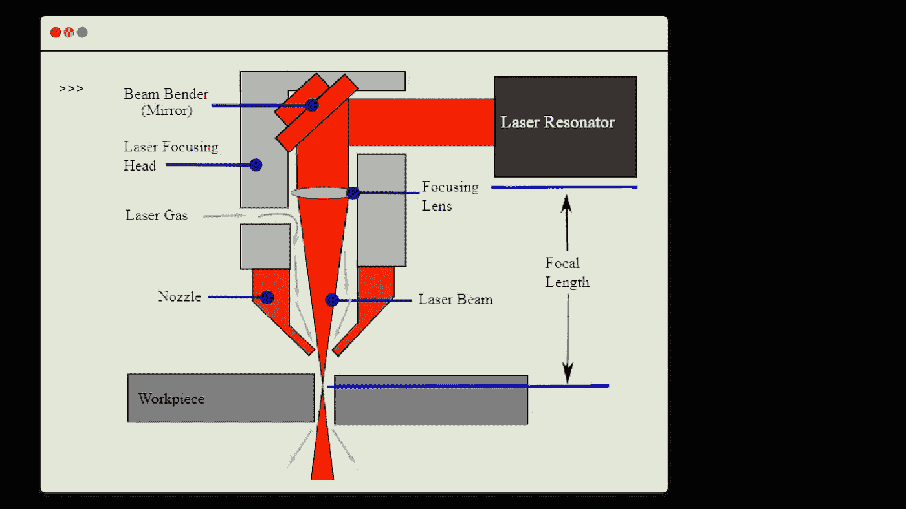

# 原型制作要点

> 原文：<https://medium.com/codex/prototyping-essentials-cf9af96b2d2?source=collection_archive---------34----------------------->

## 你(希望)了解 3D 打印、数控加工和激光打印的最简单的指南。

在世界的现代数字化之前，工程师们依赖于绘制草图和手绘蓝图，制作他们设计的实体模型，以便在最终生产之前进行可视化。

从产生想法、原型到最终完成设计的这个过程对于设计产品、服务、软件来说仍然是必不可少的——集合起来提供最好的用户体验。

在这个三步过程中，我们将重点关注中间的孩子，但是，应该提到的是，原型可以分为 4 类！

Mette Jest Tjellesen 的这篇[文章](https://www.linkedin.com/pulse/power-prototypes-from-initial-idea-final-product-just-jakobsen/)非常详细地介绍了这一点，如果你有兴趣知道它们的区别的话。今天，我们不需要知道它们的区别，但它们最适用于 ***【产品原型】*** 类别——引用 Tjellesen 的话:

> **产品原型**代表接近完成的产品，用于 1)测试数字解决方案在技术集成到其他系统方面的“深度”,和/或 2)作为产品的测试版，侧重于用户反馈和优化——在上线之前。

# 样机研究

在我们的简短介绍之后，让我们的大脑做一些工作。我想让你考虑一下我们构建原型的方法。

不要担心前面提到的类别，而是试着想出我们在构建原型时可能需要的 ***五种材料、技术或软件*** 。

对于上下文，你可以使用标题照片中的金属雕塑 ***的插图作为参考，尽管任何东西都可以。***

## 有你的清单吗？太好了！

以下是我的:乐高、纸板+美纹纸&工艺刀、泥塑、Figma 原型制作软件、车削(木头)。

> 我在这里提到的几个可能是新的和不寻常的，但它是为了创造一些区别，原型可以像使用乐高一样简单得令人难以置信。但是，当精度、准确性和功能性是我们必须考虑的参数时，就应该而且需要涉及复杂的技术和工艺。

现在我们已经建立了原型制作的大致概念，让我们看看使用 3D 的 ***原型制作。***

即 3D 打印、CNC 加工、激光/等离子/水射流/EDM 切割、热成型以及车削。

它们都非常精确，用途广泛，共同的特点是生产出完美的产品。这些技术代表了底层巨大的互联技术网络的表面视图，因此为了帮助我们理解它们，我将在整篇文章中链接相关资源。

# **No1。3D 打印**

制造 3D 模型的附加过程(将材料分层以形成想要的形状)。它通常涉及以相对经济的速度生产高度精确和详细的原型的能力，因此它适用于几乎任何类型的原型！

需要更高细节模型的产品原型阶段是 3D 打印真正闪耀的地方，然而它有着广泛的定制机会。

## **答:定制！**

FDM，SLA，SLS(不是 NASA 的那个！)是 3D 打印行业众多技术中的一小部分。令人沮丧的是，有大约 10 种不同的 3D 打印方式意味着在选择方法时要考虑许多参数。一些常见的因素包括产品尺寸、印刷材料、生产规模、目标功能等。

例如，如果我们要打印有弹性的东西，并且能够在压力下变形，那么使用 TPE 或 TPU 是明智的，这是一种能够承受相当大的力的可压缩材料。

但是，如果我们想要生产一种用于机械目的的坚固的刚性部件呢？

由于其机械强度、耐化学性和寿命，金属通常用于这种目的，然而，定制和获得这种部件要么由于高成本和不可用性而不可能，要么由于速度慢而需要大量时间。在这种情况下，使用 PEEK、PEKK 或 ULTEM 就足够了，因为它们与普通 3D 打印机兼容，同时提供类似的性能。

回到我们必须记住的参数，重要的是要知道它们并不互相排斥。

一个特别的例子是不同的材料会有不同的熔点、打印机设置、结构限制等等。像这样的考虑需要从一开始就计划好，并且对于实现某些效果是必不可少的。

## **B .软件**

一位智者曾经说过:

> 3D 打印模型本质上是通过愚蠢的精确电机在 3 轴笛卡尔平面上移动花哨的超级热喷嘴——也许还有打印床——的产物。

这个我同意——咳咳，“聪明人”。

为了扩展他的观点，一个叫做 [G 代码](https://youtu.be/iMx_UYrvuos)的东西被用来移动喷嘴和/或印刷床。g 代码可以通过将我们的 3D 模型上传到切片软件来生成，以指定我们想要实现的产品效果。例如，Ultimaker Cura 允许在众多设置中定义约束、支撑结构、模型密度、喷嘴尺寸、层厚度。

将镜头切换到另一边，我们就有了建模过程。为此，混合使用 3D 建模或 CAD 软件，使我们能够创建、修改和准备用于打印的 3D 模型。SolidWorks、TinkerCAD、blender、Autodesk AutoCAD 等等，或者你可以直接从网上下载你的模型。

## C.这是您的入门工具包:

3D 打印机，切片软件，3D 建模软件，塑料细丝，一些[工具](https://ultimaker.com/learn/essential-tools-for-every-3d-printing-professional)，一双手，一些钱，也许还有一个愉快的假期。

## D.进一步阅读的资源:

[3D 打印机种类](https://all3dp.com/1/types-of-3d-printers-3d-printing-technology/) || [打印材料种类](https://www.3dnatives.com/en/plastics-used-3d-printing110420174/#!) || [建模与切片软件列表](https://3dprinting.com/software/) || [3D 打印小技巧](https://all3dp.com/2/3d-print-quality-12-tips-on-how-to-improve-it/)

# **No2。3D 数控加工**

与印刷相反，CNC 加工是一个去除材料的减法过程。CNC 主要涉及车削或铣削，用于铝、木材、泡沫甚至丙烯酸树脂。本质上，我们是在移动钻头/铣刀(而不是喷嘴)来将一块材料加工成预期的形状。

数控加工可以说是很少用于原型，由于其排他性，操作难度，和高支出。然而，随着自由职业和公司服务的普遍引入，这个过程的可访问性现在有了很大的提高。客户只需将规格和 3D 模型上传给运营商，然后在工厂进行加工，最后再将成品送回。

## **A .多功能性和灵活性**

现在我们知道了数控加工的简化操作，应该知道数控加工可以在 3 轴或 5 轴系统上操作。[五轴系统](https://blog.swantonweld.com/what-is-5-axis-cnc-machining#:~:text=5%2Daxis%20machining%20refers%20to,cutting%20tool%20a%20multidirectional%20approach.)包括来自三轴系统的 X、Y、Z 轴，以及额外的 A(绕 X 轴旋转)和 B(绕 Y 轴旋转)轴。

这允许整个钻头(或者在某些情况下，主体本身)围绕其中心枢转，以获得特定的角度。这构成了某些可能的切口，如成角度的孔。

我们想要关注的也是能够加工多种材料的技术优势。对金属进行彻底加工使得加工其他任何东西都相对容易。只要材料在木材、金属或一些固体塑料(如丙烯酸)的范围内，这三种类型的加工都是相似的，这就提供了许多可能性。这个过程并不像听起来那么简单，但是相比之下，对于 3D 打印来说，打印金属和打印塑料是完全不同的过程。

## **B .工具**

数控加工高度依赖于铣削和车削时使用的“钻头”。

> **【钻头】** /bɪt/(又称铣刀/铣刀/雕刻刀/立铣刀)
> 
> 定义:金属钢(有时包含金刚石)头，通过高速旋转从主体上去除材料。有多种不同的钻头形状用于优化某些切削程序。

圆边，锐边，草皮，洞，都需要不同的铣刀。因此，如果你要加工一个半球，你需要使用一个球头铣刀(基本上钻头末端是圆的)。

有很多种技术可以获得速度和光洁度(表面外观)的最终平衡。钻头旋转的速度(RPM)和使用的铣削钻头的类型是控制平衡的两个主要参数。

## **C .软件**

编程是数控加工中最复杂的部分。几乎没有出错的余地，而且由于钻头达到的高速度，这通常是非常不可原谅的。加工时钻头锁死会使工件飞起来；摩擦产生的过热会损坏工件和钻头本身；加工时使用不合适的夹具会导致加工不准确。这就是为什么编程会因为安全和质量检查而变得极其冗长。

数控加工的软件方面可能会变得非常复杂，所以这里有一个粗略的总结。

1.  **CAD 软件** —用于在 2D/2.5D/3D 虚拟环境中对设计建模，并为加工做准备。示例:SolidWorks CAD、AutoCAD、Fusion360、Easel CNC 软件
2.  CAM 软件 —代表计算机辅助制造。转换设计，输出 g 代码(像 3D 打印的切片软件)。有些软件如 Fusion360 集成了 CAM 软件，但也有一些软件是独立的。即 SolidWorks CAM，OpenBuilds CAM 允许我们建立铣刀类型、角度和速度的规格。有时需要多个位，因此也在这里指定。
3.  **控制软件** —将计算机转换成数控机床控制器，管理电机等的运动。大多数数控机床还带有控制器**固件**，控制**软件**与之交互。示例:Mach 4、LinuxCNC、PlanetCNC、OpenBuilds 控件
4.  **模拟软件** —读取生成的 g 代码并预测加工时可能出现的错误。这有助于我们预防上述问题！示例:数控查看器、G 向导编辑器、数控模拟器专业版

在这一点上，你可以非常清楚地看到数控加工和 3D 打印之间的差异，它们在使用案例和使用的一些软件方面是相似的，但数控加工的学习曲线要长得多。不幸的是，我不会在这篇文章中过多地触及它们的差异，所以你可以查看 [BigRep 的文章](https://bigrep.com/posts/cnc-vs-3d-printing/)关于 3D 打印和 CNC 加工之间的差异。

## D.简而言之:

数控加工很难。我就说这么多。

## E.进一步阅读(和观看)的资源:

[数控加工历史](https://youtu.be/TdoaHK5TRh8) —视频| [泡沫数控加工实例](https://www.youtube.com/watch?v=hErWGgRRCKg) —视频| [五轴数控加工演示](https://www.youtube.com/watch?v=H7A8uYUq1BQ) —视频| [数控加工钻头种类](https://all3dp.com/2/guide-to-cnc-router-bits-all-you-need-to-know/) || [最佳数控软件](https://mellowpine.com/cnc/best-cnc-software/#sim)

# **No3。激光切割**

激光切割包括使用高功率激光照射切割材料。入射区域熔化、燃烧、蒸发或被气体喷射吹走。其他类似的技术进步包括等离子切割、放电加工(EDM)。

## **A .适宜性**

总的主题是激光切割适用于木材和亚克力，等离子切割适用于金属板，电火花切割适用于切割较厚的金属块。由此也可以看出每种材料的切割能力，激光切割最弱，电火花加工最强，但操作成本也最高。

*激光切割机也可以切割金属(如后所述)

激光切割过程相对简单:

1.  在三维建模软件中设计实际模型。
2.  在 2D 矢量处理软件中把它分割成独立的部分。
3.  设置激光切割机的设置。
4.  上传矢量文件(如 svg 格式)或激光雕刻/蚀刻光栅文件(如 bmp 格式)。还有很多其他的[规格](https://laserengravingtips.com/what-kind-of-file-do-you-need-for-laser-cutting/)。

不需要花哨的软件，不需要学习各种设备和最低限度的预防措施是必要的。入门比较快，做好一个产品也比较快。

然而，等离子和 EDM 切割会变得非常混乱，并且会引入混乱的物理概念，所以为了复杂起见，我不会深入这个领域。如果你感兴趣，你可以在这一部分的末尾找到更多的链接。

## **B .物理学(激光切割)**

相比较而言，激光切割是物理系最尖端的。3D 打印简单的用了熔化固化的概念；数控加工应用硬度和剪切力的概念。激光切割向我们介绍了产生激光的过程，因此我们使用了电磁波谱和一些热带物理学概念(取决于激光的类型——不仅有一种方式，事实上有三种主要方式，我们将在稍后介绍)。

所以。激光切割机是如何“切割”的？我的意思是，剪刀剪是因为集中的剪切力作用在裁片上。

回顾我们的概述，激光的焦点入射到熔化物、燃烧物、蒸发物上，或者被气体射流吹走。这正是这些激光切割的工作原理，尽管在直径 0.1 至 0.3 毫米的地方实现 1 至 3 千瓦的强大激光的过程非常简单。它涉及到使用曲面透镜将产生的激光束聚焦并放大成单一的薄集中光束，这就是我们看到的切割工件的光束。可以看到这种光束在侵蚀材料的点上引起小火。

然而，激光器的类型主要包括气体激光/CO2 激光切割机、晶体激光切割机和纤维激光切割机。

顾名思义， **CO2 激光器**是在氮气、氦气等气体混合物中通过电刺激 CO2 产生的。**晶体激光**是通过激发晶体中的电子产生的，这导致它们上升到更高的能量状态，然后以光子(光)的形式释放能量，当聚集时，就产生了我们的激光束。**另一方面，光纤激光器**放大光纤中的特定波长，以某种方式过滤通过的光线。

那么这些激光有什么意义呢？我之前提到过，你可以用激光切割机切割很多材料。情况并非总是如此，因为二氧化碳激光切割机无法切割金属；水晶激光切割机不能切割木材；同时，纤维激光切割机只能切割塑料和金属。这是由于所产生的光束的限制。

## **C .软件**

进入最后一部分，我们可以使用几乎任何矢量软件，3D CAD 软件，来创建上传文件。没有必要将其转换成 g 代码，这是方便的，所有需要的是调整激光切割机的设置。这意味着即使是 Adobe Illustrator 也是合适的！

## D.总而言之:

激光切割只需要很少的软件和准备就可以开始。所以，如果你的房子或办公室里有一台激光打印机，这可能是一个很好的迷你项目！

## E.其他阅读材料:

[激光切割基础知识](https://www.instructables.com/Laser-Cutting-Basics/) | [准备激光切割文件](https://laserengravingtips.com/what-kind-of-file-do-you-need-for-laser-cutting/) | [激光 vs 等离子切割](https://www.machinemfg.com/laser-cutting-vs-plasma-cutting/) | [等离子切割](https://www.twi-global.com/technical-knowledge/faqs/faq-what-is-plasma-cutting#:~:text=Plasma%20cutting%20(plasma%20arc%20cutting,and%20the%20workpiece%20(anode).) | [电火花切割](https://en.wikipedia.org/wiki/Electrical_discharge_machining)

# **结论**

3D 打印、数控加工和激光切割是产品原型制作中三种截然不同的技术。它们各有利弊。然而，它们都有一个共同的主题，那就是可以学习。

无论如何，我希望你喜欢这次旅行。如果你以前没有听说过这些，可能会有很多东西需要理解，所以考虑保存这篇文章或 LinkedIn 帖子，以供将来参考。对于那些知道一些并能够获得更多见解的人，我很高兴能够提供帮助。最后。对于那些已经知道所有事情的人(或者跳过整篇文章的人！)而且我一点用都没有，我很感激你看了一眼。

因此，希望这能激励一些人掌握一些实践技能，这样你未来的原型就不会是粘在一起的粗糙的纸板，或者是用乐高积木做的(尽管我认为这很有用)。如果是这样，祝你努力成功！

**遗言**

截至发表时，这篇文章也标志着我在 KidoCode 实习的结束。这次旅行是一次狂野、新奇、快乐，有时还有些紧张的经历，但这并不是没有我沿途遇到的所有人的陪伴。为此，我想对我的同事们致以最诚挚的谢意，对我结识的朋友表示最大的欣慰，最后，我要衷心感谢我的导师和导师:丹森、卡罗尔、斯利瓦尼、莫伊根和阿弗莎。

谢谢你，读者。祝你在未来的事业中一切顺利。

## **参考文献:**

> instructables & Crease，A. (2017 年 10 月 7 日)。激光切割基础。指示物。【https://www.instructables.com/Laser-Cutting-Basics/ 
> 
> J.(2022 年 2 月 20 日)。业余爱好者和专业人士的最佳数控软件[2022]。梅洛平。[https://mellowpine.com/cnc/best-cnc-software/](https://mellowpine.com/cnc/best-cnc-software/)
> 
> 激光雕刻技巧。(2022 年 3 月 29 日)。激光切割需要什么样的锉刀？[https://laserengravingtips . com/what-type-of-file-do-type-you-need for-laser-cutting](https://laserengravingtips.com/what-kind-of-file-do-you-need-for-laser-cutting)
> 
> 劳伦斯利弗莫尔国家实验室。(2022).NIF 激光工作指南。[https://lasers.llnl.gov/education/how-lasers-work](https://lasers.llnl.gov/education/how-lasers-work)
> 
> Obudho，B. (2019 年 8 月 31 日)。什么是激光切割机？—简单解释了一下。All3DP。[https://all 3dp . com/2/什么是激光切割机-简单解释/](https://all3dp.com/2/what-is-a-laser-cutter-simply-explained/)
> 
> 奥布多，B. (2021 年 9 月 15 日)。数控路由器位:基础-简单解释。All3DP。[https://all 3dp . com/2/guide-to-CNC-router-bits-all-you-need-to-know/](https://all3dp.com/2/guide-to-cnc-router-bits-all-you-need-to-know/)
> 
> 斯旺顿焊接公司。(2017 年 2 月 16 日)。什么是五轴数控加工？[https://blog . swantonweld . com/what-is-5-axis-CNC-machining #:% 7E:text = 5% 2d axis % 20 machining % 20 refers % 20 to，cutting % 20 tool % 20a % 20 multi-directional % 20 approach](https://blog.swantonweld.com/what-is-5-axis-cnc-machining#:%7E:text=5%2Daxis%20machining%20refers%20to,cutting%20tool%20a%20multidirectional%20approach)

## 学分:

> **图 1.0**—Unsplash[|**上 Louis Mornaud**](https://unsplash.com/photos/b588L1sZHy0) 修改后的插页图图 2.0[Unsplash](https://unsplash.com/@new_data_services?utm_source=unsplash&utm_medium=referral&utm_content=creditCopyText)[上](https://unsplash.com/s/photos/3d-printer?utm_source=unsplash&utm_medium=referral&utm_content=creditCopyText) | **图 3.0** — Formlabs，Ultimaker | **图 5.0** —HAAS |图 6.0—harveyperformance.com |**图 7.0**