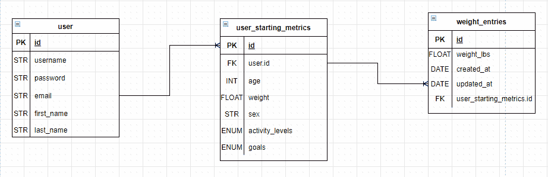
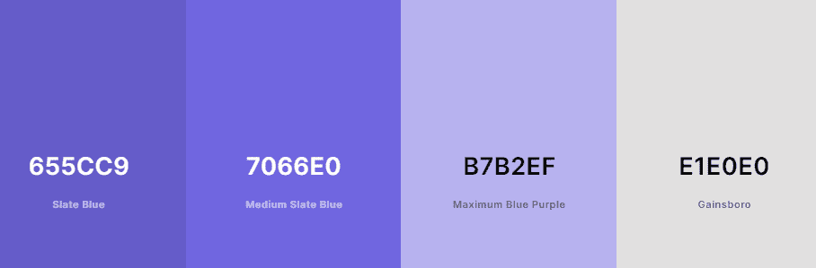
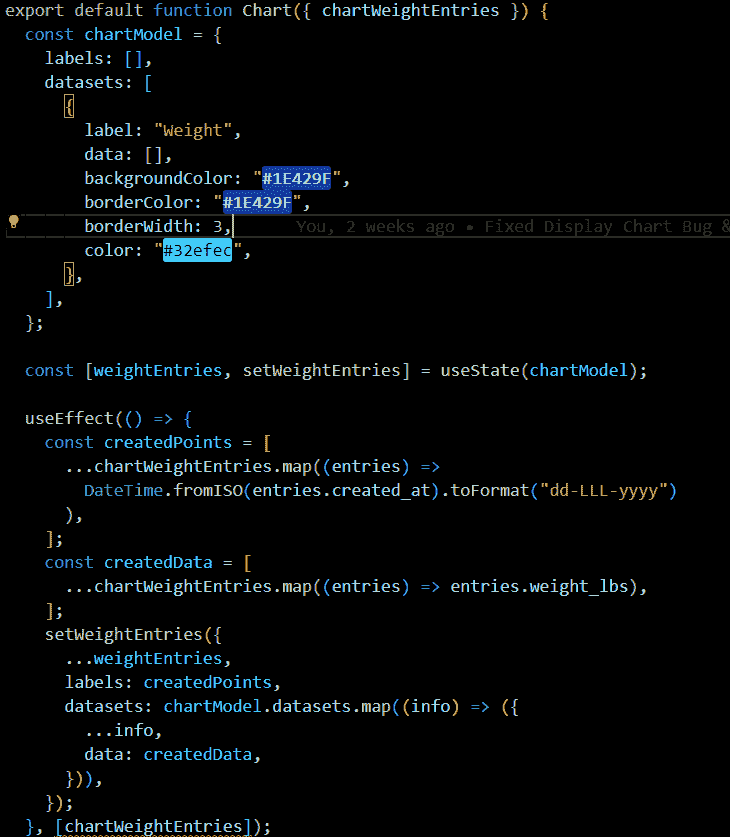

# 节俭的生活

> 原文：<https://medium.com/codex/provident-life-fe422f741812?source=collection_archive---------19----------------------->

由杰森·帕迪拉和马修·谭分别出演

# 项目概述

Provident Life 是一种深思熟虑和负责任的健康和健身方法，为用户提供了另一种选择来导航他们的体重增加/减少之旅。这是通过计算用户的每日总维持热量和宏，通知他们的食物消耗，从而帮助用户在我们的 FAQ 卡的帮助下建立平衡的饮食习惯来实现的。此外，通过使用图表，用户可以直观地了解他们的旅程。

## 要解决的问题

今天的年轻人对自己的身体没有安全感。根据[现在](https://now.org/now-foundation/love-your-body/love-your-body-whats-it-all-about/get-the-facts/#:~:text=Body%20Image,the%20time%20girls%20reach%20seventeen.&text=When%20asked%20%E2%80%9CAre%20you%20happy,their%2060s%20answered%20%E2%80%9Cyes%E2%80%9D.)，50%的青少年对他们的身体“自我意识”，26.2%的报告称“不满意”此外，互联网作为一个巨大的信息来源淹没了他们。结果，许多人走上了一条不利的道路，导致了不想要的结果。通过我们的网络应用程序，我们将为他们的减肥之旅创造更好的选择。我们计划让年轻人通过 TDEE(每日总能量消耗)来学习如何选择正确的道路。同样，我们希望成为一个可接受的、引人入胜的信息来源，不仅激起人们的兴趣；而且还支持用户通过附加信息资源继续他们的进程。

## 动机

我们受到启发建立了这个项目，因为我们想帮助人们达到他们的减肥/增重目标。这个应用程序的主要动机是创建一个平台，指导用户使用 TDEE 数字来跟踪他们的减肥/增重旅程，图表是上述旅程的可视化表示。我们还希望挑战自己，使用我们尚未使用的技术，如 NestJS 和 Chart.js。此外，我们希望改进我们之前在 React.js 等方面遇到的技术。该项目将为用户提供一种有效的减肥方法，同时还能通过精确跟踪他们的卡路里来享受他们喜欢的食物。我们希望尽可能帮助更多的人改造他们的身体，过上更健康、更幸福的生活。

## TDEE 概念

TDEE 是什么？TDEE 代表每日总能量消耗(也就是你的维持卡路里)。TDEE 是 24 小时后考虑所有活动后，每天维持体重所需的总能量。了解 TDEE 将有助于用户了解需要摄入多少卡路里来保持、减轻或增加体重。计算是通过乘以用户的基础代谢率(BMR)来完成的。BMR 是用户 TDEE 的一个组成部分，也是身体继续运转所需的卡路里数。无论如何，它不是用户减肥/增重所需的卡路里数。尽管如此，计算出一个用户的 TDEE 就足以追踪一次减肥/增重之旅。

# 设计概述

> ProvidentLife 是使用 RNPN (React，NestJS，PostgreSQL，Node.js)堆栈构建的。

## 为什么我们使用 RNPN 堆栈:

*反应(前端)*

*   构建管理自身状态的封装组件，然后将它们组合成复杂的 ui。
*   为应用程序中的每个状态设计简单的视图，当数据发生变化时，React 将有效地更新和呈现正确的组件。

*Nest.js(后端)*

*   使用 OOP 概念可以帮助你更好地理解事物。
*   建立在 express 之上。
*   使用渐进式 JavaScript，由 TypeScript 构建并完全支持 TypeScript
*   比 ExpressJS 更好的选择，因为它建立在清晰的设计上，只有几个简单的组件(控制器、模块和提供者)。
*   负责允许数据库和前端进行通信。

*PostgreSQL(数据库)*

*   对于我们的应用程序环境，使用关系数据库是最佳选择

*Node.js*

*   构建运行终端命令和应用程序的脚本

## 为什么我们使用其他技术:

*JWT(后端)*

*   创建一个 JSON web 令牌，并用一个不能被篡改的密钥对其进行编码、消毒和添加签名。
*   用于用户登录功能。

*Chart.js(前端)*

*   易于设置图表。
*   简单的学习曲线。

## TDEE 公式实现

找出用户的 TDEE 公式的过程源于首先计算用户的 BMR。考虑到这一点，进行了广泛的研究，搜索了多个健康应用程序，对它们进行了测试，并找到了用于计算基础代谢率的公式。我们找到了两个公式并进行了测试。第一个公式是哈里斯-本尼迪克特公式，于 1919 年开发，并于 1984 年进行了准确性修订，它非常受欢迎，并在今天的许多健康应用程序中使用。第二个公式，Mifflin-St Jeor 公式，对我们来说是更好的选择，因为与 Harris-Benedict 公式相比，TDEE 的计算精度提高了 5%。我们使用英制度量标准(磅，英寸)实现的 Mifflin-St Jeor 公式是通过(4.536 *体重)+ (15.88 *身高)— ( 5 *年龄)+ 5 或-161(取决于用户的性别)计算的，一旦相加，然后乘以用户的活动水平，以获得他们的 TDEE。

## 数据模型

我们建立了一个实体关系图来模拟我们的数据库，其中用户可以随时拥有许多起始指标(user_starting_metrics)来开始他们的体重之旅，因为在用户创建新的起始指标的每个时间点，他们的测量值都不同于他们上次创建的测量值，并且他们下次很可能会有不同的减肥或增重目标。我们的起始指标也有许多体重条目来记录他们的体重减少/增加，然后在图表上描绘出来。

## API 层

通过使用 NestJS 的控制器和服务类，我们为特定的路线创建了 3 个控制器(用户、用户启动度量和权重条目)，并在每个控制器中为该路线构建了 API。之后，我们根据我们的控制器为 3 个服务建立了方法。对于我们的每个控制器，我们在前端考虑了我们的用户流方法，作为用户，您应该能够注册、登录、创建用户启动指标会话、选择他们已经创建的会话，并向这些会话发布权重条目。因此，我们创建了端点来调用服务类中的方法，这些方法利用 TypeOrm 的存储库 API 来处理所有来自客户端的请求。

## 用户界面和图表库

ProvidentLife 的设计在 Figma 中进行了模拟，并使用 Tailwind/Flowbite(免费的 Tailwind 组件库)快速连续地构建干净且视觉上有吸引力的组件。使用预先构建的图表，我们还实现了 chart.js 来可视化地显示用户的体重增加/减少历程。类似地，我们建立了两个配色方案，为用户在我们的网站上提供一个简单明了的路径。

## 用户认证

为了确保我们的用户能够安全地注册、登录并开始他们的减肥旅程，我们需要一种方法来保护他们的凭证。我们想到了使用 JWT (JSON Web Token)，这是一种紧凑的 URL 安全方式，用于表示双方之间传输的声明，在用户登录时处理用户身份验证，并使用 Bcrypt 进行密码哈希处理，用于安全地对密码进行哈希和加盐处理，安全地保护数据库中用户的密码，并在用户登录时使用来比较哈希密码。我们选择使用 JWT 和 Bcrypt，因为我们已经从 Marcy Lab School 了解了这些技术，但当时并不习惯使用它们，因为我们很难使用它们。我们想利用这个项目作为一个机会来提高我们对这些技术的熟悉和实施。

# 挑战

> 在每一个项目中，都有发光和成长；我们擅长的领域和需要投入更多精力和时间的领域。在这一节中，我们将讨论我们在整个项目构建过程中所面临的挑战，因为没有一个项目是线性的。

## 重量输入会话

我们第一次为 ProvidentLife 创建 ERD 时遇到了一些挑战，我们的 ERD 变得太复杂，很难导航。如果我们致力于该设计，最初的 ERD 在创建多个用户启动指标会话时会遇到问题，因为用户表不仅包含登录凭据，还包含所有用户指标。我们后来意识到，在创建不同的会话时，用户的身体指标可能每次都不同，这意味着每次创建会话时都要更新用户的指标，必须有更好的方法。经过一天的头脑风暴，我们提出了一个想法，并最终坚持了下来，即只构建 3 个表，一个用于包含用户凭据的用户，一个用于存储每次创建会话时的指标的用户启动指标表，以及一个用于存储每次会话的权重条目的权重条目表。

## 通过 TypeORM 将 NestJS 连接到 Postgres

学习 NestJS，一个我们从未使用过的框架，是一个有趣的挑战，并且在创建控制器和服务时非常直观。但是连接到 Postgres 已经把我们扔进了一个很深的兔子洞，那里有许多资源，比如 NestJS 文档和 YouTube 教程，它变得非常不一致，因为我们检查的每个资源都不同地连接到 Postgres。我们多次尝试通过这些资源连接到 Postgres，但都没有成功。几天后，我们再次尝试跟踪相同的资源，深入研究了 NestJS 文档并阅读了关于 TypeORM 的内容。按照文档进行的另一次尝试，我们能够为我们的数据库创建表并与之连接。

## 无状态图表

Chart.js 在图表中呈现 dataset 属性中提供给它的数据。这个过程在组件呈现到 web 上时立即发生。这导致图表试图显示尚不存在的数据，从而引发错误。第一种方法是创建一个关闭/打开图表的按钮，相信如果在呈现组件时关闭图表，就不会抛出错误。然而，我们仍然有同样的问题。在聚在一起、进行对等编程并寻求帮助之后，我们决定创建一个虚拟图表对象，它在页面加载时不会呈现任何内容。但是，当用户选择一个会话时，它将为 dataset 属性提供要呈现的图表所需的信息。后来，一个成员重构并清理了它，同时启发了他的同事。

## ORM 与原始查询

在为我们的端点构建查询之前，我们讨论了在原始查询和使用 ORM 之间的决策，ORM 列出了每种查询的优缺点。

**ORM 缺点:**

*   模糊了底层数据库操作
*   可能在您没有意识到的情况下进行低效的查询，例如在表上使用了不正确的索引。
*   慢，如果你比较写原始 SQL 和使用 ORM 的性能，你会发现 raw 快得多，因为没有转换层。

**ORM 优点:**

*   数据的嵌套，在关系的情况下，ORM 层会自动为你拉数据。
*   单一语言，处理数据库不一定要懂 SQL 语言。
*   添加就像修改，大多数 ORM 以同样的方式处理添加新数据(SQL insert)和更新数据(SQL Update)，这使得编写和维护代码变得轻而易举。
*   消除重复的编码任务，主要是从查询结果集的单个行的列中分配许多对象属性。

在仔细考虑了使用 ORM 的利与弊之后，使用 ORM 的缺点通常不会出现在更简单的应用程序中，比如 ProvidentLife，所以 ORM 给我们带来的速度和便利性使得与好处相比，这不是一个大问题。

## Chart.js vs D3.js

我们决定实现一个数据可视化库，在用户记录他们的旅程时显示他们的体重条目。我们遇到了两个流行的，D3.js 和 Chart.js，它们都有各自的优点和缺点。Chart.js 提供了预构建的图表，从条形图到饼图。Chart.js 擅长于建立连续的图表，并且学习曲线很短。然而，他们最大的资产也是他们最大的负债。因为图表是预先构建的，所以它不会对可视化数据的定制和完整操作增加太多。尽管可以对它们的配置和设置进行更改，但仍有许多限制。

与 Chart.js 不同，D3.js 提供了更多的创作自由，因为我们可以根据自己的喜好操纵和显示数据。D3.js 允许工程师创建视觉上吸引人的图形。然而，这是以极端的学习曲线为代价的，因为比 Chart.js 有更多的自由，使用 D3.js 需要更多的知识。在研究了两个库的优缺点并考虑了我们团队的范围后，该小组得出结论，Chart.js 将是最好的行动方案。虽然 D3.js 反映了我们项目的任务是创造引人入胜的内容，但额外工作量的成本，以及我们四周内的最后期限，可能会导致成员比预期更快地耗尽精力。

# 扩展机会

> 如果给我们更多的时间，我们会加上:

## 预期体重减轻/增加轨迹图

我们希望添加的一个功能是在图表上绘制预期的体重减轻/增加轨迹。当用户创建一个会话并开始添加体重条目时，他们将看到他们每周的估计增长，并将它与用户的实际增长进行比较，当他们在图表上绘制体重条目时，他们可以看到他们是否在跟踪。

# 结论和参考文献

Provident Life 是一个指导人们减肥/增重旅程的网站。我们希望你能像我们制作它一样喜欢它！