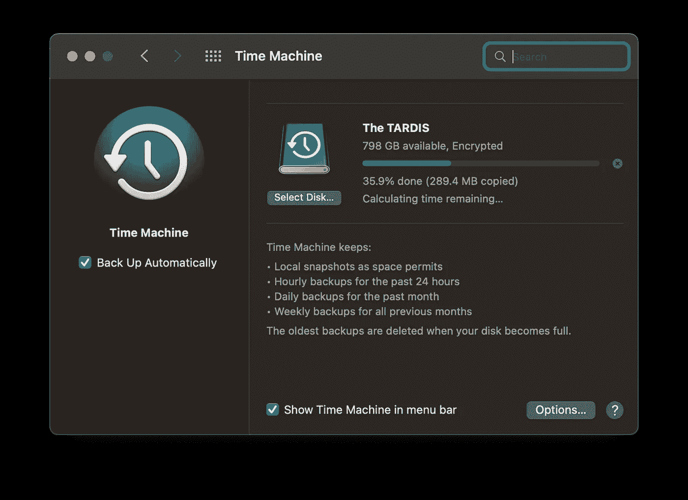

# PSA:请在安装 macOS 13 Ventura 之前备份您的 Mac

> 原文：<https://medium.com/codex/psa-please-back-up-your-mac-before-installing-macos-13-ventura-92df44575c2f?source=collection_archive---------4----------------------->

## 有备份总是好的。一直都是。

图片由作者提供

随着 macOS Ventura 的发布，许多拥有合格设备的 Mac 用户都急于安装更新，并开始使用我们今年获得的新功能，这是有道理的。我对今年的 macOS 发布感到兴奋，我期待着使用完整版…