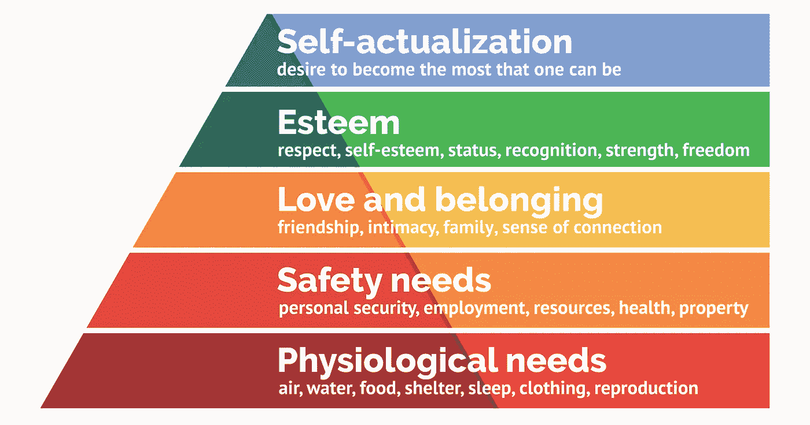
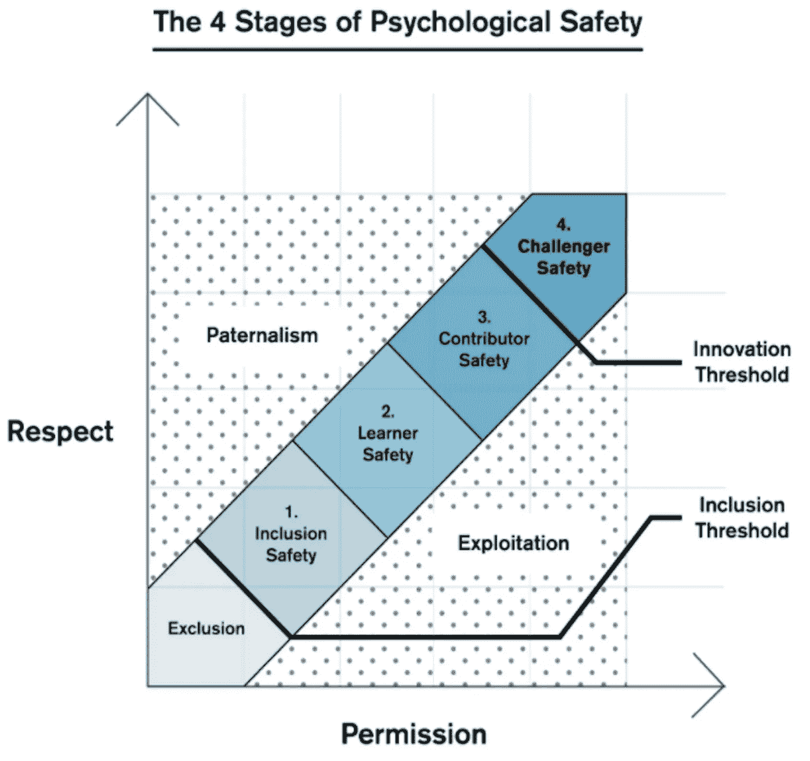

# 走向心理安全的环境

> 原文：<https://medium.com/codex/psychological-safety-in-a-software-team-18730b15c1db?source=collection_archive---------1----------------------->

## 感觉在一个安全的环境中是一个快乐和富有成效的团队的先决条件。我将提到一个软件团队作为例子，但它也可以应用于其他团队。

亲爱的实习生

[马斯洛的需求层次](https://en.wikipedia.org/wiki/Maslow%27s_hierarchy_of_needs)是人类需求的结构化金字塔。

注意*个人安全*位于*安全需求*之内，刚好在*生理需求*之上。如果我们不满足那些低层次的需求，我们怎么能释放上面的需求，那里可以发生创造力和创新？如果你在为生存而挣扎，你怎么能思考政治或文化？[研究表明，心理安全允许适度的冒险、畅所欲言、发挥创造力、敢于冒险而不用担心被切断脖子。](https://hbr.org/2017/08/high-performing-teams-need-psychological-safety-heres-how-to-create-it)

> 病理组织寻找“窒息的喉咙”:调查的目的是找到对问题“负责”的人，然后惩罚或责备他们(……)如果失败受到惩罚，人们就不会尝试新事物。将失败视为学习的机会，进行无可指责的事后分析，找出改进的方法。 [*加速*](https://www.goodreads.com/book/show/39080433-accelerate)

[根据维基百科](https://en.wikipedia.org/wiki/Psychological_safety)“*心理安全是能够展示和利用自己，而不用担心自我形象、地位或职业的负面后果*”。如果你生活在恐惧中，不管是因为你害怕打破一个系统还是害怕被评判，你都会克制自己不去挑战现状，甚至不去参与。你可能会想办法隐藏那些对你的生产力和幸福有害的恐惧。举个例子，如果你不明白某件事，但是你因为害怕而不说出来，那是多么的徒劳？理想情况下，你希望在一个可以展示你弱点的地方工作。说“不知道”应该是很正常的事情。

[心理安全框架的 4 个阶段](https://en.wikipedia.org/wiki/Psychological_safety)

恐惧和焦虑总是不好的。不要把它们正常化。承担风险是进化的一个要求，在这个过程中犯错误是很自然的。如果错误是生活和工作的一部分，我们最好学会接受它们。

> 我们从失败中学习，而不是从成功中。*布拉姆储料器*

团队应该足够成熟，将错误视为学习过程的一部分。不管你的职位高低，你都应该感到犯错误是安全的，没有负罪感。接受错误主要是关于文化。归根结底是组成公司和团队的人。有了这些，就有了实现一些实践和*工作方式*的自主权。

在这里，我们包括文化、实践和方法论相关的主题。有太多的内容需要介绍，所以我只重点介绍一些我认为相关的内容，并建议您进一步研究:

*   **适当的欢迎**:当一个新的团队成员加入时，你不需要举办一个聚会，但要确保你准备了一些入职培训。要善良(记得是你的时候)。结对编程可以成为一个强大的欢迎工具，提供安全感和归属感。典型的选择是发送大量的链接和文档，并说“如果有问题，告诉我”；当然，许多人会因为害怕看起来愚蠢而克制自己。
*   **焦点**:已经证明频繁切换会损害生产力；由于所涉及的压力，误差会增加。理想情况下，你应该在给定的时间内一次做一个项目/产品。理想情况下，你应该一次专注于一个功能，并找到减少干扰的方法。
*   **没有指责和责备**:团队应该是一群有凝聚力的人，他们互相帮助实现共同的目标。竞争恰恰相反。共享所有权是这里的一个关键策略——我们都对产品的错误(和成功)负责，重点是理解和避免重复错误，而不是归咎责任。
*   没有[守门](https://en.wikipedia.org/wiki/Gatekeeping_(communication)):以“一个真正的程序员……”或“你不知道……”开头的句子体现成人版的霸凌。不要让某人因为不知道某事而感到内疚，不管他的经历如何。使用结对编程作为一种工具，促进学习和解决知识差距。
*   不要做独狼。求助于诸如[代码审查和结对编程](https://www.infoq.com/news/2009/01/Pair-Programming-Code-Review/)这样的实践来提高质量和了解你的同事。这些实践减少了对未知的恐惧，因为我们得到了团队对我们和我们工作的反馈。当一个人入职时，从一开始就公开你的弱点；稍后提及你的优势。
*   **反馈文化**:考虑定期回顾、*、[团队健康检查](https://www.teamretro.com/health-checks/team-health-check/)，以及一对一反馈会议(*临时*或预定)，这样团队可以增加彼此的信任并持续改进。反馈是一个巨大的话题，需要它的文章，所以确保你在实施之前阅读它。*
*   ***实验文化**:减少变革阻力的一种方法是根据[科学方法](https://en.wikipedia.org/wiki/Scientific_method)进行小实验:基于一个假设，提出一个实验，分析结果，并采取行动。这适用于任何事情——从调整技术到调整方法。这减少了对承诺的恐惧，因为我们以前可以尝试(小的)事情。这也是一种通过小步骤实现大改变的方法(在这个过程中总是要适应)。只有当团队接受学习和谦逊的文化，而不是“我确定”的文化时，这种方法才会奏效。*
*   *透明文化:对同事诚实，要求管理层透明行事。人们害怕他们不知道的东西。*
*   ***互相了解**:根据我的经验，信任是一个职能团队的首要因素。一个捷径是做一些聚会活动。还有，了解自己；求反馈，做一些自省。*
*   *提升平面层次结构。即使公司的组织不是扁平的，你仍然可以表现得好像所有人都对产品和解决方案有发言权。不要害怕与利益相关者和产品所有者交流——通常情况下，你们相互交流对你们最有利。*
*   *[**精益方法**](/codex/towards-lean-software-development-24460340b11a) :做最少所需，才有所用；获得早期和频繁的用户反馈。MVP 思维模式不仅仅适用于新产品；事实上，它主要适用于新特性。*
*   ***:通过交付小的[用户驱动的故事](https://levelup.gitconnected.com/stop-creating-technical-stories-f5e7bc424ff8)来降低风险；不要创建变化大的长期存在的分支；频繁(绿色)提交；经常推。有了适当的 CI/CI，您可以轻松地查明有问题的小提交并恢复它。***
*   *****假设积极意图**:不要假设最坏的情况，减少误解；除非有相反的证据，否则假设每个人都希望产品、沟通和公司都是最好的。***

> ***小批量工作的关键是将工作分解成允许快速开发的特性，而不是在分支上开发并偶尔发布的复杂特性。这个想法可以应用在特性和产品层面。 [*加速*](https://www.goodreads.com/book/show/39080433-accelerate)***

*   ***[**测试驱动开发**](/codex/how-to-write-a-test-using-tdd-b2828788d7ea?source=search_post---------0) :对我来说，它提供了很多情感上的安全感，因为我知道很难打破东西，因为所有东西都有非常频繁运行的测试(加上 CI/CD 系统)。此外，我几乎停止使用调试器，因为开发更加循序渐进，很少出现意外。***
*   *****连续交付**:大家都感受到了发布驱动的焦虑。“如果我破坏了构建怎么办？”考虑从发布到持续交付的转换，以获得恒定的[价值流](https://en.wikipedia.org/wiki/Value_stream)，并降低大爆炸(即瀑布)发布固有的风险。***

*** [## 软件开发团队的价值观

### 我决定以宣言的形式写下我珍视的价值观。希望他们能影响成功…

medium.com](/codex/values-of-a-software-development-team-e7c4cbfd3532) 

> 我们的研究表明，精益管理，以及其他一系列被统称为持续交付的技术实践，事实上确实会影响文化。(…)当团队实践 CD 时，部署到产品中并不是一个巨大的、大爆炸式的事件，而是可以在正常工作时间内作为日常工作的一部分来完成的事情。(…)我们的研究还发现，在主干/主分支之外开发，而不是在长期特性分支上开发，与更高的交付性能相关。 [*加速*](https://www.goodreads.com/book/show/39080433-accelerate)
> 
> 与传统的软件开发方法不同，当我们应用连续交付技术时，发布到产品中并不是一个令人担忧、紧张的事件，休假被取消，人们随叫随到，我们肯定会出错，我们将在接下来的几天或几周内花费很长时间来解决这些问题。 [*连续输送管道*](https://www.goodreads.com/book/show/56771495-continuous-delivery-pipelines---how-to-build-better-software-faster)

所有这些举措都应该被整个团队所接受——当然，公司应该通过信任员工和赞助必要的培训来推广这些举措。然而，如果你有动力和激情，你可以成为变革的推动者。一个行为可以产生类似行为的连锁反应——一个[良性循环](https://en.wikipedia.org/wiki/Virtuous_circle_and_vicious_circle)。慢慢来，积极点，否则你只会成为抱怨和批评的人(这是针对你个人的)。

糟糕的环境可能并不总是糟糕的。如果你看到一个同事被评判，被攻击，不断被打断，或者害怕问事情，也许你应该介入。如果每个人都对不好的事情保持沉默，不好的事情就会扩大。

未知是恐惧最常见的原因之一——当你不了解你的同事、代码库、系统状态或产品的未来时。我们看到了一些应对方法，但总会有一些不确定性，因为公司存在于一个不确定的世界中。因此，即使在非常安全的环境中，接受这一点也很重要。变化是唯一不变的，所以我只是试图让代码库——和我自己——对变化更加开放，尽管遵循了一种[精益方法](/codex/towards-lean-software-development-24460340b11a)。

不要认为你不会虐待别人。它可能发生在我们所有人身上，而我们却没有注意到。例如，我们可能会因为某些[隐性偏见](https://implicit.harvard.edu/implicit/takeatest.html)而让某人说话过度，造成痛苦。我以前也遇到过这种情况，当我看到属于我的行为时，我会对某人感到恼火(心理偏见)。也就是说，花些时间回顾一下你的日常态度。

> 心理投射(Psychological projection)是一种防御机制，在这种机制中，自我通过否认无意识的冲动或品质(包括积极的和消极的)在自己身上的存在，并将其归因于他人，来为自己辩护。 [*心理投射*](https://en.wikipedia.org/wiki/Psychological_projection)

我倾向于建议，你花在抱怨团队或公司上的精力应该花在试图从一开始就解决问题上——除非问题太大。例如，如果你在恐惧的环境中工作，你不可能在短期内改变它；有些人太抗拒改变，有些公司适应太慢，所以也许你应该考虑另一个挑战。幸运的是，如果你从事软件行业，有太多的机会可以探索。如果是团队问题，你可以要求轮换到另一个团队。

此外，你可以通过战略方式(例如自动化)求助于*技术*。我将在其他地方进一步探讨这些主题:

 [## 利用技术实现心理安全

### 技术可以为我们服务，作为一种手段，让我们在团队和公司中感到心理上更安全。

lsoares.medium.com](https://lsoares.medium.com/leveraging-technology-for-psychological-safety-48071fbd131e) 

生活太短暂了(职业生涯更短),不应该生活在压力中——你可能正在经历一些精神问题。为什么与身体伤害相比，精神问题被如此低估？如果你需要专业的帮助，不要感到羞耻。照顾好你自己。

> 在 Bing 团队实施技术实践和持续交付原则之前，工程师们报告的工作/生活平衡满意度得分仅为 38%。实施这些技术实践后，分数跃升至 75%。(……)我们的研究表明，提高关键技术能力减少部署痛苦:实现全面测试和部署自动化的团队；使用持续集成，包括基于主干的开发；在安全上向左移动；有效管理测试数据；使用松散耦合的架构；能独立工作；并对重现生产环境所需的一切进行版本控制，减少了部署的困难。 [*加速*](https://www.goodreads.com/book/show/39080433-accelerate)

# 进一步阅读

 [## 加速

### 这本书感觉像是一个混合体:一些基于多项调查的非常好的建议，科学的…

www.goodreads.com](https://www.goodreads.com/book/show/35747076-accelerate)***