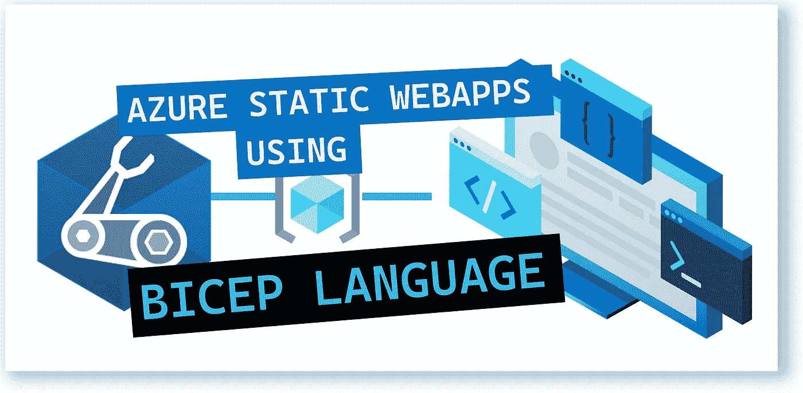
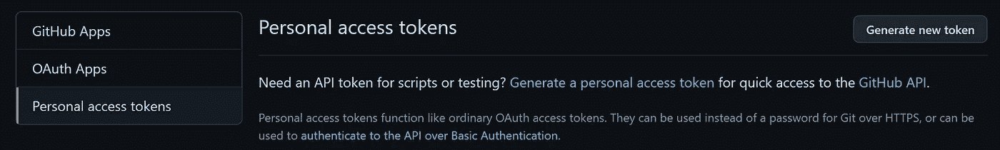
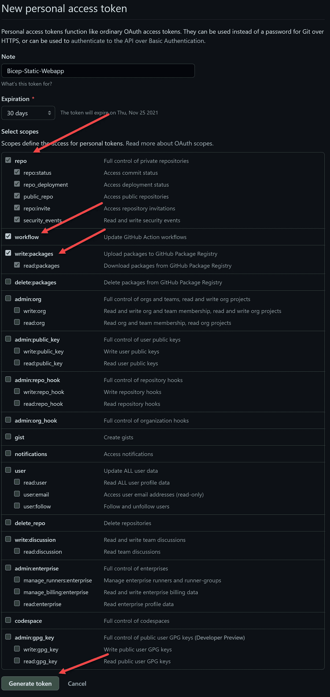
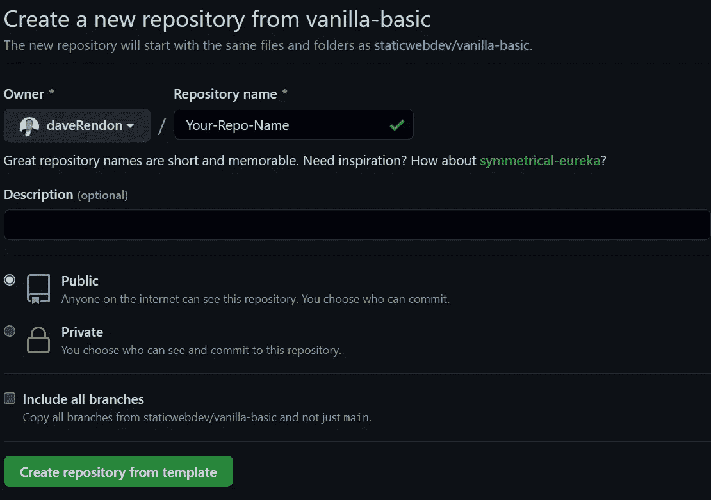
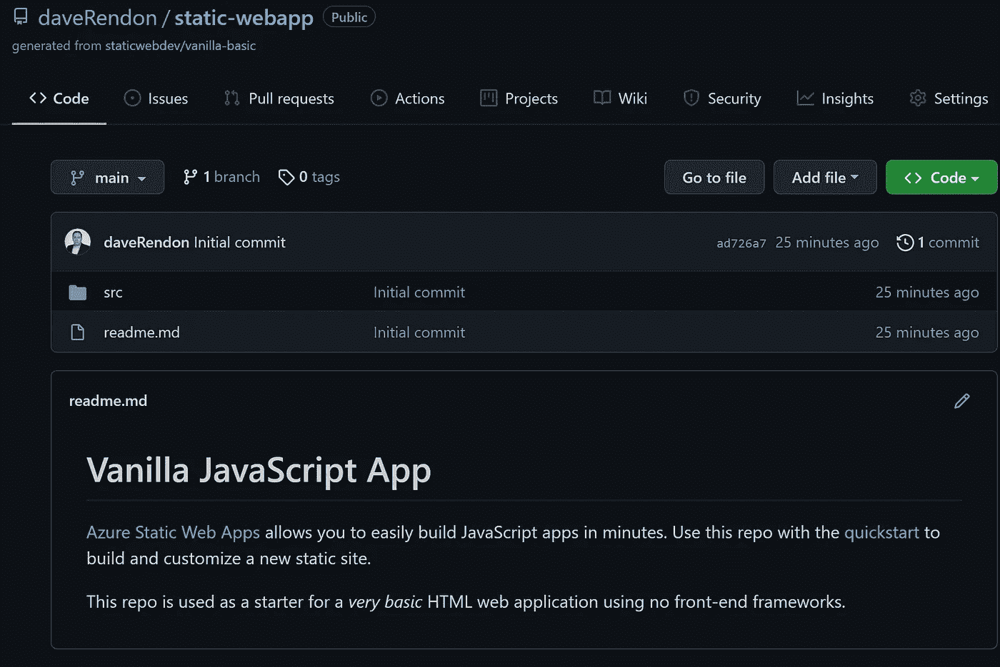
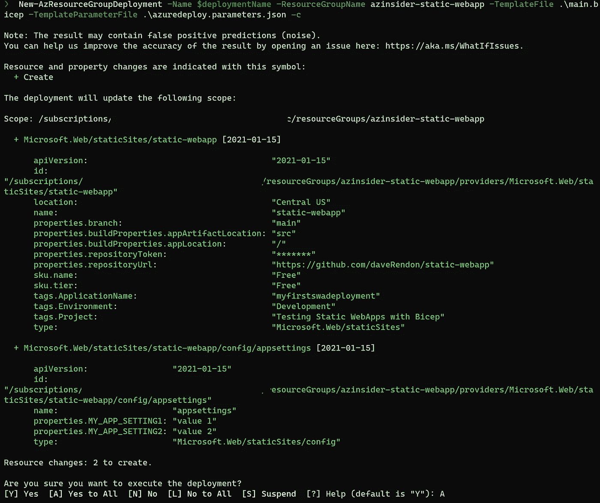
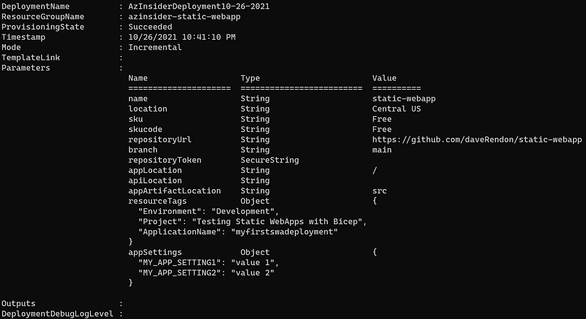
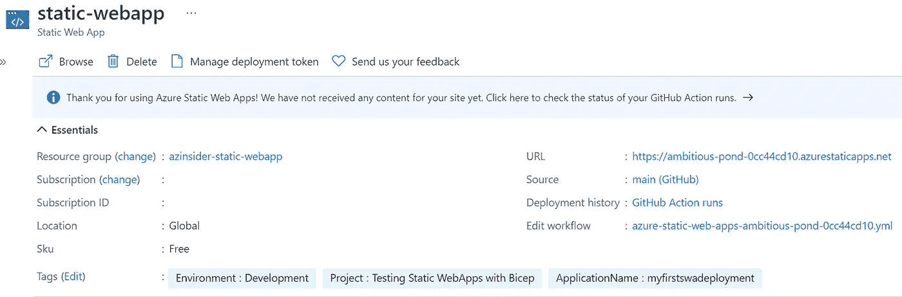
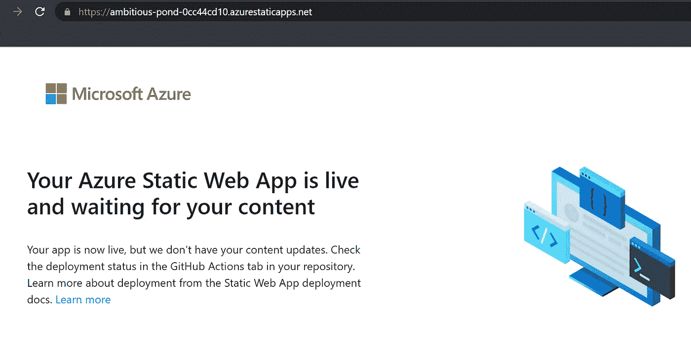

# 💪使用 Bicep 模板发布 Azure 静态 Web 应用

> 原文：<https://medium.com/codex/publish-azure-static-web-apps-using-a-bicep-template-ca315a825b74?source=collection_archive---------1----------------------->

了解如何使用 Bicep 部署 Azure 静态 Web 应用。



使用 Bicep 模板发布 Azure 静态 Web 应用

本文将回顾如何利用 Bicep 这种新的领域特定语言(DSL)来创建 Azure 静态 Web App 实例。

# 先决条件

*   一个活跃的 Azure 账户:你可以[免费](https://azure.microsoft.com/free/)创建一个账户。
*   GitHub 账号:你可以[免费创建一个 GitHub 账号](https://github.com/)
*   [Azure 二头肌](https://github.com/azure/bicep)安装在你的本地机器上。
*   Azure PowerShell。参见:[安装 Azure PowerShell](https://docs.microsoft.com/en-us/powershell/azure/install-az-ps) 。

我们将执行以下步骤:

1.创建 GitHub 个人访问令牌

2.创建 GitHub repo

3.创建二头肌模板

4.创建参数文件

5.运行部署

我们开始吧！

# 1.创建 GitHub 个人访问令牌

我们将利用一个名为' *repositoryToken* 的参数，它允许部署流程与保存静态站点源代码的 GitHub repo 进行交互。

在你的 GitHub 账户资料中(右上角)，选择*设置*。然后转到'*开发者设置*，选择'*个人访问令牌*。'



GitHub 访问令牌

现在生成一个新令牌。您可以在“注释”字段中为此令牌提供一个名称。在这种情况下，我们将把它命名为' *Bicep-Static-Webapp* '。

指定以下范围:' *repo '，' workflow '，' write: packages'* 。然后选择选项'*生成令牌*，如下图所示:



生成令牌

请务必复制这个令牌，并将其存储在安全的地方。

现在让我们创建一个新的 GitHub 存储库。

# 2.创建 GitHub repo

导航到以下位置创建新的存储库:

[https://github.com/staticwebdev/vanilla-basic/generate](https://github.com/login?return_to=/staticwebdev/vanilla-basic/generate)



创建 GitHub repo

然后，您应该会看到新的 GitHub repo，如下所示:



GitHub 回购

下一步是创建二头肌模板。

# 3.创建二头肌模板

创建一个新文件夹来存储 Bicep 模板，并创建一个名为“main.bicep”的新文件。

现在我们将定义参数。

## 二头肌模板-参数

下面的代码显示了参数的定义:

```
param name string
param location string = resourceGroup().location
param sku string
param skucode string
param repositoryUrl string
param branch string[@secure](http://twitter.com/secure)()
param repositoryToken string
param appLocation string
param apiLocation string
param appArtifactLocation string
param resourceTags object
param appSettings object
```

注意我们对 repositoryToken 使用了一个 secure()装饰器。

接下来，我们将定义资源。

## Bicep 模板—资源

我们将定义两个资源:静态网站和配置。

下面的代码显示了这些资源的定义:

```
resource name_resource 'Microsoft.Web/staticSites@2021-01-15' = {
  name: name
  location: location
  tags: resourceTags
  properties: {
    repositoryUrl: repositoryUrl
    branch: branch
    repositoryToken: repositoryToken
    buildProperties: {
      appLocation: appLocation
      apiLocation: apiLocation
      appArtifactLocation: appArtifactLocation
    }
  }
  sku: {
    tier: sku
    name: skucode
  }
}resource name_appsettings 'Microsoft.Web/staticSites/config@2021-01-15' = {
  parent: name_resource
  name: 'appsettings'
  properties: appSettings
}
```

现在我们将创建一个参数文件来传递所有的参数值。

## 参数文件。

创建一个名为“azuredeploy.parameters.json”的新文件。

下面的代码显示了参数文件的定义。

```
{
    "$schema": "[https://schema.management.azure.com/schemas/2019-04-01/deploymentParameters.json#](https://schema.management.azure.com/schemas/2019-04-01/deploymentParameters.json#)",
    "contentVersion": "1.0.0.0",
    "parameters": {
        "name": {
            "value": "myfirstswadeployment"
        },
        "location": { 
            "value": "Central US"
        },   
        "sku": {
            "value": "Free"
        },
        "skucode": {
            "value": "Free"
        },
        "repositoryUrl": {
            "value": "[https://github.com/](https://github.com/)<YOUR-GITHUB-USER-NAME>/<YOUR-GITHUB-REPOSITORY-NAME>"
        },
        "branch": {
            "value": "main"
        },
        "repositoryToken": {
            "value": "<YOUR-GITHUB-PAT>" 
        },
        "appLocation": {
            "value": "/"
        },
        "apiLocation": {
            "value": ""
        },
        "appArtifactLocation": {
            "value": "src"
        },
        "resourceTags": {
            "value": {
                "Environment": "Development",
                "Project": "Testing SWA with Bicep",
                "ApplicationName": "myfirstswadeployment"
            }
        },
        "appSettings": {
            "value": {
                "MY_APP_SETTING1": "value 1",
                "MY_APP_SETTING2": "value 2"
            }
        }
    }
}
```

根据您的设置，更新参数' *name* '、*repository rl*和' *repositoryToken* '。

接下来，我们将部署这个二头肌模板。

# 5.运行部署

确保您事先创建了资源组。

您可以使用以下命令使用 Azure PowerShell 登录到您的 Azure 订阅:

```
Connect-AzAccount -Tenant 'YOUR-TENANT-ID' -SubscriptionId 'YOUR-SUBSCRIPTION-ID'
```

我们将使用下面的命令来部署该模板:

```
$date = Get-Date -Format "MM-dd-yyyy"
$deploymentName = "AzInsiderDeployment"+"$date"New-AzResourceGroupDeployment -Name $deploymentName -ResourceGroupName azinsider-static-webapp -TemplateFile .\main.bicep -TemplateParameterFile .\azuredeploy.parameters.json -c
```

因为我们使用了-C 标志，所以我们将能够预览部署，如下所示:



部署预览

验证完成后，让我们执行部署。几秒钟后，您应该会看到如下所示的部署输出:



静态 Web 应用程序—部署输出

你可以去 Azure 门户寻找静态 web 应用，然后浏览到静态 web 应用的 URL:



Azure Porta —静态 web 应用程序

您可以看到静态 web 应用程序的初始屏幕，如下所示:



使用 Bicep 模板发布 Azure 静态 Web 应用

# 源代码—使用 Bicep 模板发布 Azure 静态 Web 应用。

您可以在以下 URL 中找到所有代码:

[](https://github.com/daveRendon/azinsider/tree/main/application-workloads/static-webapp) [## 主 daveRendon/azinsider 上的 azin sider/应用程序工作负载/静态 webapp

### 在 GitHub 上创建一个帐户，为 daveRendon/azinsider 开发做出贡献。

github.com](https://github.com/daveRendon/azinsider/tree/main/application-workloads/static-webapp) 

希望这能让您更好地理解 Bicep 的基础设施即代码功能。

👉 [*在此加入****azin sider****邮箱列表。*](http://eepurl.com/gKmLdf)

*-戴夫·r*