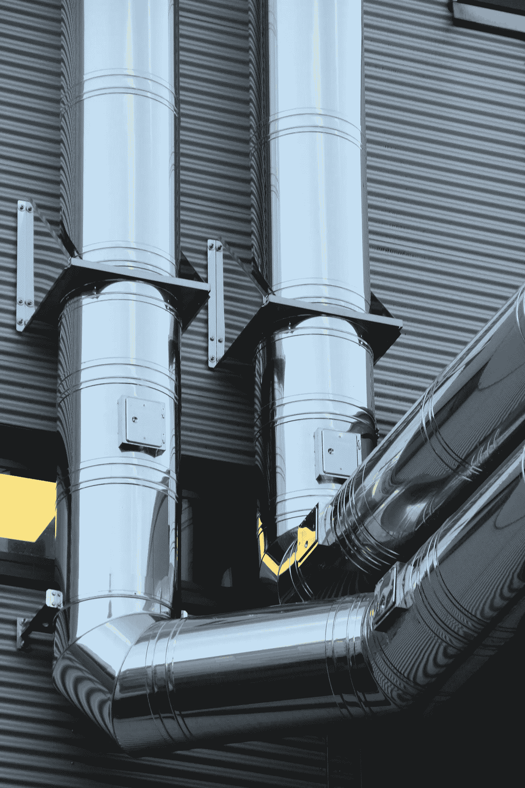

# 拉式请求持续集成— AWS 图

> 原文：<https://medium.com/codex/pull-request-continuous-integration-aws-diagram-2d1321ebdf59?source=collection_archive---------5----------------------->

为 Git 拉请求构建持续集成/持续交付(CI\CD)管道在拉请求(PR)时运行 CI\CD，以便在合并到主线之前从验证构建转移到验证整个环境。这种方法允许开发人员更早地获得更高质量的反馈，加速 PR 评审(现在被 CI\CD 结果所丰富),并最小化构建中断对开发团队的影响。

autor fotky:[Pixabay](https://www.pexels.com/sk-sk/@pixabay?utm_content=attributionCopyText&utm_medium=referral&utm_source=pexels)na[Pexels](https://www.pexels.com/sk-sk/fotka/architektura-bruska-budova-ciara-257770/?utm_content=attributionCopyText&utm_medium=referral&utm_source=pexels)