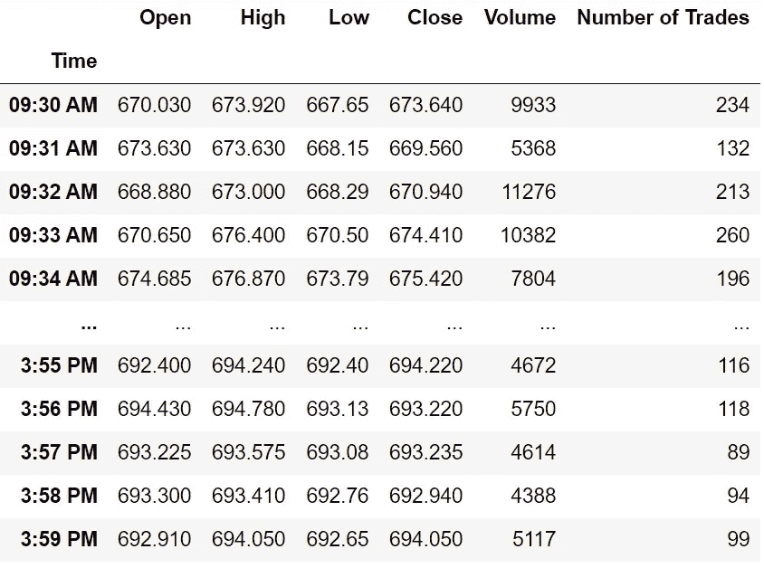

# 用 Python 从 IEX 云中提取股票数据

> 原文：<https://medium.com/codex/pulling-stock-data-from-iex-cloud-with-python-d44f63bb82e0?source=collection_archive---------0----------------------->

## [法典](http://medium.com/codex)

## 用几行代码访问市场数据的简单方法


照片由[杰米街](https://unsplash.com/@jamie452?utm_source=medium&utm_medium=referral)在 [Unsplash](https://unsplash.com?utm_source=medium&utm_medium=referral) 拍摄

每次从网上下载股市数据都不是一件愉快的工作。此外，从互联网手动下载数据时，不可能获得实时价格。这就是云和 API 发挥作用的时候。

在进入编码部分之前，让我们理解使用 API 从云中提取股票数据的机制。假设有一家名为 IEX 云的公司直接从交易所拥有或购买实时股票市场数据。该公司将数据存储在自己的数据库中，并通过云托管平台进行托管，即分散数据。现在，数据是公开的，但仍然不能就这样提取出来。这就是 API 变得有用的时候。即使用户不拥有云，使用 API，他们也可以与云交互并从云中提取数据。

这就是我们将要做的。需要记住的一点是，为了用 API 访问数据，用户必须有一个 API 密匙(类似于密码，不应该泄露)。如果没有 API 密钥，用户访问数据的请求将被拒绝，并显示 400 响应(错误或否定响应)。

在本文中，我们将:

```
**-** [**Creating an IEX Cloud account**](#38d0)**-** [**Importing packages into the python environment**](#f333)**-** [**Getting the latest updates of stocks**](#9b7c)**-** [**Extracting historical prices of a stock**](#5d4a)**-** [**Pulling intraday prices of a stock**](#c80d)
```

# 创建 IEX 云帐户

拥有一个 IEX 云账户是非常重要的，因为只有这样我们才能拥有自己的秘密 API 密钥和访问数据。若要创建帐户，请首先访问 IEX 云网站。悬停在右上角的“登录”按钮，找到“创建帐户”选项。输入所需的详细信息并创建您自己的帐户。创建帐户后，导航到控制台页面([iexcloud.io/console](https://iexcloud.io/console/))。你会看到这样一个页面(我隐藏了个人信息):


控制台页面

在“API 令牌”部分，选择“转到 API 令牌”按钮。按下按钮后，您将被引导至如下页面:


API 页面

正如您所看到的，有两种类型的 API 令牌，它们是秘密的和可发布的令牌。您可以使用这两种 API 标记，但是当您向公众展示您的代码时，您不应该泄露您的秘密标记。在本文中，我将只在代码中使用可发布的令牌。希望你们都已经在 IEX 云上创建了一个账户，并且熟悉了 API 环境。我们来编码吧！

# 导入包

每个 python 程序都从导入所需的包开始。在本文中，我们将使用 Pandas、Requests 和 Matplotlib 作为主要的包。让我们将包导入到 python 环境中。

**Python 实现:**

除了导入主包，我们还导入了 Termcolor 包来定制字体，并更改了 Matplotlib 上的一些设置。

# 获取股票的最新动态

现在让我们用 python 定义一个函数来获取股票的最新更新。

**Python 实现:**

**输出:**

```
**Latest Updates of FB
--------------**
**symbol :** FB
**latestPrice :** 268.4
**marketCap :** 766013634355
**peRatio :** 26.6
**--------------** 
**Latest Updates of AAPL
--------------**
**symbol :** AAPL
**latestPrice :** 121.03
**marketCap :** 2031863258880
**peRatio :** 32.89
**--------------** 
**Latest Updates of AMZN
--------------**
**symbol :** AMZN
**latestPrice :** 3089.49
**marketCap :** 1555758237851
**peRatio :** 73.86
**--------------** 
**Latest Updates of NFLX
--------------**
**symbol :** NFLX
**latestPrice :** 518.02
**marketCap :** 228858650044
**peRatio :** 85.2
**--------------** 
**Latest Updates of GOOGL
--------------**
**symbol :** GOOGL
**latestPrice :** 2050
**marketCap :** 1392148604815
**peRatio :** 34.98
**--------------**
```

**代码解释:**首先我们定义一个名为‘get _ latest _ updates’的函数。我们定义这个函数的方式是，将尽可能多的股票代码作为参数。在函数内部，我们传递一个 for 循环来遍历作为参数传递的 tickers 列表。当深入研究 for 循环时，我们将 api 键(可发布键)存储到“iex_api_key”变量中，并将 API 的 URL 存储到“api_url”变量中。

在进一步研究代码之前，有一件事需要记住。有四种与 API 交互的主要方法，即 GET、POST、PUT 和 DELETE 方法。GET 方法用于从数据库中提取数据，POST 方法用于向数据库中添加数据。PUT 方法用于添加或覆盖数据，DELETE 方法用于从数据库中删除数据。记住这一点，让我们继续前进！

在将 API 键和 URL 存储到它们各自的变量中之后，我们使用 Requests 包提供的 GET 请求来提取数据。我们将这些数据以 JSON 格式存储到‘df’变量中。接下来，我们将进行一些数据处理，以便更清楚地显示结果。最后，我们用 FAANG(脸书，苹果，亚马逊，网飞，谷歌)股票的报价器作为参数来调用这个函数，瞧！很酷，对吧？！

请记住，许多属性会随数据一起出现，但是在我们的代码中，我们只使用了四个属性来显示结果(symbol、latestPrice、marketCap、peRatio)。

# 提取股票的历史价格

现在让我们定义一个函数来提取股票上市时的市场数据。

**Python 实现:**

**输出:**


作者提供的图片

**代码解释:**首先，我们定义一个名为“get _ historic _ data”的函数，该函数将股票代码作为参数。在函数内部，它几乎类似于我们在上一个函数中所做的，但是 API 的 URL 有所不同。在将可发布的 API 键和 URL 存储到它们各自的变量中之后，我们调用 GET request 方法来提取数据，并将其作为 JSON 格式存储在‘df’变量中。之后是一个漫长的数据处理过程，以更精确地显示最终的数据帧。接下来，我们使用 Matplotlib 生成一个图，以更有意义的方式表示数据。最后，我们调用以“AAPL”为参数的函数，看看它是如何工作的。

# 拉一只股票的当天价格

让我们定义一个函数，使我们能够获得给定股票的当天价格。

**Python 实现:**

**输出:**



作者提供的图片

**代码解释:**首先，我们定义一个名为“get_intraday_prices”的函数，它将股票的代码作为参数。正如我之前所说的，这个函数的结构与前面的几乎相似，但是 API 的 URL 有所不同。在以 JSON 格式提取和存储数据之后，我们正在进行一些数据操作，以便更清楚地清理和表示数据。在函数的最后，我们使用 Matplotlib 生成一个日内价格的折线图。最后，我们返回并调用函数来测试它。

# 结论

在本文中，我们使用 API 从云服务器中提取不同种类的数据，并做了一些数据操作，以便更清楚地显示结果。作为一名数据科学家，使用 API 从云中提取数据是一项非常有用且重要的任务。随着数据量的日益增长，公司希望数据科学家使用云存储而不是传统的数据库来简化工作流程和提高效率。在本文中，我们仅仅介绍了使用 API 提取数据的基础知识，但是还有很多内容有待探索。就这样，我们到达了文章的结尾。希望你找到了一些好东西！