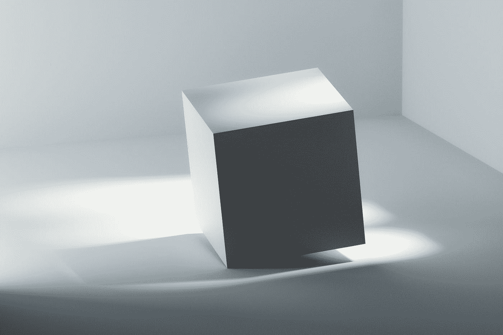

# 纯 CSS 动画#1: 3D 立方体

> 原文：<https://medium.com/codex/pure-css-animation-1-3d-cubes-f8ecc53ef16e?source=collection_archive---------4----------------------->



米拉德·法库里安在 [Unsplash](https://unsplash.com?utm_source=medium&utm_medium=referral) 上拍摄的照片

很久以前我就想写代码动画了，我看到一些是在 AE 上制作的，可以用纯 CSS 或一点 JS 复制。然后我现在从一个项目给我的动画开始。

我的客户希望我做一系列的立方体，这些立方体是独立移动的，并且是链接，所以我也需要让它们具有交互性。

首先，我将开始用 HTML 编写立方体的结构。很久以前，我跟随德桑德罗的超级[介绍开始了 CSS 3D。我们将跟随它开始。](https://3dtransforms.desandro.com/)

```
<a href="#">
  <div class="scene">
    <div class="cube">
      <div class="cube__face cube__face--inside">
        <p>Click</p>
      </div>
      <div class="cube__face cube__face--front"></div>
      <div class="cube__face cube__face--back"></div>
      <div class="cube__face cube__face--right"></div>
      <div class="cube__face cube__face--left"></div>
      <div class="cube__face cube__face--top"></div>
      <div class="cube__face cube__face--bottom"></div>
    </div>
  </div>
</a>
```

我复制了 dessandro 的结构，删除了 faces 文本内容，并添加了一个新的“cube _ _ face-inside ”,它将是这个立方体中心的内容，包含链接的名称。

之后，我按照介绍来设置面部的基本位置:

```
body {
  background-color: #000;
}a {
  color: #fff;
  text-decoration: unset;
}.scene {
  width: 200px;
  height: 200px;
  perspective: 600px;
}.cube {
  width: 100%;
  height: 100%;
  position: relative;
  transform: translateZ(-100px);
  transform-style: preserve-3d;
  transition: transform 1s;
}.cube__face {
  position: absolute;
  width: 200px;
  height: 200px;
  display: flex;
  justify-content: center;
  align-items: center;
}.cube__face:not(.cube__face--inside) {
  outline: 2px solid #fff;
}[https://codepen.io/fromager/pen/rNpKzqO?editors=1100](https://codepen.io/fromager/pen/rNpKzqO?editors=1100).cube__face--inside{ transform: rotateY(  0deg) translateZ(  0px); }
.cube__face--front { transform: rotateY(  0deg) translateZ(100px); }
.cube__face--right { transform: rotateY( 90deg) translateZ(100px); }
.cube__face--back  { transform: rotateY(180deg) translateZ(100px); }
.cube__face--left  { transform: rotateY(-90deg) translateZ(100px); }
.cube__face--top   { transform: rotateX( 90deg) translateZ(100px); }
.cube__face--bottom{ transform: rotateX(-90deg) translateZ(100px); }
```

正如你在[代码笔](https://codepen.io/fromager/pen/qBpKjvE?editors=1100)上看到的，我们已经有了立方体，现在我们要做的是复制它并制作动画。德桑德罗在他的[电台示例](https://codepen.io/desandro/pen/KRWjzm)中添加了展示不同面孔的类。我们要取这个值，让立方体浮动。

正如你在[代码笔](https://codepen.io/fromager/pen/XWVYgGQ?editors=1100)中看到的，我开始添加一个将旋转立方体的“浮动”动画:

```
.cube {
  width: 100%;
  height: 100%;
  position: relative;
  transform: translateZ(-100px);
  transform-style: preserve-3d;
  transition: transform 1s;
  animation: float 10s infinite ease-in-out;
}[@keyframes](http://twitter.com/keyframes) float {
  0% {
    transform: translateZ(-100px) rotateY(-20deg) rotateX(-15deg) rotateZ(10deg);
  }
  25% {
    transform: translateZ(-100px) rotateY(-22deg) rotateX(-22deg) rotateZ(8deg);
  }
  50% {
    transform: translateZ(-100px) rotateY(-15deg) rotateX(-20deg) rotateZ(15deg);
  }
  75% {
    transform: translateZ(-100px) rotateY(-14deg) rotateX(-17deg) rotateZ(16deg);
  }
  100% {
    transform: translateZ(-100px) rotateY(-20deg) rotateX(-15deg) rotateZ(10deg);
  }
}
```

然后，我想让它动起来，我用` . scene '创造了一个“移动”动画来翻译一切。

```
body {
  background-color: #000;
  position: relative;
}.scene {
  position: absolute;
  left: 50vw;
  top: 50vh;
  transform: translate(-50%, -50%);
  width: 200px;
  height: 200px;
  perspective: 600px;
  animation: move 10s infinite ease-in-out;
}[@keyframes](http://twitter.com/keyframes) move {
  0% {
    transform: translate(-60%, -50%);
  }
  25% {
    transform: translate(-50%, -60%);
  }
  50% {
    transform: translate(-40%, -50%);
  }
  75% {
    transform: translate(-50%, -40%);
  }
  100% {
    transform: translate(-60%, -50%);
  }
}
```

我们得到了我们想要的东西！现在我们需要复制立方体，并使它们相互作用。为此，我们所需要的就是严格地命名不同的动画和场景:

```
a {
  color: #fff;
  text-decoration: unset;
}a:hover .cube__face:not(.cube__face--inside) {
  outline: 3px solid #fff;
}.scene {
  position: absolute;
  transform: translate(-50%, -50%);
  width: 200px;
  height: 200px;
  perspective: 600px;
}.scene--1 {
  left: 30vw;
  top: 40vh;
  animation: move-1 9s infinite ease-in-out;
}.scene--1 .cube {
  animation: float-1 10s infinite ease-in-out;
}.scene--2 {
  left: 50vw;
  top: 30vh;
  animation: move-2 9s infinite ease-in-out;
}.scene--2 .cube {
  animation: float-2 10s infinite ease-in-out;
}.scene--3 {
  left: 45vw;
  top: 70vh;
  animation: move-3 9s infinite ease-in-out;
}.scene--3 .cube {
  animation: float-3 10s infinite ease-in-out;
}
```

好了，现在你可以去[代码栏](https://codepen.io/fromager/pen/JjMZyyK?editors=1100)看看我们有三个不同的立方体分别浮动。当我在 [BEM](https://css-tricks.com/bem-101/) 中工作时，我更喜欢使用预处理器。在我这边，我对 SCSS 很有信心，然后我会在 SCSS 写 [Codepen 的例子。](https://codepen.io/fromager/pen/rNpKzqO?editors=1100)