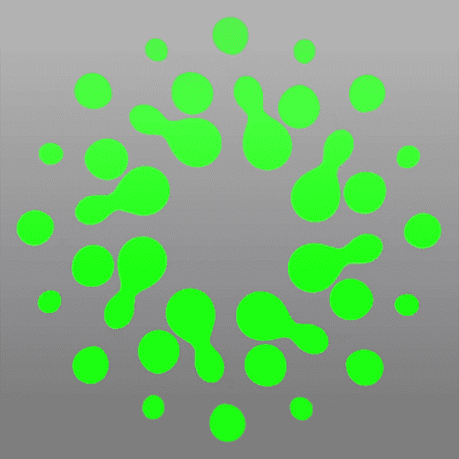

# 纯 CSS 动画#2:变形球

> 原文：<https://medium.com/codex/pure-css-animation-2-metaballs-732a91ba908a?source=collection_archive---------12----------------------->

在一个新项目中，我试图用象形的方式来实验[代谢球](https://en.wikipedia.org/wiki/Metaballs)。我正在设计一个标识，它由像加载器、旋转器和箭头这样的元素组成，以一种未来的界面方式出现。



为此，我决定制作一系列由圆点设计的元素。根据它们的大小和移动，这些点将通过一条血滴状的有机链相互连接。

在我学习期间，我确实使用了像 [paper.js](http://paperjs.org/) 这样的库来做我可以在网站上直接处理的事情(P5js 到来之前)。并且在他们的页面上有一个[代谢球的例子](http://paperjs.org/examples/meta-balls/)。

但是我寻找一种方法在纯 CSS 中实现它，使它轻量级，并在网站更重要的部分使用 JS。简单的方法就是玩模糊和对比。我们只需要模糊孩子的项目，使它们平滑，并创建叠加精灵。之后，改变阈值增加对比度，并对结果进行色调分离。

```
#parent { background: #fff;
  -webkit-filter: brightness(1) contrast(100);
  filter: brightness(1) contrast(100);}.child { background: #000;
  width: 50px;
  height: 50px;
  border-radius: 50%;
  -webkit-filter: blur(10px);
  filter: blur(10px);}
```

之后，我想做一个真正复杂的元素，更接近于一个标识，更有个性。

我开始画一条三点线，这样我以后可以作为一个装载器重复使用。代码完全相同，非常简单。

```
.metaballs { -webkit-filter: brightness(.9) contrast(100);
  filter: brightness(1) contrast(100);
  position: fixed;
  background: #fff;
  width: 100vw;
  height: 100vh;
  padding: 10px 0px;
  top: 50%;
  left: 50%;
  -webkit-transform: translate(-50%, -50%) scale(2);
  transform: translate(-50%, -50%) scale(2); & div {

    background: lime;
    left: 50%;
    top: 50%;
    width: 45px;
    height: 45px;
    -webkit-ftransform: translate(-50%, -50%);
    transform: translate(-50%, -50%);
    border-radius: 50%;
    -webkit-filter: blur(12px);
    filter: blur(10px);
    position: absolute;
    -webkit-animation-duration: 2s;
    -webkit-animation-fill-mode: both;
    -webkit-animation-name: pulse;
    -webkit-animation-iteration-count: infinite;

    &:first-child {
      left: calc(50% - 60px);
    }

    &:last-child {
      left: calc(50% + 60px);
    }

    [@for](http://twitter.com/for) $i from 1 through 3 { &:nth-of-type(#{$i}) {
        -webkit-animation-delay: #{$i * 0.5}s;
      } } }}@-webkit-keyframes pulse { 40% {
    -webkit-transform: translate(-50%, -50%) scale(1.4);
  }}
```

现在我有一条线，并决定复制它和旋转它来创建一个圆。我又用 scss for loop 和 transform-origin 做了一个太阳链形状。变形球效果逐行聚焦，将它们聚集在一起。我用混合模式让白色背景消失。

```
.metaballs__line { position: absolute;
  -webkit-filter: brightness(.9) contrast(120);
  filter: brightness(1) contrast(100);
  mix-blend-mode: lighten; background: #000;
  width: 200px;
  height: 150px;
  left: 50%;
  top: 50%;
  -webkit-transform: translateY(-50%);
  transform: translateY(-50%);
  transform-origin: 0 50%; @for $i from 1 through 16 { &:nth-of-type(#{$i}) { -webkit-transform: translateY(-50%) rotate(#{$i*360/16}deg);
     transform: translateY(-50%) rotate(#{$i*360/16}deg); } }}
```