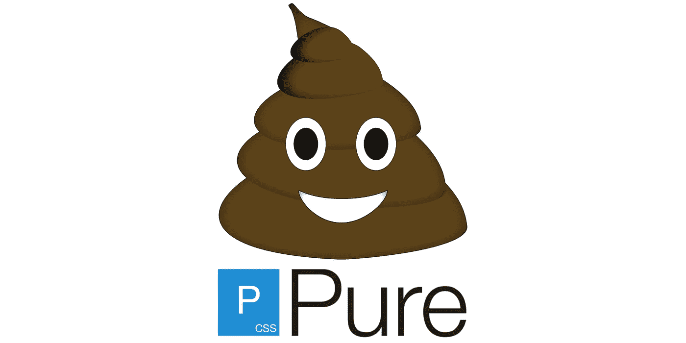

# 纯粹。CSS？更像是纯粹的垃圾

> 原文：<https://medium.com/codex/pure-css-more-like-pure-junk-1ec2d26a1122?source=collection_archive---------0----------------------->

最近有很多人问我对[“纯”CSS 框架](https://purecss.io)的看法，好像我对所有前端框架的看法并不明显。他们都有一个共同的线索，这种系统的**创造者**要么对 HTML 或 CSS 了解不够，无法告诉别人如何制作网站，要么故意推广不良做法。