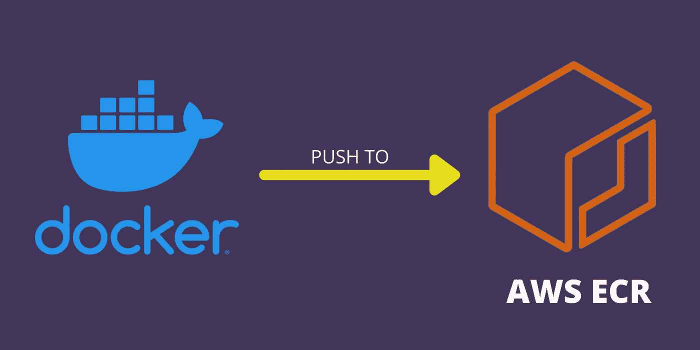

# 将 Docker 图像推送到 AWS ECR

> 原文：<https://medium.com/codex/push-docker-image-to-aws-ecr-e9718df8a729?source=collection_archive---------1----------------------->

## 了解如何创建 Docker 映像、创建 AWS ECR repo、配置 AWS 凭据以及将 Docker 映像推送到 AWS ECR。

AWS ECR

在本教程中，我们将了解如何将 Docker 映像从本地计算机推送到 **AWS ECR(弹性容器注册表)**。以及如何使用 AWS ECR 运行容器。如果您创建了一个 Docker 图像，并希望…