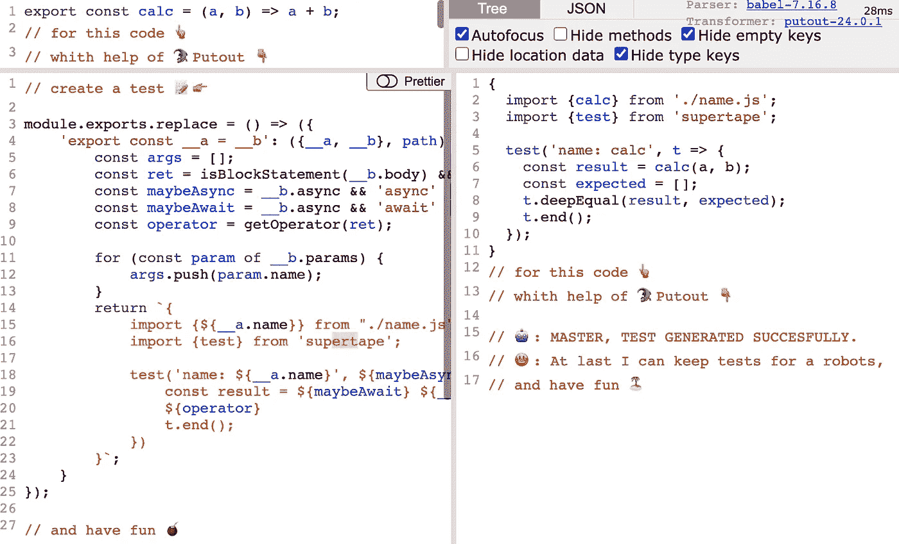
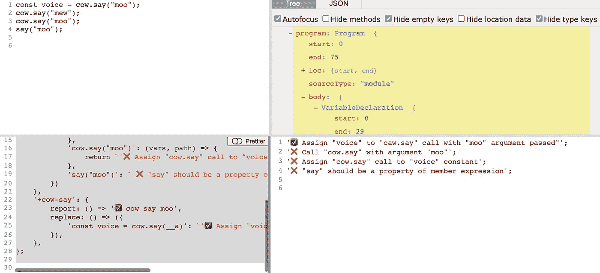

# 输出 v25

> 原文：<https://medium.com/codex/putout-v25-5e1a52268fbd?source=collection_archive---------6----------------------->


# 失去对节点< 16

> *的支持在直重领主墙上的格言中有这样一条:“重大的事情不应该被轻视。lttei 大师评论道:“小事也要认真对待。”*
> 
> *山本恒茂《haga kure》*

嗨伙计们！发布新版本的时候到了🎉！

支持节点版本< 16 is dropped. “Why is so?” — you ask. The main goal of 🐊 【 is **带来软件开发** **过程**的最佳实践。最佳实践之一是:及时更新依赖关系。

节点`v16`稳定，LTS，我认为没有理由等待大约一年，而每个人都下降`v14`。

*☝️如果不能升级就用🐊* `*Putout*` *v24，如果你有任何问题* [*制造问题*](https://github.com/coderaiser/putout/issues/new) *我随时恭候你的帮助:)*

☝️ *需要 github 动作支持帮助使用:*[*@ putout/plugin-github*](https://github.com/coderaiser/putout/tree/master/packages/plugin-github#set-node-versions)

# 应用-数组-at

> 在一个人的事情中，不应该有超过两三件事可以称之为大问题。
> 这些如果是平时推敲，也能理解。事先想好事情，到时候再轻松处理，这才是关键。
> 
> *山本恒茂《haga kure》*

放弃旧节点版本的第二个原因是适应和推广像`[array.at()](https://developer.mozilla.org/en-US/docs/Web/JavaScript/Reference/Global_Objects/Array/at)`这样的新构造。所以从现在开始，当你想得到数组的最后一个元素时,`[@putout/plugin-apply-array-at](https://github.com/coderaiser/putout/tree/master/packages/plugin-apply-array-at#readme)`会被捆绑、启用并帮助你。

# 错误代码的❌示例

```
const array = [1, 2, 3];
console.log(array[array.length - 1]);
```

# 正确代码的✅示例

```
const array = [1, 2, 3];
console.log(array.at(-1));
```

`apply-array-at`是写在🦎[输出脚本](https://github.com/coderaiser/putout/blob/master/docs/putout-script.md)并这样看:

```
module.exports.replace = () => ({
    '__a[__a.length - __b]': '__a.at(-__b)',
});
```

如此少的代码却有如此强大的功能，令人惊叹，不是吗😏？

☝️ *徘徊为什么还在* `[*CommonJS*](https://nodejs.org/api/modules.html#modules-commonjs-modules)` *而不是* `[*ESM*](https://nodejs.org/api/esm.html#modules-ecmascript-modules)` *？不要担心！等到*[*eslint/eslint # 15394*](https://github.com/eslint/eslint/issues/15394)*解决了:我们需要* `[*eslint-plugin-putout*](https://github.com/coderaiser/putout/tree/master/packages/eslint-plugin-putout#eslint-plugin-putout--)` *工作了！反正* `[*convert-commonjs-to-esm*](https://github.com/coderaiser/putout/tree/master/packages/plugin-convert-commonjs-to-esm#putoutplugin-convert-commonjs-to-esm-)` *已经准备好了🤺，到时候——****转换不免*** *✊.*

# `[apply-try-catch](https://github.com/coderaiser/putout/tree/master/packages/plugin-apply-try-catch#putoutplugin-apply-try-catch-)`

在`apply-try-catch`的帮助下，又大又丑的`try-catch`方块将被转换成又小又漂亮的叫声。

# 错误代码的❌示例

```
try {
    say('hello');
} catch (error) {
    log(error);
}
```

# 正确代码的✅示例

```
import tryCatch from 'try-catch';
const [error] = tryCatch(say, 'hello');if (error)
    log(error);
```

这一切都有可能借助于:

*   ✅ `[try-catch](https://github.com/coderaiser/try-catch#try-catch-----)`
*   ✅ `[try-to-catch](https://github.com/coderaiser/try-catch#try-catch-----)`
*   ✅ `[@putout/plugin-declare-undefined-variables](https://github.com/coderaiser/putout/tree/master/packages/plugin-declare-undefined-variables#putoutplugin-declare-undefined-variables-)`

这里是用`try-catch`代替旧语法结构的[推理](https://gist.github.com/coderaiser/a26e535bc43b5fe1ac4d72624bd6bed2)。

# 新加载器 API

> 如果你事先没有下定决心，重新面对一件事并轻松解决它是很困难的，而且在达到目标的过程中总会有不确定性。
> 但是，如果之前就打好了基础，你可以把这句话
> “大事化小，小事化了”，作为自己行动的基础。
> 
> *山本恒茂《haga kure》*

Loaders 是 node.js 的试验性新功能。根据文档，它可以随时更改，但是:

> ☝️Loaders 是覆盖 ESM 中导入模块的唯一方法

🐊**输出**和基于它的工具支持这种实验技术。

节点 v14 有一种类型的加载程序:

*   [resolve(说明符、上下文、默认解析)](https://nodejs.org/dist/latest-v14.x/docs/api/esm.html#esm_resolve_specifier_context_defaultresolve)
*   [getFormat(url，context，defaultGetFormat)](https://nodejs.org/dist/latest-v14.x/docs/api/esm.html#esm_getformat_url_context_defaultgetformat)
*   [getSource(url，context，defaultGetSource)](https://nodejs.org/dist/latest-v14.x/docs/api/esm.html#esm_getsource_url_context_defaultgetsource)
*   [transformSource(source，context，defaultTransformSource)](https://nodejs.org/dist/latest-v14.x/docs/api/esm.html#esm_transformsource_source_context_defaulttransformsource)
*   [getGlobalPreloadCode()](https://nodejs.org/dist/latest-v14.x/docs/api/esm.html#esm_getglobalpreloadcode)

节点 v16 具有其他:

*   [resolve(说明符、上下文、默认解析)](https://nodejs.org/dist/latest-v16.x/docs/api/esm.html#resolvespecifier-context-defaultresolve)
*   [加载(url，上下文，默认加载)](https://nodejs.org/dist/latest-v16.x/docs/api/esm.html#loadurl-context-defaultload)
*   [globalPreload()](https://nodejs.org/dist/latest-v16.x/docs/api/esm.html#globalpreload)

支持他们两个一点都不好玩😅…

☝️ *所以*`[*mock-import*](https://github.com/coderaiser/mock-import)`*`[*zenload*](https://github.com/coderaiser/zenload)`*和🎩* `[*EScover*](https://github.com/coderaiser/escover)` *也更新到只支持最新版本的 API。**

# *减少依赖计数*

**

**[](https://en.wikipedia.org/wiki/Cipactli)**

> ****这三个属性，Sat、Chit、阿难
> (存在、意识、极乐)
> 实际上并没有定义梵天。毒药对别人是毒药，但对自己不是。****
> 
> ****光泽、硬度、黄色、
> 合起来表示黄金。
> 粘、甜、粘，
> 合起来表示蜂蜜。****
> 
> ****jnaneshwara《amṛit'ānubhava》****

***有几个变化，使安装🐊`Putout`更快。***

# ***将规则合并成`promises`***

***`[@putout/plugin-promises](https://github.com/coderaiser/putout/tree/master/packages/plugin-promises#putoutplugin-promises-)`将下一个规则作为依赖项:***

*   ***✅ `apply-top-level-await`***
*   ***✅ `remove-useless-async`***
*   ***✅ `remove-useless-await`***

***但是现在它们合并成了一个 npm 包。***

# ***将规则合并到`remove-empty`***

***同`[@putout/plugin-remove-empty](https://github.com/coderaiser/putout/tree/master/packages/plugin-remove-empty)`它合并了`remove-empty-pattern`。***

# ***`remove-useless-variables`中的新规则`destruct`***

***`remove-useless-variables` [能多做一点点😏](https://github.com/coderaiser/putout/tree/master/packages/plugin-remove-useless-variables#destruct)现在:***

```
***-function hello(args) {
-    const {a, b} = args;
-}
+function hello({a, b}) {
+}***
```

****☝️****

# ***`remove-unused-variables`变得更加强大***

***现在支持`ClassProperties` ( [#96](https://github.com/coderaiser/putout/issues/96) )，编码:***

```
***import thing from ‘./thing.js’;
const pi = Math.PI;export default class {
    static t = thing;
    static mathPi = pi;
    t = thing;
}***
```

***将不会出现误报:***

```
***1:7  error   "thing" is defined but never used  remove-unused-variables 
 3:6  error   "pi" is defined but never used     remove-unused-variables */***
```

***感谢向[@ adamdicallo](https://github.com/adamdicarlo)举报！***

# ***比较***

******

> ***没有任何外在的东西能让你变得更好、更强、更富有、更快或更聪明。
> 万物皆在。一切都存在。不要在自己之外寻求任何东西。”
> 宫本武藏***

***[@输出/比较](https://github.com/coderaiser/putout/tree/master/packages/compare#comparenode-string--node-template-string--node--options-options)中的一些变化。它大量使用了`[Replacer](https://github.com/coderaiser/putout/tree/master/packages/engine-runner#replacer)`、`[Includer](https://github.com/coderaiser/putout/tree/master/packages/engine-runner#includer)`和异人🦎 [**PutoutScript**](https://github.com/coderaiser/putout/blob/master/docs/putout-script.md) 一个活的！***

***很久以前，出于简化的原因，做出了下一个决定:当节点类型不同时，向上比较。***

***但是🎩`[ESCover](https://github.com/coderaiser/escover#readme)`需要保持比较，所以现在我们有了`findUp`标志(*默认开启*):***

```
***compare(path, 'const __a = __b', {
    findUp: false,
});***
```

***和代码:***

```
***const operator = getOperator(ret.argument || ret);***
```

***可以转换为:***

```
***const operator = (__c4['🧨'](4, 17), getOperator((__c4['🧨'](4, 29), ret.argument) || (__c4['🧨'](4, 45), ret)));***
```

***而不是:***

```
***const operator = (__c4['🧨'](4, 17), getOperator(ret.argument || ret));***
```

***而`SequenceExpressions`像`(__c4['🧨'](__d, __e), __f)`被排除在外。***

# ***🤷‍♂️这个变化跟♨️ `Speca`有什么关系？***

***嗯，♨️ `[Speca](https://github.com/coderaiser/speca)`是基于🐊`Putout`。有些病例没有报道，所以我被困在这。***

***它看起来是这样的:***

******

# ***我还能做什么🐊熄灭？***

******

***你可以在转换的帮助下学习人类代码！***

***让我们假设你想学习学生写变量声明:***

```
***const voice = cow.say("moo");***
```

***我们在这里做的是:创建一个名为`voice`的新常量，然后将它赋给`cow.say("moo")`调用表达式。表达式`cow.say("moo")`由成员表达式被调用方`cow.say`和字符串参数`"moo"`组成。让我们看看代码和警告的例子。***

*****代码:*****

```
***const voice = cow.say("moo");
cow.say("mew");
cow.say("moo");
say("moo");***
```

*****警告**:***

```
***‘✅ Assign “voice” to “caw.say” call with “moo” argument passed”’;
‘❌ Call “cow.say” with argument “moo”’;
‘❌ Assign “cow.say” call to “voice” constant’;
‘❌ “say” should be a property of member expression’;***
```

***这是🐊**Putout**实现(没错，你可以用它在玩🐊**输出编辑**😏):***

```
***module.exports.rules = {
    '-cow-say': {
        report: () => '❌ cow say moo',
        match: () => ({
            'cow.say("moo")': ({__a}, path) => {
                return !path.parentPath.isVariableDeclarator();
            },
            'cow.say(__a)': ({__a}, path) => {
                return __a.value !== 'moo';
            },
        }),
        replace: () => ({
            'cow.say(__a)': (vars, path) => {
                return `'❌ Call "cow.say" with argument "moo"'`;
            },
            'cow.say("moo")': (vars, path) => {
                return `'❌ Assign "cow.say" call to "voice" constant'`;
            },
            'say("moo")': `'❌ "say" should be a property of member expression'`,
        })
    },
    '+cow-say': {
        report: () => '✅ cow say moo',
        replace: () => ({
            'const voice = cow.say(__a)': `'✅ Assign "voice" to "caw.say" call with "moo" argument passed"'`,
        }),
    },
};***
```

***实现由捆绑在一起的几个规则组成。这就是嵌套规则的工作方式。***

# ***很好的第一期***

***如果你想帮忙，又不知道怎么帮，看看[好的第一期](https://github.com/coderaiser/putout/issues?q=is%3Aissue+is%3Aopen+label%3A%22good+first+issue%22)标签:)。***

***今天到此为止🎈！祝您愉快，并照顾好您的代码库🦔！***