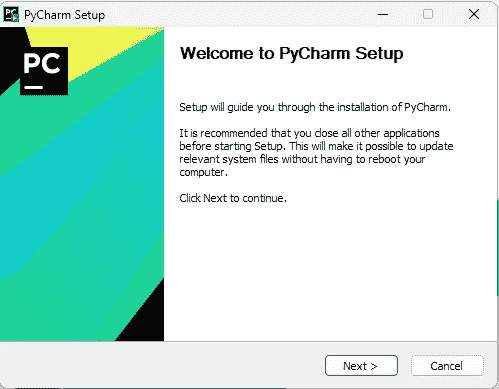

# PyCharm 安装 Windows 11

> 原文：<https://medium.com/codex/pycharm-install-windows-11-186ac1635b31?source=collection_archive---------9----------------------->

## 带屏幕帽的漫游

进入[这一页](https://www.jetbrains.com/pycharm/promo/?source=google&medium=cpc&campaign=14127625568&term=pycharm&content=603858680136&gclid=CjwKCAiAzKqdBhAnEiwAePEjkuJWaEt68m1B6BueCbiLLFo0GfV3OYH9B2yWaJqElizTLfsuVJVEyBoCQf4QAvD_BwE)。

单击下载按钮。

双击安装程序运行。

