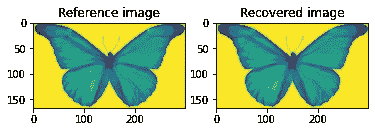

# PyCUDA、FFT 和 Gerchberg-Saxton 算法

> 原文：<https://medium.com/codex/pycuda-the-fft-and-the-gerchberg-saxton-algorithm-35fb7bceb62f?source=collection_archive---------0----------------------->

恢复其振幅和变换振幅已知的二维函数的问题是一个经典的光学问题。

解决这个问题的第一个简单算法是 Gerchberg 和 Saxton 的算法。它包括给振幅已知的函数的相位分配一个初始猜测。随后，对如此获得的函数进行傅立叶变换。变换的相位被保留，而幅度被称为问题数据的数据所取代。如此获得的变换被变换回空间域。以非常类似于在变换域中所做的方式，在空间域中，函数的相位被保留，而幅度被问题数据代替。该过程继续进行，直到达到收敛。停止迭代的一个标准可以是当未知函数从一次迭代到另一次迭代没有显著变化时返回结果。

Gerchberg 和 Saxton 算法也被归类为*相位恢复*算法，因为其目标是从未知函数的振幅和其变换的振幅开始恢复未知函数的相位。

在 [Retro Refractions](https://www.retrorefractions.com/blog/) 博客上，可以检索到很多关于我们正在讨论的问题和正在讨论的算法的有用信息。

本文的目的是展示 Gerchberg 和 Saxton 算法的一个简单 PyCUDA 实现，这也给我们提供了一个机会，指出在图形处理器(GPU)上计算并行 FFT 和 IFFTs 的一个可能的例程。

在下面的例子中，我们将使用蝴蝶的黑白图像的强度的平方根作为未知函数的振幅，而变换的振幅将被认为一致等于 1。

在深入 PyCUDA 实现之前，让我们先来看一个顺序 Python 版本。在下面的[链接](https://github.com/vitalitylearning2021/FFT/tree/main/GerchbergSaxton)中可以找到顺序和并行版本。

Python 中实现 Gerchberg 和 Saxton 算法的函数如下:

请注意，`measuredAmplitudeSpace`和`measuredAmplitudeFourier`是问题的数据，即函数和变换函数的振幅，未知函数的相位完全随机选择。由于`numpy`库的功能，产生了随机相位。

在`for`循环中，函数及其变换的振幅被问题数据反复替换。在顺序情况下，FFT 和 IFFT 是通过`numpy`库实现的。

PyCUDA 中实现 Gerchberg 和 Saxton 算法的函数如下:

它假设`d_img`输入图像已经是 PyCUDA `gpuarray`。与之相反，它返回一个`numpy`数组。

该函数遵循与 Python 实现相同的代码行。未知函数的相位仍然是随机选择的，这一次要感谢 PyCUDA 库的功能，它允许直接在 GPU 上生成随机数组。并行 FFT 的实现得益于`skcuda`库的`fft`功能，它本质上是 CUDA `cuFFT`库的一个包装器。与`cuFFT`库例程一样，`skcuda` FFT 库也需要一个`plan`。与顺序版本不同，由于 PyCUDA 提供的元素运算，通过将函数除以其幅度来提取相位。更多详情，请参见 PyCUDA 中的[基本运算。](https://vitalitylearning.medium.com/elementary-operations-in-pycuda-5cb8d0b72161?source=your_stories_page-------------------------------------)

最后，在位于[链接](https://github.com/vitalitylearning2021/FFT/tree/main/GerchbergSaxton)的存储库中，Gerchberg 和 Saxton 函数的另一个并行版本实现如下:

在这个稍有不同的版本中，*投影*操作，即替换作为问题数据涉及的函数的幅度，是通过一个显式 CUDA 内核实现的:

