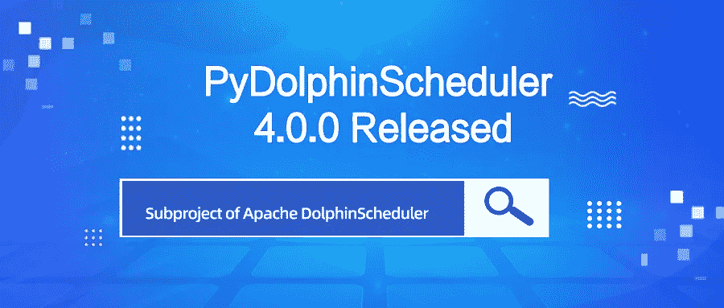

# PyDolphinScheduler 4.0.0 正式发布

> 原文：<https://medium.com/codex/pydolphinscheduler-4-0-0-officially-released-878ba20cf4b6?source=collection_archive---------12----------------------->

> 最近，Apache DolphinScheduler 子项目 PyDolphinScheduler 迎来了 PyDolphinScheduler 4 . 0 . 0(DolphinScheduler-SDK-python)的第一个发布版本，它将作为一个独立的存储库进行维护。

**新建仓库:**[**https://github.com/apache/dolphinscheduler-sdk-python**](https://github.com/apache/dolphinscheduler-sdk-python)

PyDolphinScheduler 4.0.0 的主要变化包括:

*   支持工作流执行策略#9
*   添加身份验证令牌#13
*   添加对 DolphinScheduler 版本检测#47 的支持
*   将时间增量类型用于工作流超时#41
*   提交工作流只创建一次链接#16
*   工作流名称从流程定义更改为工作流#42

# 特征

*   通过 [#9](https://github.com/apache/dolphinscheduler-sdk-python/pull/9) 中的[@中建杰](https://github.com/zhongjiajie)将执行类型添加到工作流中
*   【壮举】在 [#13](https://github.com/apache/dolphinscheduler-sdk-python/pull/13) 中通过[@中建杰](https://github.com/zhongjiajie)添加令牌作为 python 网关的认证
*   【专长】【任务】通过 [#15](https://github.com/apache/dolphinscheduler-sdk-python/pull/15) 中的 [@tuchg](https://github.com/tuchg) 支持 Kubernetes 任务
*   【功绩】在 [#41](https://github.com/apache/dolphinscheduler-sdk-python/pull/41) 中通过[@中建杰](https://github.com/zhongjiajie)将工作流超时标记为类型时间增量
*   通过 [#44](https://github.com/apache/dolphinscheduler-sdk-python/pull/44) 中的[@中建杰](https://github.com/zhongjiajie)将变更日志添加到我们的文档中
*   【功绩】通过 [#47](https://github.com/apache/dolphinscheduler-sdk-python/pull/47) 中的[@中建杰](https://github.com/zhongjiajie)对 dolphinscheduler 主包进行版本检查

# 改善

*   对于 [#16](https://github.com/apache/dolphinscheduler-sdk-python/pull/16) 中[@中建杰](https://github.com/zhongjiajie)提交的单个工作流，只创建一个连接
*   【impv】请勿在 [#33](https://github.com/apache/dolphinscheduler-sdk-python/pull/33) 中[@钟家杰](https://github.com/zhongjiajie)开发版本中警告
*   【impv】在 [#43](https://github.com/apache/dolphinscheduler-sdk-python/pull/43) 中由[@钟家杰](https://github.com/zhongjiajie)添加工作流和任务的选项参数
*   【测试】通过 [#46](https://github.com/apache/dolphinscheduler-sdk-python/pull/46) 中的 [@jieguangzhou](https://github.com/jieguangzhou) 优化任务插件中的测试用例

# 错误修正

*   【修复】由 [#36](https://github.com/apache/dolphinscheduler-sdk-python/pull/36) 中的[@钟家杰](https://github.com/zhongjiajie)上传资源并添加文档
*   【修复】在 [#35](https://github.com/apache/dolphinscheduler-sdk-python/pull/35) 中[@钟家杰](https://github.com/zhongjiajie)上传开发分支资源

# 文件

*   【doc】在 [#28](https://github.com/apache/dolphinscheduler-sdk-python/pull/28) 中通过[@钟家杰](https://github.com/zhongjiajie)添加历史和版本兼容性

# 例行工作

*   【苦差事】通过 [#1](https://github.com/apache/dolphinscheduler-sdk-python/pull/1) 中的[@钟家杰](https://github.com/zhongjiajie)从主 repo apache/dolphinscheduler 中迁移代码
*   【ci】在 [#10](https://github.com/apache/dolphinscheduler-sdk-python/pull/10) 中添加可合并并启用 github 发布[@钟家杰](https://github.com/zhongjiajie)
*   【苦差事】通过 [#11](https://github.com/apache/dolphinscheduler-sdk-python/pull/11) 中的[@钟家杰](https://github.com/zhongjiajie)提高 CI，修复死锁
*   【杂务】被 [#17](https://github.com/apache/dolphinscheduler-sdk-python/pull/17) 中的[@钟家杰](https://github.com/zhongjiajie)合并后启用删除分支
*   【家务】通过 [#26](https://github.com/apache/dolphinscheduler-sdk-python/pull/26) 中的[@钟家杰](https://github.com/zhongjiajie)将类名从流程定义改为工作流
*   [ci]避免计划事件通过[@钟嘉杰](https://github.com/zhongjiajie)在 [#29](https://github.com/apache/dolphinscheduler-sdk-python/pull/29) 上传太多文件到 codecov
*   【杂务】更改综合测试行为，并在 [#30](https://github.com/apache/dolphinscheduler-sdk-python/pull/30) 中通过[@钟家杰](https://github.com/zhongjiajie)添加一些文档
*   【苦差事】CI python 版本从 3.11-dev 到 3.11 由[@钟家杰](https://github.com/zhongjiajie)在 [#31](https://github.com/apache/dolphinscheduler-sdk-python/pull/31)
*   【苦差事】修正徽章许可证，并在 [#32](https://github.com/apache/dolphinscheduler-sdk-python/pull/32) 中通过[@钟家杰](https://github.com/zhongjiajie)将下载改为 pypy.tech
*   【苦差事】通过 [#37](https://github.com/apache/dolphinscheduler-sdk-python/pull/37) 中的[@钟家杰](https://github.com/zhongjiajie)修复 ubuntu-latest 无法在 github 动作中设置 python
*   【家务】通过 [#39](https://github.com/apache/dolphinscheduler-sdk-python/pull/39) 中的[@钟家杰](https://github.com/zhongjiajie)更改网站链接
*   【苦差事】在 [#42](https://github.com/apache/dolphinscheduler-sdk-python/pull/42) 中通过[@钟家杰](https://github.com/zhongjiajie)修改 pd 的工作流实例名称

# 贡献者

**钟家街、土城街、广州街**

*   [@tuchg](https://github.com/tuchg) 在 [#15](https://github.com/apache/dolphinscheduler-sdk-python/pull/15) 第一次投稿
*   [@杰光州](https://github.com/jieguangzhou)在 [#46](https://github.com/apache/dolphinscheduler-sdk-python/pull/46) 第一次投稿

完整变更日志: [3.1.0…4.0.0](https://github.com/apache/dolphinscheduler-sdk-python/compare/3.1.0...4.0.0)

# 从 DolphinScheduler 资源库分离的原因

*   **职责明确**:pyDolphinScheduler 的代码库是独立于 dolphin scheduler 的，它有自己的用户和开发人员、CI、测试用例，甚至语言也不一样。
*   **独立发布周期** : PyDolphinScheduler 是一个 SDK，应该独立于 DolphinScheduler 发布。分离之前，每次 DolphinScheduler 的时候都要释放 PyDolphinScheduler。这就带来了问题:
*   DolphinScheduler 的发布周期对于 PyDolphinScheduler 来说太长了，因为 PyDolphinScheduler 是 DolphinScheduler 的一个新的子项目，它还不够稳定，我们有许多功能和增强功能想要添加，所以我们必须更频繁地发布 DolphinScheduler。
*   每次 DolphinScheduler 的时候我们都要释放 PyDolphinScheduler，即使 PyDolphinScheduler 没有变化。在过去，我们同时发布了这两个版本，一些 DolphinScheduler 错误修复版本，如 2.0.5，2.0.6，2.0.7，只修复了 DolphinScheduler 中的一些错误，而不是 PyDolphinScheduler，没有必要发布 PyDolphinScheduler 但我们必须发布。
*   应该使用与 DolphinScheduler 相同的版本，由于相同的发布周期，我们必须拥有与 DolphinScheduler 相同的版本，所以您可能会看到 DolphinScheduler bug 修复版本中有一些功能性的加法器，对于 PyDolphinScheduler 用户来说可能会有点陌生。
*   **更快的 CI 运行** : PyDolphinScheduler 有自己的 CI，当我们只更改 PyDolphinScheduler 代码时，没有必要运行 DolphinScheduler CI。而且 DolphinScheduler CI 更完整，合并 pull 请求需要用到一部分 CI，把 PyDolphinScheduler 和 DolphinScheduler 分开可以让 CI 在两个仓库都运行得更快。

更多详情请参考[分离邮件线程讨论](https://lists.apache.org/thread/4z7l5l54c4d81smjlk1n8nq380p9f0oo)。

需要注意的是，从 DolphinScheduler 库分离出来后，PyDolphinScheduler 会独立发布，PyDolphinScheduler 的版本不会对应 DolphinScheduler 的版本，这意味着在 PythonGateway 代码没有变化的情况下，PyDolphinScheduler 的部分版本会对应多个 DolphinScheduler 版本。而 PyDolphinScheduler 的部分代码只会对应一个版本的 DolphinScheduler，如果 PythonGateway 下一个版本的代码发生了变化。

为了提醒用户，这是一个特殊的版本，我们故意放弃遵循之前的 3.1.x 版本号，而是使用了 4.0.0，这不仅表明这是一个全新的版本，也让用户意识到异常，并关注我们的变化。

更多信息，请参考[https://dolphinscheduler.apache.org/python/4.0.0/#history](https://dolphinscheduler.apache.org/python/4.0.0/#history)

📌📌欢迎填写[这份调查](https://www.surveymonkey.com/r/7CHHWGW)来反馈您的用户体验或您对 Apache DolphinScheduler 的想法:)

【https://www.surveymonkey.com/r/7CHHWGW 