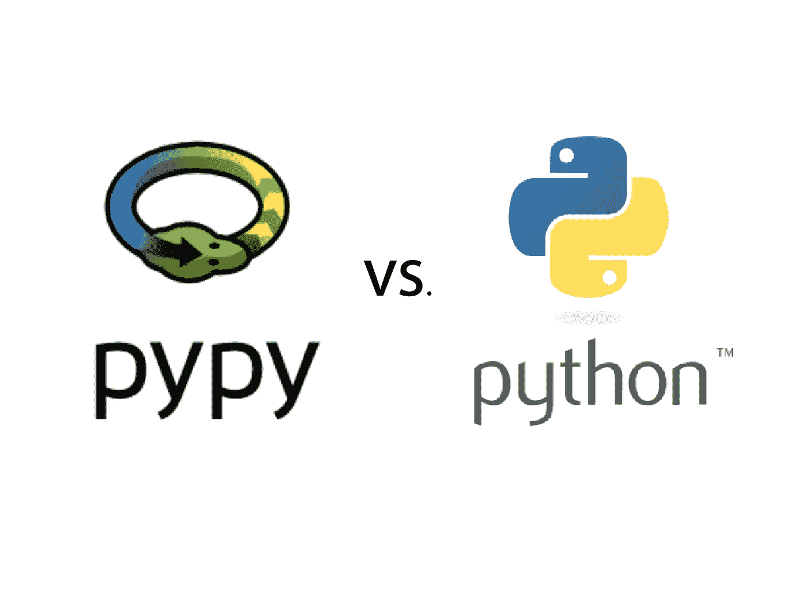

# PyPy 真的比 Python 快吗？这里有 5 个基准

> 原文：<https://medium.com/codex/pypy-vs-python-49153daca65c?source=collection_archive---------1----------------------->

## 编程；编排

## HTTP、数据库、算法等等

Python 很慢。

我又说了一遍。每个人都知道。然而，对于许多用 Python 编写的程序来说，糟糕的性能并不是什么大问题。