# Pyspark 数据帧

> 原文：<https://medium.com/codex/pyspark-for-begineers-part-2-pyspark-dataframe-60008da53e30?source=collection_archive---------3----------------------->

> DataFrame 现在是一个行业流行语，人们倾向于在各种情况下使用它。在本文中，我们将了解更多关于 Pyspark 中的数据框架、其特性、重要性、创建以及使用 Pyspark 数据框架的探索性数据分析。稍后，我们将使用一个用例。

要了解更多关于 Pyspark 的知识并成为一名认证的 Pyspark 开发人员，请阅读第 1 部分:Pyspark 初学者。

[](https://muttinenisairohith.medium.com/pyspark-for-beginners-part-1-introduction-638fb16c5092) [## Pyspark 初学者|第 1 部分:简介

### PySpark 是 Apache Spark 的 Python API。使用 PySpark，我们可以在分布式集群上并行运行应用程序…

muttinenisairohith.medium.com](https://muttinenisairohith.medium.com/pyspark-for-beginners-part-1-introduction-638fb16c5092) 

**Pyspark 数据帧**

Dataframes 是一种类似于 excel 表或 SQL 表的数据结构，其中数据被组织成行和列。通常，行代表观察的数量。行可以有多种数据格式，比如*异构*，而列可以有相同数据类型的数据，比如*同构*。除了数据，数据帧通常还包含一些元数据；例如，列名和行名。

**py spark 数据帧的特点**


*   数据帧在本质上是分布式的，这使得它们成为容错和高度可用的数据结构。
*   **惰性求值**是一种求值策略，它保持对表达式的求值，直到需要它的值。避免了重复评估。Spark 中的惰性求值意味着直到一个动作被触发，执行才会开始。在 Spark 中，当 Spark 转换发生时，就会出现懒惰评估的情况。
*   数据帧本质上是不可变的。这意味着一旦创建就不能改变。但是我们可以通过应用某种转换来转换它的值，就像在 RDDs 中一样。

**PySpark 数据帧创建**

首先，让我们构建 Sparksession，在 2.0 版本之后，Sparksession 成为了 Spark 的入口点。

```
from pyspark.sql import SparkSessionspark =SparkSession.builder.appName("Practice").getOrCreate()
spark
```

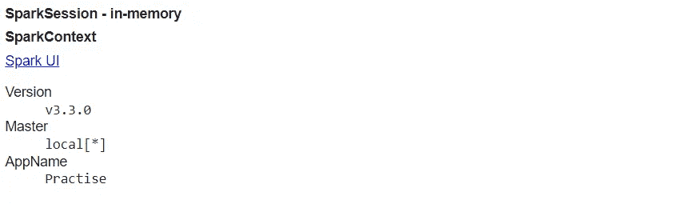

我们创建了一个名为“实践”的应用程序 SparkSession。创建 SparkSession 后，让我们从 RDD 创建一个 Spark 数据框架。

```
from pyspark.sql import RowEmployee = Row("firstName", "lastName", "email", "salary")employee1 = Employee('Basher','armbrust','bash@edureka.co',100000)
employee2 = Employee('Daniel','meng','daniel@stanford.edu',120000)
employee3 = Employee('Muriel',None, 'muriel@waterloo.edu',140000)
employee4 = Employee('Rachel','wendell','rach_3@edureka.co',160000)
employee5 = Employee('Zach','galifikis','zach_g@edureka.co', 160000)employees = [employee1,employee2,employee3,employee4,employee5]
```

我们已经创建了一个 employees 实例，让我们使用 **createDataFrame** 命令将其转换为 DataFrame。

```
df_pyspark = spark.createDataFrame(employees)
df_pyspark.show()
```

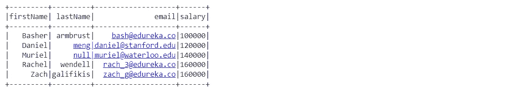

**从外部来源创建数据帧:**

在这里，我们将了解如何从 CSV、JSON 等外部来源读取数据。，转换成 Pyspark 数据帧。对于这一部分，我将使用以下示例 [**CSV**](https://github.com/muttinenisairohith/Encoding-Categorical-Data/blob/7ebb851bf47a608dfb41093771e1b16597603d96/data/test1.csv) 。

```
df_pyspark = spark.read.csv("test1.csv", inferSchema=True, header=True)df_pyspark.show()
```

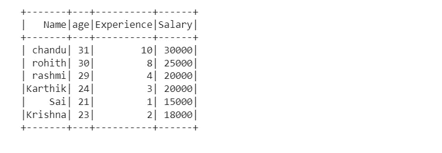

这里使用了 read options header 和 inferSchema。header 用于从 CSV 文件中收集列名，而 inferSchema 用于自动检测数据帧中每一列的数据类型。
**注意:**在没有 inferSchema = True 的情况下，不管列的性质如何，在 Pyspark 中每一列都会被读取为一个字符串。

**。show()** 用于直观地查看数据帧及其内容。类似于。头()在熊猫中，这里我们可以用。show(n)在数据帧中显示 n 行。

```
df_pyspark.show() #shows top 20 rows in DataFrame
df_pyspark.show(3) #shows top 3 rows in DataFrame
df_pyspark.head(5) # shows top 5 rows in DataFrame but in Row Format
```

**。printSchema()**

为了查看 DataFrame 的模式和结构，我们将使用 printSchema 方法。这将为我们提供数据帧中的不同列，以及该特定列的数据类型和可空条件。

```
df_pyspark.printSchema()
```

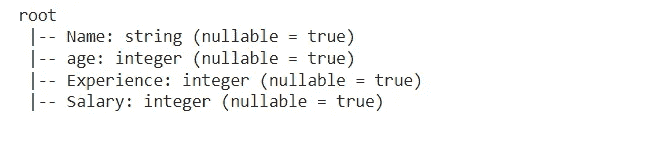

**。count()** —了解数据帧中的行数

```
df_pyspark.count()  
# Output: 6
```

。**列** —要知道数据帧中列的名称。使用列。它将返回所有列的列表。

```
print(df_pyspark.columns)   # lists all columns in DataFrame
print(len(df_pyspark.printSchema())  # lists no.of.columns
```

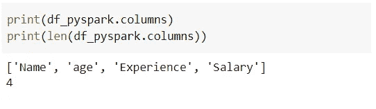

**。dtypes**——类似熊猫，。dtypes 用于了解数据帧中每一列的数据类型

```
print(df_pyspark.dtypes)
```

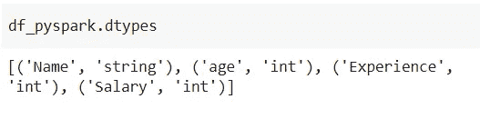

**注意—**py spark 数据帧中默认不支持就地操作。我们需要执行相等操作来转换数据帧。

**汇总统计数据—** 获取数据帧中所有数值列的汇总统计数据(mean，stddev，max)，类似于 pandas， ***。*形容使用()方法。**

```
df_pyspark.describe().show()
```

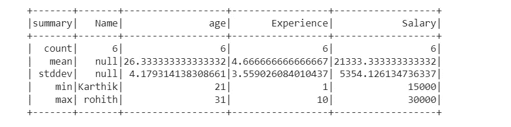

**选择数据帧的特定列—** 选择数据帧的特定列。使用选择命令。不像熊猫，切片在 Pyspark 是不可能的。强制使用选择命令。

```
df_pyspark.select(["Name","Age"]).show(5)+-------+---+
|   Name|Age|
+-------+---+
| chandu| 31|
| rohith| 30|
| rashmi| 29|
|Karthik| 24|
|    Sai| 21|
+-------+---+
only showing top 5 rows
```

**。distinct() —** 在数据帧中查找不同的值。使用 distinct()方法。

```
df_pyspark.select(["Name"]).distinct().count()#6
```

**。with column()—**data frame 的转换函数，用于更改值、转换现有列的数据类型、创建新列，等等，如下所示:

1.  更改列的数据类型

```
df_pyspark = df_pyspark.withColumn("Age",df_pyspark["Age"].cast("String"))df_pyspark.printSchema()
```

2.更新现有列的值

```
df_pyspark.withColumn("salary",df_pyspark["salary"]*100).show()
```

3.从现有列创建新列

```
df_pyspark.withColumn("Experience * salary", df_pyspark["Experience"]*df_pyspark["salary"]).show()
```

4.使用 withColumn()添加新列— lit 方法用于在整个数据帧中添加文字常量

```
from pyspark.sql.functions import litdf_pyspark.withColumn("Country",lit("India")).show()
```

5.重命名列

```
df_pyspark.withColumnRenamed("Name","Full Name") .show()
```

6.从 PySpark 数据框架中删除列

```
df_pyspark.withColumnRenamed("Name","Full Name") .show()
```

**toPandas()** —将 Pyspark 数据帧转换为 Pandas 数据帧。

```
df_pyspark.toPandas()
```

**创建没有模式的空数据帧**

```
from pyspark.sql.types import StructType,StructField, StringTypedf = spark.createDataFrame([], StructType([]))
df.printSchema()
```

**使用模式**从空 RDD 创建空数据帧

```
from pyspark.sql.types import StructType,StructField, StringTypeemptyRDD = spark.sparkContext.emptyRDD()schema = StructType([
  StructField('firstname', StringType(), True),
  StructField('middlename', StringType(), True),
  StructField('lastname', StringType(), True)
  ])#Create empty DataFrame from empty RDD
df = spark.createDataFrame(emptyRDD,schema)
df.printSchema()
```

**在 Pyspark 数据帧中删除一列**

```
df_pyspark.drop("Experience * salary").show()
```

**py spark 数据帧中的过滤器**

PySpark `filter()`函数用于根据给定的条件或 SQL 表达式过滤数据帧中的行，其中()方法也可以代替 filter()

1.  使用列()条件过滤(选择年龄> 25 岁的数据)

```
df_pyspark.filter(df_pyspark["age"]>25).show()
```

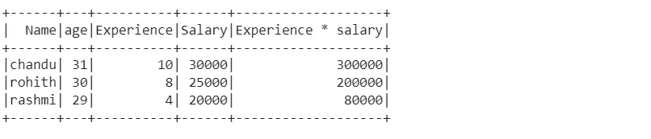

2.使用过滤器()仅选择年龄大于 25 岁的姓名和年龄

```
df_pyspark.filter(df_pyspark["age"]>25).select(["Name","age"]).show()
```

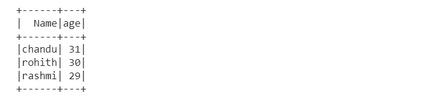

3.基于两列的筛选— And 条件

```
df_pyspark.filter((df_pyspark["age"]>25) & (df_pyspark["salary"]>=20000)).show()
```

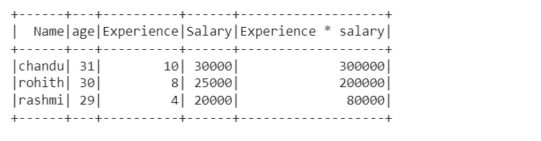

4.基于两列或条件进行过滤

```
df_pyspark.filter((df_pyspark["age"]>25) | (df_pyspark["salary"]>=20000)).show()
```

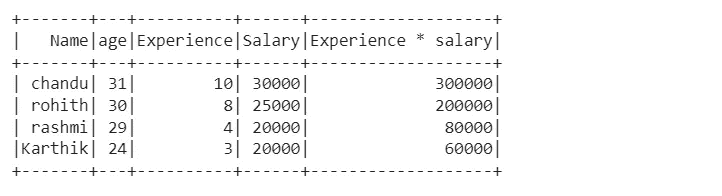

4.基于两列过滤—非条件

```
df_pyspark.filter(~(df_pyspark["age"]>25)).select(["Name","age"]).show()
```

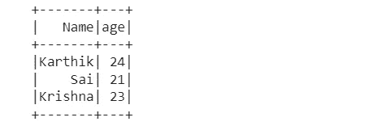

展望未来，我们将在 Pyspark 数据框架中涵盖更多主题，我认为这将变得冗长。

我在下面的文章中添加了关于 groupby()、连接、处理缺失值和其他概念的信息。一定要参考一下…

[](https://muttinenisairohith.medium.com/pyspark-for-begineers-part-3-pyspark-dataframe-db02f0fcd275) [## 初学者用 Pyspark |第 3 部分:Pyspark 数据框架

### DataFrame 现在是一个行业流行语，人们倾向于在各种情况下使用它。在我们之前的文章中，我们…

muttinenisairohith.medium.com](https://muttinenisairohith.medium.com/pyspark-for-begineers-part-3-pyspark-dataframe-db02f0fcd275) 

快乐编码和学习…