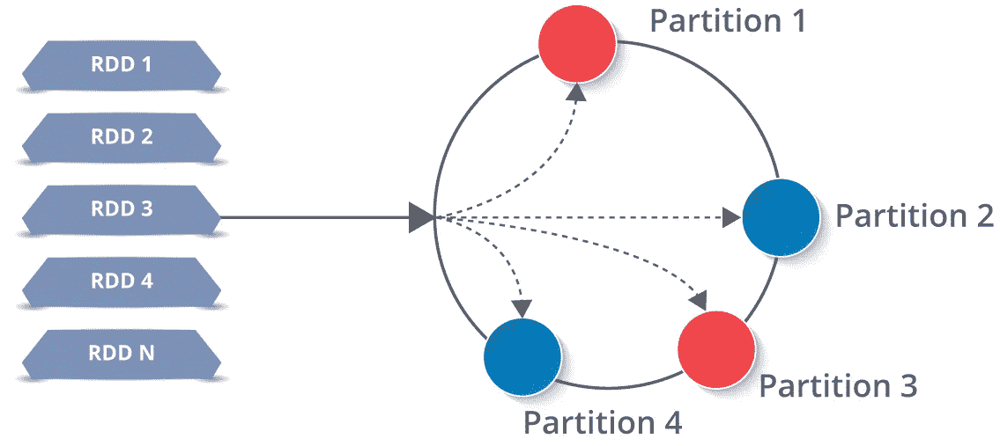
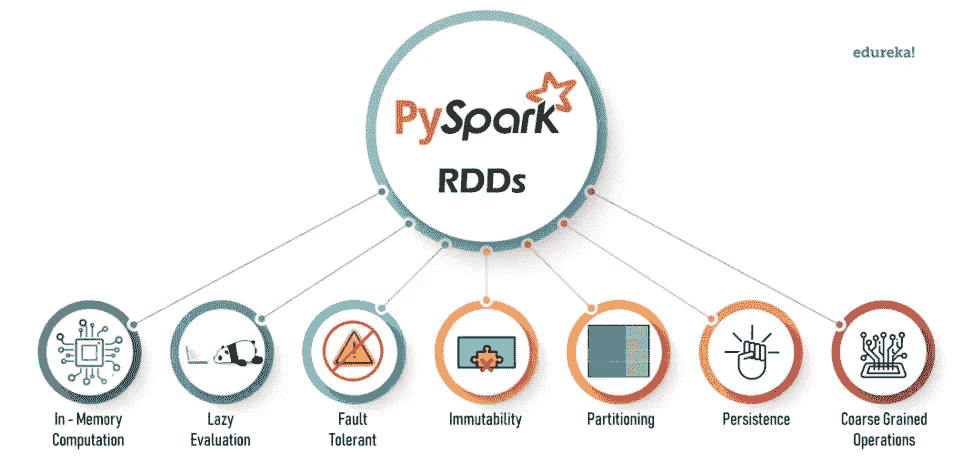
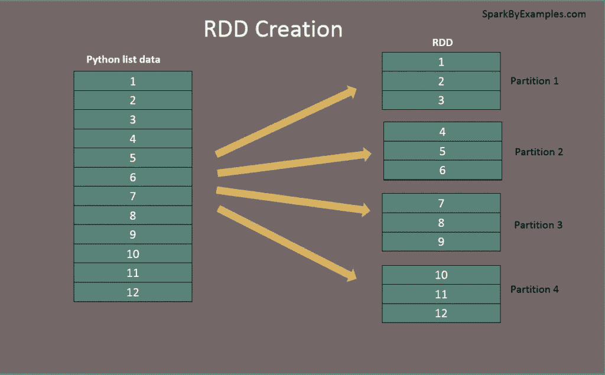

# 派斯帕克·RDD

> 原文：<https://medium.com/codex/pyspark-for-beginners-part-4-pyspark-rdd-7b5587347b4c?source=collection_archive---------8----------------------->

> 弹性分布式数据集(rdd)是 Pyspark 的基本构建块，Pyspark 是一种分布式内存抽象，可帮助程序员在大型集群上以容错方式执行内存计算。在本教程中，我们将重点介绍，RDD 的特点，对 RDD，RDD 和其他概念的转换和行动。

要了解更多关于 Pyspark 的知识并成为一名认证的 Pyspark 开发人员，请阅读第 1 部分:Pyspark 初学者。

[](https://blog.devgenius.io/pyspark-for-beginners-part-1-introduction-638fb16c5092) [## Pyspark 初学者|第 1 部分:简介

### PySpark 是 Apache Spark 的 Python API。使用 PySpark，我们可以在分布式集群上并行运行应用程序…

blog.devgenius.io](https://blog.devgenius.io/pyspark-for-beginners-part-1-introduction-638fb16c5092) 

RDD 是一个类似于 Python 中的列表的对象集合，不同之处在于 RDD 是在分布于多个物理服务器(也称为集群中的节点)的多个进程上计算的，而 Python 集合只在一个进程中运行和处理。默认情况下，它提供并行性。



rdd 主要用于 I/O 操作，因为在内存中，通过 rdd 共享数据要快 10-100 倍。

**RDD 的特色:**



**创造 RDD**

可以从 sparkSession 的 sparkContext 中使用 parallelize()方法创建 RDD。在 2.0 版本之后，sparkSession 可以用来创建 sparkContext。

让我们首先创建一个 sparkSession

```
from pyspark.sql import SparkSessionspark = SparkSession.builder.appName("Practice").getOrCreate()
```

创建 sparkSession 后，让我们创建 RDD

```
myRDD = spark.sparkContext.parallelize(["chandu",1,"rohith",2,"minu",3,"karthik",4])
```

这里，我们使用并行化方法来创建 RDD



该函数将驱动程序中的现有集合加载到并行化 RDD 中。对于生产应用程序，我们通常使用外部存储系统来创建 RDD，如`HDFS`、`S3`、`HBase`等

1.  使用并行化方法:

```
myRDD = spark.sparkContext.parallelize(["chandu",1,"rohith",2,"minu",3,"karthik",4])myRDD.take(4)# Output:
# ['chandu', 1, 'rohith', 2, 'minu', 3, 'karthik', 4]
```

2.使用文本文件-要从. txt 文件创建 RDD，我们将使用 sparkContext 中的文本文件

```
New_RDD = spark.sparkContext.textFile("Sample.txt")
```

3.使用 CSV 文件-创建 RDD。我们将使用的 csv 文件。地图转换，我们将在后面讨论。

```
CSV_RDD = (spark.sparkContext.textFile("file:///home/edureka/Downloads/fifa_players.csv".map(lambda element: element.split(",")))
```

对于本文，我们将使用通过并行化方法创建的 myRDD

# **pySpark RDD 行动:**

动作是在 RDD 上应用的操作，用于指示 Apache Spark 应用计算并将结果传递回驱动程序。

**。take(n) —** 从 RDD 返回前 n 个元素

```
myRDD = spark.sparkContext.parallelize(["chandu",1,"rohith",2,"minu",3,"karthik",4])myRDD.take(4)# Output:
# ['chandu', 1, 'rohith', 2]
```

**。collect() —** 用于返回 RDD 的所有元素。一般来说，当数据较多时，从驱动程序加载所有数据并返回到控制台是非常繁忙的。所以不使用 collect()，而是使用 take()方法。

```
myRDD = spark.sparkContext.parallelize(["chandu",1,"rohith",2,"minu",3,"karthik",4])myRDD.collect()# Output:
# ["chandu",1,"rohith",2,"minu",3,"karthik",4]
```

**。count()** —用于获取 RDD 中元素的数量

```
myRDD.count()# Output:
# 8
```

。 **first()** —用于返回 RDD 的第一个元素

```
myRDD.first()# Output:
# "chandu"
```

**。top(n)** —用于返回 RDD 中最大的 n 个元素

```
myRDD = spark.sparkContext.parallelize([1,3,2,4])
myRDD.top(2)# Output:
# [4, 3]
```

**。min()，。max()** —用于返回 RDD 的最小、最大元素

```
myRDD = spark.sparkContext.parallelize([1,3,2,4])
print(myRDD.min(),myRDD.max())# Output:
# 1 4
```

**。reduce()**-使用指定的二元运算符减少数据集的元素。

```
myRDD = spark.sparkContext.parallelize([1,3,2,4])add = lambda x,y: x + y
myRDD.reduce(add)# Output:
# 10
```

**。fold()** —类似于 reduce，但 reduce 和 fold 的区别在于，reduce 取第一个和第二个元素，而 fold 取第一个元素。

```
myRDD = spark.sparkContext.parallelize([1,3,2,4])from operator import addmyRDD.fold(0, add)# Output: 10
```

**。saveAsTextFile()** —用于将生成的 RDD 作为文本文件提供。

```
myRDD.saveAsTextFile('file.txt')
```

**。getNumPartitions() —** 返回分区的数量

```
myRDD.getNumPartitions()# Output
# 2
```

# **派斯帕克 RDD 变换:**

PySpark RDD 变换是惰性求值，用于从一个 RDD 变换到另一个。由于 RDD 在本质上是不可变的，转换总是创建新的 RDD 而不更新现有的，因此，RDD 转换链创建了 RDD 谱系或 RDD 算子图，或 RDD 依赖图。

**。map()** —转换接受一个匿名函数，并将该函数应用于 RDD 中的每个元素

```
myRDD = spark.sparkContext.parallelize([1,3,2,4])myRDD = myRDD.map(lambda x: x + 1)
myRDD.collect()# Output:
# [2, 4, 3, 5]
```

**。filter()** —转换接受一个匿名函数，用于过滤出满足函数中特定条件的元素。

```
myRDD = spark.sparkContext.parallelize([1,3,2,4])myRDD = myRDD.filter(lambda x: x>2)
myRDD.collect()# Output:
# [3,4]
```

**。distinct()** —此转换返回 RDD 中的不同元素

```
myRDD = spark.sparkContext.parallelize([1,3,2,4,3,5,2,4])myRDD = myRDD.distinct()
myRDD.collect()# Output:
# [2, 4, 1, 3, 5]
```

**。union()** —合并两个 RDD 并返回一个 RDD

```
myRDD = spark.sparkContext.parallelize([1,3,2,4])myRDD1 = myRDD.filter(lambda x: x>2)  # [3,4]myRDD2 = myRDD.filter(lambda x: x%2==0) # [2,4]unionRDD = myRDD1.union(myRDD2)
unionRDD.collect()# Output:
# [2,4,3,4]
```

**。flatMap()** —执行与**相同。map()** 转换并返回原始 RDD 中每个元素的单独值。

```
flatmap_rdd = spark.sparkContext.parallelize(["Hey there", "This is PySpark RDD"])flatmap_rdd.flatMap(lambda x: x.split(" ")).collect()# Output:
# ['Hey', 'there', 'This', 'is', 'PySpark', 'RDD']
```

**。重新分区(n)** —在 RDD 上创建 n 个分区

```
myRDD = spark.sparkContext.parallelize([1,3,2,4])print("Number of Partitions Before: ",myRDD.getNumPartitions())myRDD = myRDD.repartition(3)print("Number of Partitions Before: ",myRDD.getNumPartitions())# Output:
# Number of Partitions Before:  2 
# Number of Partitions Before:  3
```

**。coalesce()** —当我们想要减少分区时，类似于 repartition by 操作更好。与所有节点相比，通过重新分区，从更少的节点对数据进行重新排序，可以实现更好的性能。

# PySpark 对 RDD 操作

Pair RDDs 是 PySpark 中一种特殊的数据结构，采用键值对的形式。键被称为标识符，而值被称为数据。

```
marks = [('Rahul', 88), ('Swati', 92), ('Shreya', 83), ('Abhay', 93), ('Rohan', 78)]pairRDD = spark.sparkContext.parallelize(marks)
```

**。countByKey()** 操作— 返回基于键值对的成对 RDD 的计数

```
marks_rdd = spark.sparkContext.parallelize([('Rahul', 25), ('Swati', 26), ('Rohan', 22), ('Rahul', 23), ('Swati', 19), ('Shreya', 28), ('Abhay', 26), ('Rohan', 22)])dict_rdd = marks_rdd.countByKey()dict(dict_rdd)# Output:
# {'Abhay': 1, 'Rahul': 2, 'Rohan': 2, 'Shreya': 1, 'Swati': 2}
```

**。reduceByKey()** 转换-将每个键的值与指定的函数合并。

```
marks_rdd = spark.sparkContext.parallelize([('Rahul', 25), ('Swati', 26), ('Shreya', 22), ('Abhay', 29), ('Rohan', 22), ('Rahul', 23), ('Swati', 19), ('Shreya', 28), ('Abhay', 26), ('Rohan', 22)])print(marks_rdd.reduceByKey(lambda x, y: x + y).collect())# Output:
# [('Rahul', 48), ('Shreya', 50), ('Rohan', 44), ('Swati', 45), ('Abhay', 55)]
```

**。sortByKey()** 转换-根据关键字对 RDD 元素进行排序

```
marks_rdd = spark.sparkContext.parallelize([('Rahul', 25), ('Swati', 26), ('Shreya', 22), ('Abhay', 29), ('Rohan', 22), ('Rahul', 23), ('Swati', 19), ('Shreya', 28), ('Abhay', 26), ('Rohan', 22)])print(marks_rdd.sortByKey('ascending').collect())# Output:
# [('Abhay', 29), ('Abhay', 26), ('Rahul', 25), ('Rahul', 23), ('Rohan', 22), ('Rohan', 22), ('Shreya', 22), ('Shreya', 28), ('Swati', 26), ('Swati', 19)]
```

**。groupByKey()** 转换-根据关键字对 RDD 元素进行分组

```
marks_rdd = spark.sparkContext.parallelize([('Rahul', 25), ('Swati', 26), ('Shreya', 22), ('Abhay', 29), ('Rohan', 22), ('Rahul', 23), ('Swati', 19), ('Shreya', 28), ('Abhay', 26), ('Rohan', 22)])marks_grouped_rdd = marks_rdd.groupByKey()for i,j in marks_grouped_rdd.collect():
    print(i,list(j))# Output:
Rahul [25, 23] 
Shreya [22, 28] 
Rohan [22, 22] 
Swati [26, 19] 
Abhay [29, 26]
```

**RDD 到数据帧，反之亦然**

我们可以使用以下语法将 RDD 数据帧和 RDD 数据帧进行转换:

```
# Converts RDD to DataFrame
dfFromRDD1 = rdd.toDF()
# Converts RDD to DataFrame with column names
dfFromRDD2 = rdd.toDF("col1","col2")
# using createDataFrame() - Convert DataFrame to RDD
df = spark.createDataFrame(rdd).toDF("col1","col2")
# Convert DataFrame to RDD
rdd = df.rdd
```

这就是我认为我们已经涵盖了大部分的 RDD 概念。

下一步要了解更多关于 Pyspark DataFrame 的信息，请参考 [**这里。**](https://muttinenisairohith.medium.com/pyspark-for-begineers-part-2-pyspark-dataframe-60008da53e30)

快乐编码和学习。