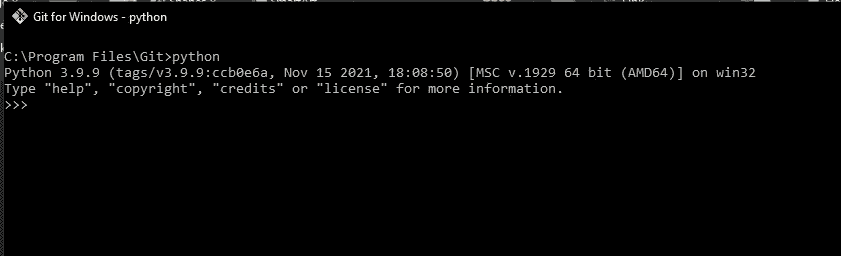
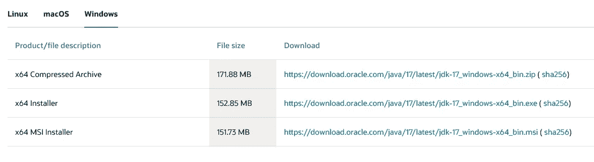
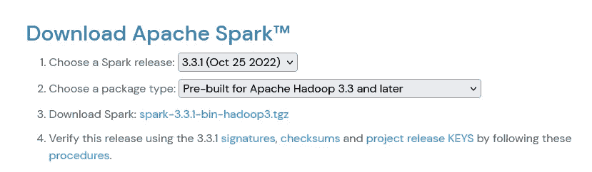
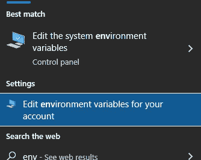
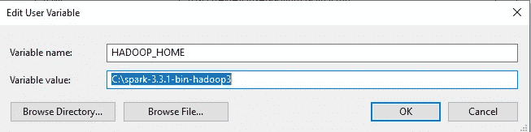
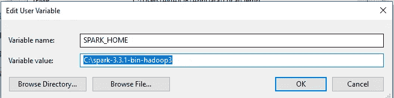
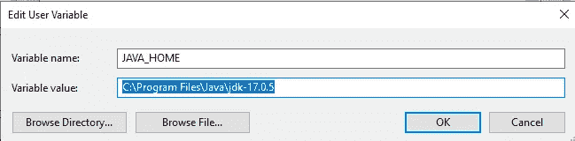
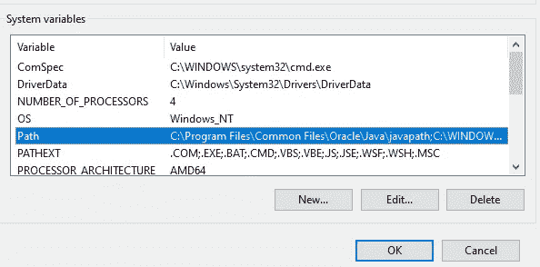
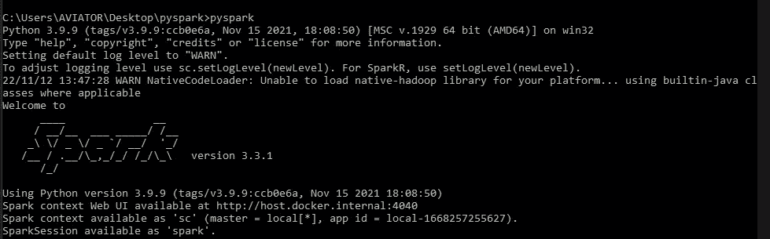
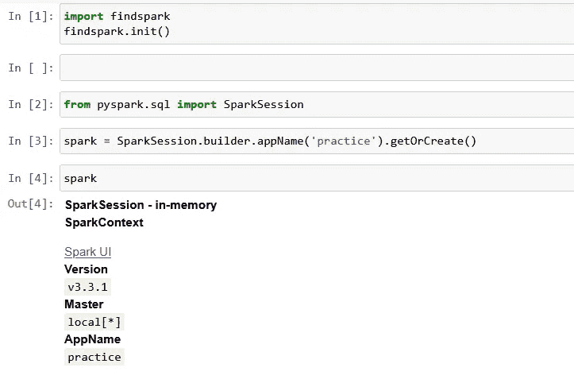

# Pyspark:在 Windows 上安装并运行您的第一个 pyspark 程序

> 原文：<https://medium.com/codex/pyspark-setup-on-windows-and-run-your-first-pyspark-program-7ce7c2833338?source=collection_archive---------4----------------------->


Jez Timms 在 [Unsplash](https://unsplash.com?utm_source=medium&utm_medium=referral) 上拍摄的照片

Apache Spark 是一个广泛用于处理和使用大数据和数据工程项目的框架。 **Python** 是一种用于数据分析、数据工程等等的编程语言。大多数数据专业人员都熟悉 Python，并在工作流中使用它。PySpark 允许他们使用自己熟悉的语言工作，而不需要学习另一种语言的语法。

PySpark 是 Python 中 Apache Spark 的接口。使用 PySpark，您可以编写类似 Python 的命令来操作和分析数据。它的发布是为了支持 Apache Spark 和 Python 之间的协作。如果您熟悉 python 的用法，那么使用 pyspark 就不会那么困难了。

# 在 Windows 上安装 Pyspark

必备软件

Python 3

Java 17

Winutils

7-zip

**Python**

[在这里下载 python](https://www.python.org/downloads/windows/)。下载版本至少高于 3.7

在安装过程中，记得点击将 python 添加到 path 的选项。

下载和安装后，检查 python 是否安装成功。

打开命令提示符并输入 python。您应该会得到下面的输出



# **Java** :

Apache Spark 对 Java 有依赖性。下载 Java 17 x64 安装程序并运行其安装

[Java 17 这里](https://www.oracle.com/java/technologies/downloads/#java17)



# Winutils

要在本地运行 Apache Spark，需要 winutils。[在此下载](https://github.com/cdarlint/winutils/tree/master/hadoop-3.2.2/bin)

# 7-zip

[在此下载](https://www.7-zip.org/download.html)

Spark 以 GZIP 档案文件的形式压缩而来。tgz)文件。默认情况下，windows
并没有提供一种本地方式来提取这种文件。一个流行的解压选项是 7-zip。访问网站，下载软件，并按照
安装指南操作

# 阿帕奇火花

点击访问他们的网站[并下载。](https://spark.apache.org/downloads.html)



下载完成后，解压文件并将文件夹移动到 C:\驱动器目录。我的是这样放的。**C:\ spark-3 . 3 . 1-bin-Hadoop 3**

注意:您可能需要解压文件两次

将下载的 winutils.exe 文件移动到 spark 的 bin 目录中。

这里是我的**C:\ spark-3 . 3 . 1-bin-Hadoop 3 \ bin**

一旦完成了以上工作，接下来就是设置环境变量了

# 设置环境变量

单击 Windows 按钮，在搜索栏中键入 env，并从显示的可用选项中单击“编辑您帐户的环境变量”。



单击 new，并设置以下环境变量。



转到您移动 winutils 软件的 spark 文件夹路径。这里是我的:**C:\ spark-3 . 3 . 1-bin-Hadoop 3 \ bin。**复制这条路径。

在系统变量下，单击路径，然后单击编辑。点击新建，粘贴你复制的路径。单击确定三次。



按照 windows 的一贯要求，您可能需要重新启动计算机，环境变量才能生效。

# 测试 PySpark

一旦一切都设置好了，启动命令提示符并键入 pyspark。如果在安装过程中一切正常，您将看到下面的输出。



酷毙了。PySpark 现已启动并运行。访问 [http://localhost:4040](http://localhost:4040) 查看 pyspark 运行情况。

注意:确保 pyspark 仍然在命令提示符下运行

# 在 jupyter 笔记本上运行 pyspark

要用 pyspark 写一些代码，我们需要启动 jupyter notebook。

首先，安装 jupyter 笔记本

```
pip install jupyter
```

为了让 jupyter 与 pyspark 一起正常工作，我们需要安装另一个名为 findspark 的库。

它使得 pyspark 可以作为常规库导入。[文档](https://pypi.org/project/findspark/)

```
pip install findspark
```

在命令提示符下，键入 jupyter notebook。笔记本的一个实例应该已经启动并正在运行。

导入下面的库，并从您的 jupyter 笔记本上观看 pyspark 的神奇之处



现在我们可以使用 jupyter 和 pyspark，导入我们的数据集，并做一些令人惊讶的事情。

如果你到了这里，恭喜你。一切都应该运行良好，您应该准备好开始处理大数据了，在您的机器上本地安装 pyspark。

在本指南中，我们介绍了如何在本地机器上安装 pyspark，使其工作所需的依赖项，以及如何在 jupyter notebook 上启动 pyspark。