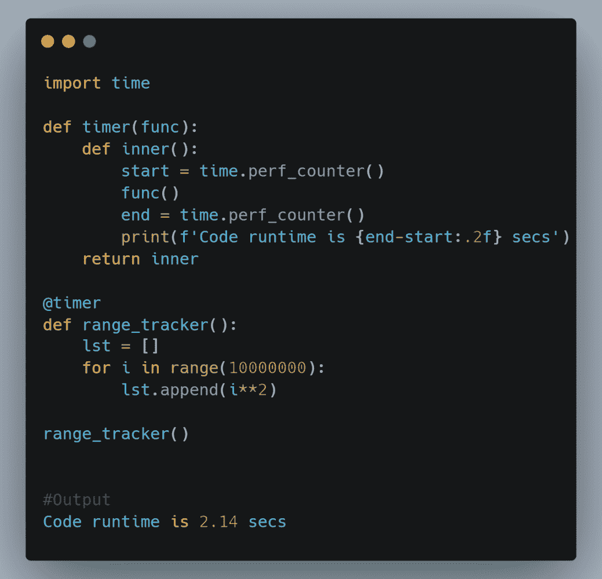
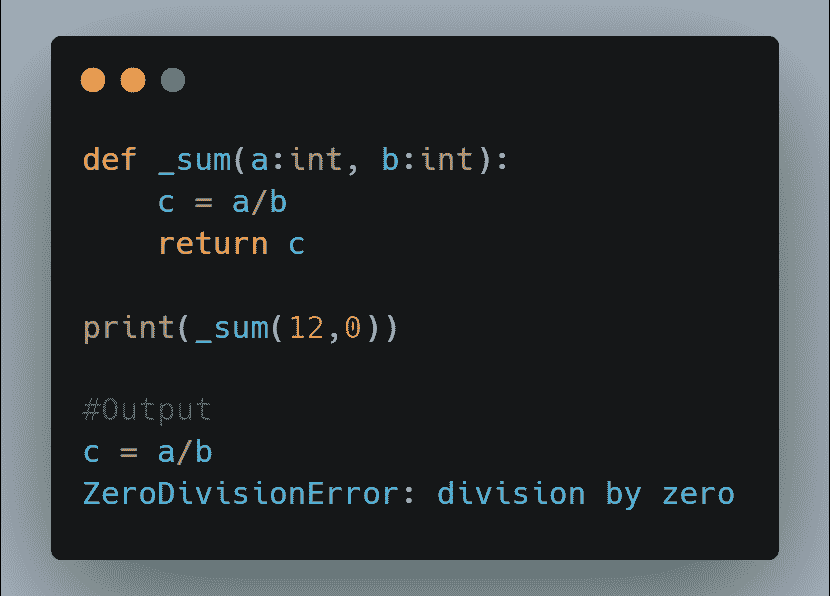
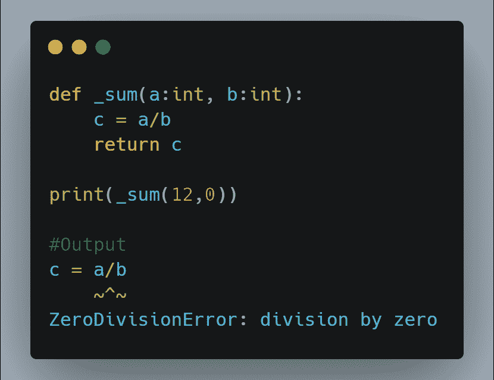
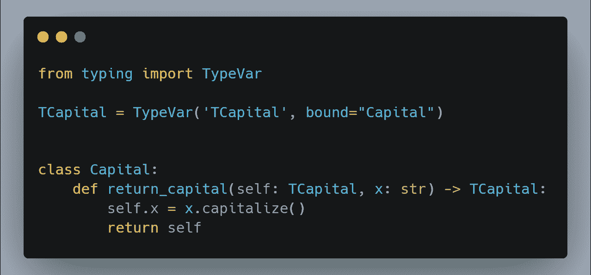
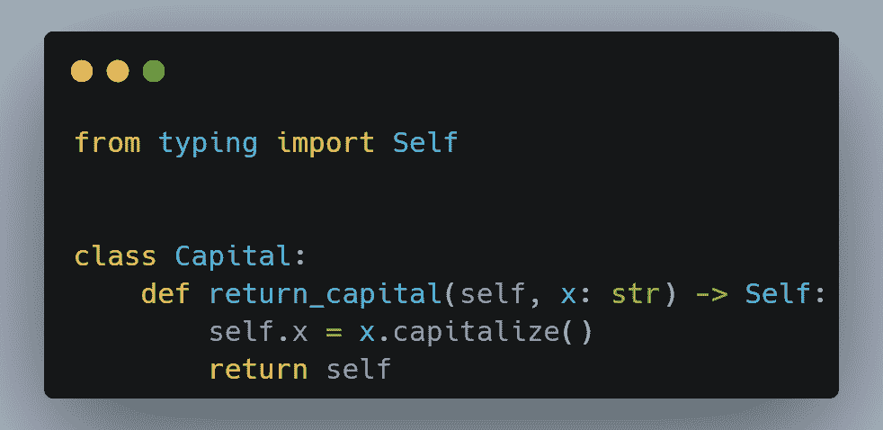
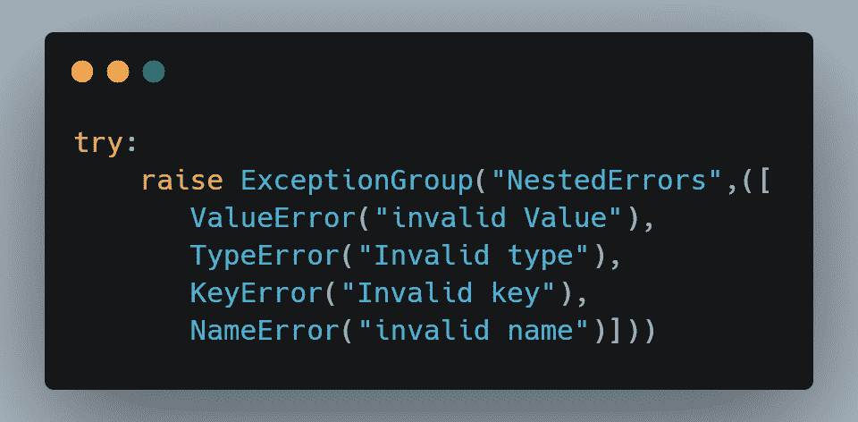
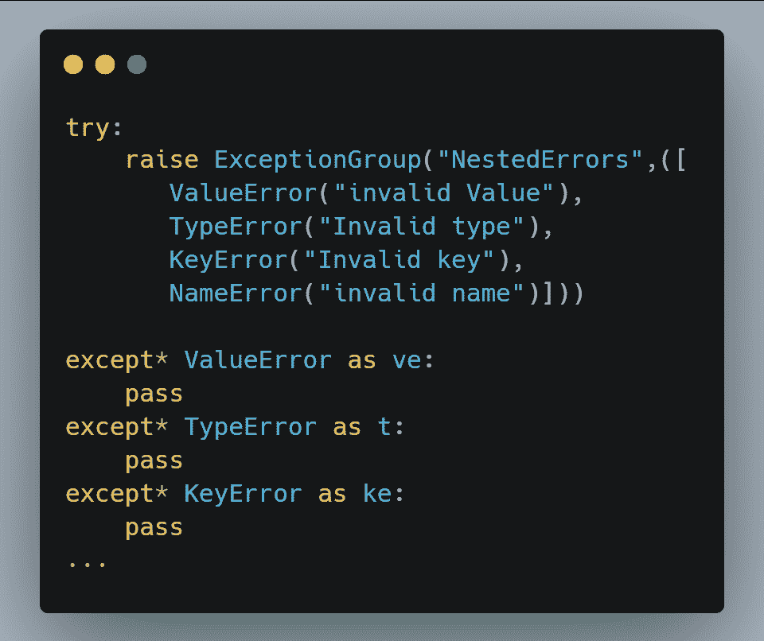
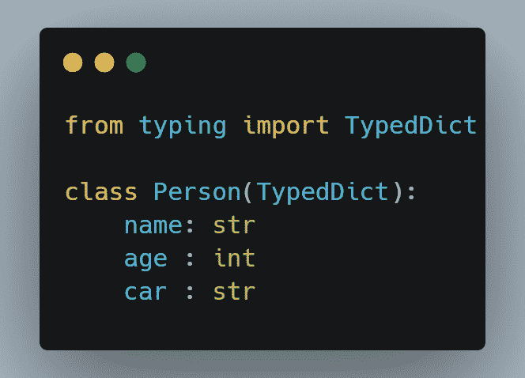
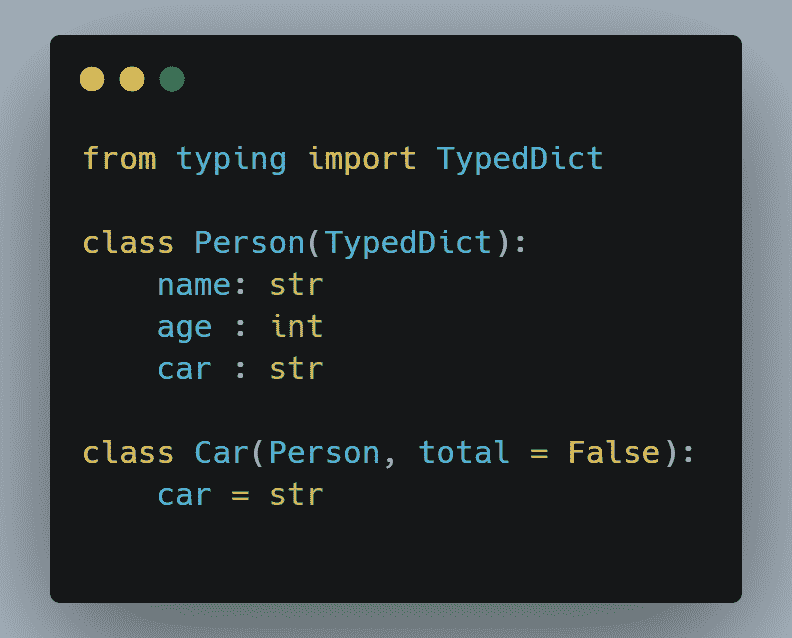
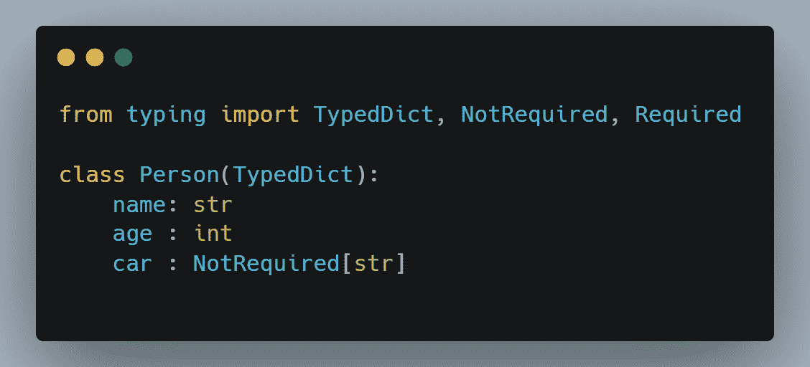

# Python 3.11:解包五个新特性。

> 原文：<https://medium.com/codex/python-3-11-unpacking-five-new-features-ca05925f5495?source=collection_archive---------0----------------------->

图片由 SHVETS 制作:[https://www . pexels . com/photo/young-搬迁-女士-打包-纸箱-盒子-坐在地板上-7203812/](https://www.pexels.com/photo/young-relocating-lady-packing-carton-boxes-sitting-on-floor-7203812/)

Python 3.11 就要发布了，每个新版本都有新的特性。在本文中，我们将看看 Python 3.11 的五(5)个很酷的新特性，你应该期待一下。

# 1.比前一版本快 60%

Python 3.11 预计比 Python 3.10 快 60%，具体取决于您的工作负载。平均而言，在启动和运行时间方面，预计它将比以前的版本快 25%。为了证实这一点，我用 Python 3.11 和 Python 3.10 运行了相同的代码，并比较了执行时间。运行时结果证实 Python 3.11 比以前的版本快得多。请参见下面的代码:

使用 Python 3.10

执行时间为 5.50 秒。

使用 Python 3.11

执行时间为 2.14 秒。

# 2.改进了回溯中的错误位置

为了演示这一新特性，我们将使用两个示例。我们将使用 Python 3.10 运行第一个示例，使用 Python 3.11 运行第二个示例。这两个代码都会产生错误。请注意错误消息中的差异。

**例二**

以上两个代码都输出零除法误差。第一个例子只返回有错误的行(c = a/b ),但是它没有具体说明错误的确切原因。在第二个示例(使用 Python 3.11)中，它不仅返回有错误的行，而且还指向代码中导致错误的实际元素，即除法(/)符号。

# 3.用自身类型注释代码

在以前的 Python 版本中，如果想要注释返回类实例的方法，可以使用类型模块的 TypeVar 类。Python 3.11 增加了一种新的直观方式来注释方法，而不使用基于类型变量的方法。下面的第一段代码演示了如何实现基于 TypeVar 的方法。第二段代码演示了使用 self 类型的新 Python 3.11 方法。

在 Python 3.11 中，您将使用 Self 类型注释类的方法。你可以在下面看到 Python 3.11 的方法使得代码更加简洁易懂。

# 4.用异常组处理多个异常

Python 3.11 将包含一个新的内置异常类型，称为 ExceptionGroup。这种异常类型令人兴奋的地方在于，它可以同时引发多个不同的异常或错误。ExceptionGroup 接受两个参数，一个字符串，然后是我们希望引发和处理的一系列错误。参见下面的代码:

一旦我们抛出错误，我们可以使用新的 except*块来处理错误。见下文:

except*还可以对多个异常进行分组。有关这一全新内置标准的更多信息，请查看以下链接:

# 5.TypeDict 必需和非必需键。

Python 3.8 在类型模块中引入并添加了 TypedDict。TypedDict 类型使得用特定的键和值创建字典成为可能。然而，如果我们希望某些信息在字典中是可选的，那么用 TypedDict 实现就不容易了。让我们用一个例子来说明这一点。我们将创建一个包含三(3)个关键字的字典—姓名、年龄和汽车。见下文:

上面的字典需要这个人的姓名、年龄和驾驶的汽车。但是，我们想让汽车信息可选，因为不是每个人都有车。为了在 Python 3.10 或更早的版本中实现这一点，我们必须创建另一个类(子类)来实现可选键。在以前的 Python 版本中，这是唯一的方法。下面是代码的样子:

在上面的代码中，total 是 false，因为这个车钥匙现在是可选的。如果有人没有汽车，他们可以省略汽车部分。

Python 3.11 引入了*必需的*和*非必需的*类型来解决这类问题。使用这些类型( *Required* 和 *NotRequired* ，我们不必创建一个子类来实现一个可选键，相反，我们可以将可选键注释为 *NotRequired* 。见下文:

# 结论。

这些是 Python 3.11 中的一些新特性。Python 3.11 的 beta 预览版于 2022 年 5 月 8 日发布。Python 的最终版本预计将于 2022 年 10 月发布。请分享文章，关注我，订阅在我发表文章时获得通知。