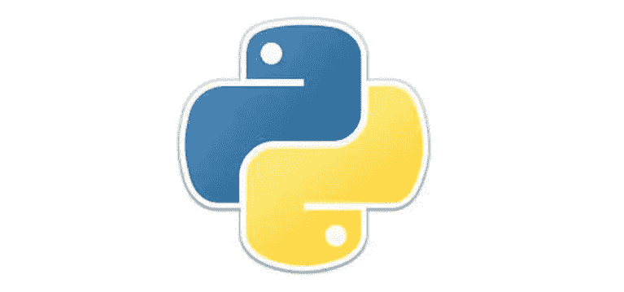

# Python 一个简短的教程

> 原文：<https://medium.com/codex/python-a-short-tutorial-f1d9c65b6e87?source=collection_archive---------3----------------------->

这篇教程是在我试图学习这门语言的时候编写的。在这里展示它，是为了那些想快速了解这门语言的人，而不需要翻阅所有的手册。这不是一个“完整的参考”，也不是一个“傻瓜的 Python”。它是为那些了解开发并想了解 Python 世界的人准备的。