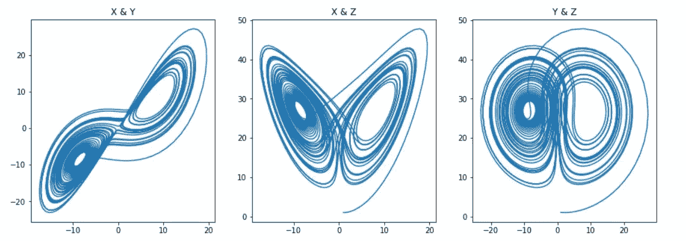

# Python 和物理学:洛伦兹和罗斯勒系统

> 原文：<https://medium.com/codex/python-and-physics-lorenz-and-rossler-systems-65735791f5a2?source=collection_archive---------1----------------------->

基于我以前关于龙格-库塔方法的文章，我们将探索龙格-库塔方法在绘制著名的洛伦兹和罗斯勒系统图中的一些应用。

# **洛伦兹**

洛伦兹系统是一组方程，显示了某些参数的混沌行为，最显著的是产生了一个有趣的图形。我们将要使用的方程如下


洛伦兹方程

这些将是我们将插入到我们的导数函数中的方程，这样我们就可以应用 RK4(龙格-库塔四步法)方法。首先，我们从导入必要的包开始。

```
import numpy as np #For arrays
import matplotlib.pyplot as plt #For plotting
```

然后，我们从这些方程要用到的变量开始。

```
sigma = 10.0 #Variable for dx/dt
rho = 28.0 #Variable for dy/dt
beta = 8/3 #Variable for dz/dt
t = 0 #Starting time
tf = 40 #Ending time
h = 0.01 #Step size for RK4#These variables were used since they can be easily found for comparison, for example, in Wikipedia under the Lorenz system article
```

随着变量的设定，我们现在开始研究导数函数。

```
#Derivative function to work with RK4 loop
def derivative(r,t):
    x = r[0]
    y = r[1]
    z = r[2]
    return np.array([sigma * (y - x), x * (rho - z) - y, (x * y) - (beta * z)])
```

导数函数的快速复习。 *r* 变量用于数组内部设置的初始条件。我们为每个变量分配数组的值，在本例中为 3，然后函数将返回开始时画出的微分方程，但现在是初始条件。每次循环经历一次迭代，函数将继续用新值更新，这些新值将存储在下面的数组中。

```
time = np.array([]) #Empty time array to fill for the x-axis
x = np.array([]) #Empty array for x values
y = np.array([]) #Empty array for y values
z = np.array([]) #Empty array for z valuesr = np.array([1.0, 1.0, 1.0]) #Initial conditions array
```

现在，随着我们的主要部分的设置，我们只是继续前进，并适用于 RK4 循环内的一切，我们结束了

```
while (t <= tf ): #Appending values to graph
        time = np.append(time, t)
        z = np.append(z, r[2])
        y = np.append(y, r[1])
        x = np.append(x, r[0]) #RK4 Step method
        k1 = h*derivative(r,t)
        k2 = h*derivative(r+k1/2,t+h/2)
        k3 = h*derivative(r+k2/2,t+h/2)
        k4 = h*derivative(r+k3,t+h)
        r += (k1+2*k2+2*k3+k4)/6 #Updating time value with step size
        t = t + h
```

运行循环后，我们的数组应该填充了等量的值，所以现在我们可以继续绘制这些值，这样我们就可以看到它们如何使用下面的代码生成图形。

```
#Multiple graph plotting
fig, (ax1,ax2,ax3) = plt.subplots(1,3, figsize = (15, 5))
ax1.plot(x, y)
ax1.set_title("X & Y")
ax2.plot(x, z)
ax2.set_title("X & Z")
ax3.plot(y, z)
ax3.set_title("Y & Z")
plt.show()
```



针对每个变量绘制的洛伦兹系统图

这些是一些有趣的图表！通过对希腊变量使用不同的值，我们可以看到系统行为的变化，有些值会产生复杂的图形。

# **罗斯勒**

与 Lorenz 系统非常相似，我们将微分方程应用于我们的导数函数，并通过 RK4 循环运行它，以使用以下方程产生 Rossler 系统的可视化表示。


罗斯勒方程

有了这些方程，我们只要把我们的导函数方程中的返回线改成这些，我们就都设置好了。在下面，你会找到完整的代码，以及产生的图表。

```
import numpy as np
import matplotlib.pyplot as plta = 0.2
b = 0.2
c = 5.7
t = 0
tf = 100
h = 0.01def derivative(r,t):
    x = r[0]
    y = r[1]
    z = r[2]
    return np.array([- y - z, x + a * y, b + z * (x - c)])time = np.array([])
x = np.array([])
y = np.array([])
z = np.array([])r = np.array([0.1, 0.1, 0.1])while (t <= tf ):

        time = np.append(time, t)
        z = np.append(z, r[2])
        y = np.append(y, r[1])
        x = np.append(x, r[0])

        k1 = h*derivative(r,t)
        k2 = h*derivative(r+k1/2,t+h/2)
        k3 = h*derivative(r+k2/2,t+h/2)
        k4 = h*derivative(r+k3,t+h)
        r += (k1+2*k2+2*k3+k4)/6

        t = t + hfig, (ax1,ax2,ax3) = plt.subplots(1,3, figsize = (15, 5))
ax1.plot(x, y)
ax1.set_title("X & Y")
ax2.plot(x, z)
ax2.set_title("X & Z")
ax3.plot(y, z)
ax3.set_title("Y & Z")
plt.show()
```


罗斯勒系统图，针对每个变量绘制

与洛伦兹系统非常相似，罗斯勒系统也表现出复杂的行为，这取决于方程所用的变量。

# **概述**

我们可以看到龙格-库塔方法对于使用常微分方程的编程方程是多么有用。虽然这些更多的是为了探索物理概念，但这种方法也可以用于帮助其他更实际的模拟。此外，我强烈建议查看这两个系统的维基百科页面，因为它们实际上向你展示了如何在三维空间中用 Python 编写这些方程！