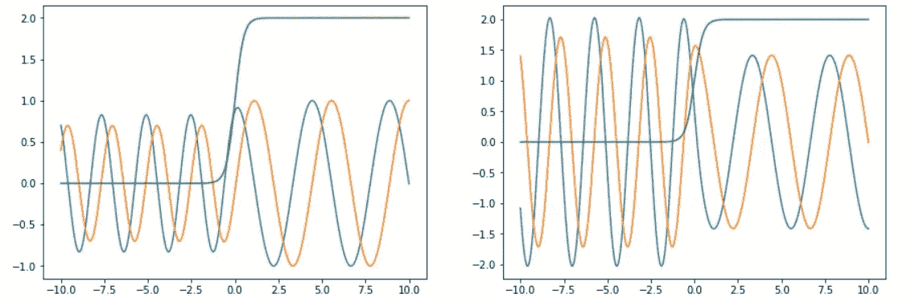

# Python 与物理学:龙格-库塔方法

> 原文：<https://medium.com/codex/python-and-physics-runge-kutta-method-93d7e2105230?source=collection_archive---------5----------------------->

我在研究生院偶然发现的最常见的数学问题之一是常微分方程，也称为 ODEs，其中一个让我困惑了一段时间的挑战是，我如何用 Python 求解 ODEs？谢天谢地，我偶然发现了两种方法，Runge-Kutta 方法和 SciPy 的内置函数。

# **龙格-库塔法**

龙格-库塔法是由卡尔·龙格和威廉·库塔提出的对常微分方程的数值近似。通过在一个区间内使用四个不一定落在实际解上的斜率值，并对斜率取平均值，可以得到一个非常好的近似解。对于龙格-库塔法及其变体的更详细的解释，我强烈建议使用你最喜欢的教科书/网站来研究历史、推导和应用。现在对于这个例子，我们将集中在四阶龙格-库塔方法，以帮助我们解决 1D 散射问题。

# **编码**

为了开始我们的代码，我们将导入一些有助于数学和可视化的包。

```
import cmath #To help us out with the complex square root
import numpy as np #For the arrays
import matplotlib.pyplot as plt #Visualization
```

从这里，我们开始定义方程的初始参数。

```
mass = 1.0 #Mass, one for simplicity
hbar = 1.0 #HBar, one for simplicity
v0 = 2.0 #Initial potential value
alpha = 0.5 #Value for our potential equation
E = 3.0 #Energy
i = 1.0j #Defining imaginary number
x = 10.0 #Initial x-value
xf = -10.0 #Final x-value
h = -.001 #Step valuexaxis = np.array([], float) #Empty array to fill with out x-valuespsi = np.array([], complex) #Empty array to fill with the values for  the initial equation we are trying to solve, defined array as complex to fill with complex numberspsiprime = np.array([], complex) #Empty array to fill with the values for the first derivative equation we are trying to solve, defined array as complex to fill with complex numbers
```

一旦我们有了初始值，我们就开始研究定义我们将要用到的方程的函数。我们拥有的主方程是 *k(x)* ，它是薛定谔方程的修正版本，用于求解变量 *k* ，以及我们的**ψ**方程，它们将由 *psione(x)* 和*PS inone(x)*定义。为了进一步探索这个方程式，麻省理工开放式课程有免费讲座，任何人都可以免费参加。

```
def v(x): #Potential equation we will be using for this example
    return v0/2.0 * (1.0 + np.tanh(x/alpha))def k(x): #Reworked Schrödinger's equation to solve for k
    return cmath.sqrt((2*mass/(hbar**2))*(E - v(x)))def psione(x): #PSI, wavefunction equation
    return np.exp(i*k(x)*x)def psitwo(x): #Derivative of the psione equation
    return i*k(x)*np.exp(i*k(x)*x)
```

现在我们开始精彩的部分了。首先，我们需要定义一个包含初始条件波函数的数组。

```
r = np.array([psione(x), psitwo(x)]) #Array with wavefunctions, usually this is where our initial condition equations go.
```

在我们的数组中设置这些方程，我们可以通过 Runge-Kutta 方法迭代这两个方程，这将在下面定义，并让它们给出我们为 *psione(x)* 和*PS ione(x)定义的方程的近似解。但是在我们到达等式的主要部分之前，我们需要定义一个更重要的函数。*

```
def deriv(r,x): 
    return np.array([r[1],-(2.0*mass/(hbar**2) * (E - v(x))*r[0])], complex)
#The double star, **, is for exponents
```

*deriv* 函数是龙格-库塔的输出通过的地方，这个函数从数组 *r* 中获取我们的值，然后推动它通过这些条件。对于返回的第一个值，这很简单，我们的 *x* 值将被输入到数组的第二个等式中。然而，第二个值将经历不同的处理。这一次， *x* 值将经历薛定谔方程的另一次迭代，其中考虑了波函数 *psione(x)* 。

```
#While loop to iterate through the Runge-Kutta. This particular version, the Fourth Order, will have four slope values that help approximate then next slope value, from k1 to k2, k2 to k3, and k3 to k4.#This loop also appends that values, starting with the initial values, to the empty arrays that we've initialized earlier.while (x >= xf ):
        xaxis = np.append(xaxis, x)
        psi = np.append(psi, r[0])
        psiprime = np.append(psiprime, r[1])
        k1 = h*deriv(r,x)
        k2 = h*deriv(r+k1/2,x+h/2)
        k3 = h*deriv(r+k2/2,x+h/2)
        k4 = h*deriv(r+k3,x+h)
        r += (k1+2*k2+2*k3+k4)/6
        x += h #The += in this line, and the line above, is the same thing as telling the code to x = x + h, which updates x, using the previous x with the addition of the step value.
```

在这里，循环几乎覆盖了龙格-库塔的整个过程。通过使用斜率的近似值，如由 *k* 值定义的，每个 *k* 值有助于近似下一个斜率，使我们更接近于求解 *f(x)* 。此外，在获得每个斜率后，我们获得一个加权平均值，并用这些新值更新数组，为下一次迭代做好准备。这个过程将在我们定义的 x 轴范围内继续进行，最终将为我们绘制即将求解的 ODE 提供必要的值。

# **概述**

龙格-库塔方法可以很容易地适用于许多其他方程，大多数时候我们只需调整 *deriv* 函数和我们的初始条件方程。其他例子包括钟摆运动微分方程和行星运动微分方程。在下面，你可以找到完整的代码，以及额外的步骤，比如求解反射和透射值的函数，以及如何绘制我们的值。

```
import cmath #To help us out with the complex square root
import numpy as np #For the arrays
import matplotlib.pyplot as plt #Visualizationmass = 1.0 #Mass, one for simplicity
hbar = 1.0 #HBar, one for simplicity
v0 = 2.0 #Initial potential value
alpha = 0.5 #Value for our potential equation
E = 3.0 #Energy
i = 1.0j #Defining imaginary number
x = 10.0 #Initial x-value
xf = -10.0 #Final x-value
h = -.001 #Step valuexaxis = np.array([], float) #Empty array to fill with out x-valuespsi = np.array([], complex) #Empty array to fill with the values for  the initial equation we are trying to solve, defined array as complex to fill with complex numberspsiprime = np.array([], complex) #Empty array to fill with the values for the first derivative equation we are trying to solve, defined array as complex to fill with complex numbersdef v(x): #Potential equation we will be using for this example
    return v0/2.0 * (1.0 + np.tanh(x/alpha))def k(x): #Reworked Schrödinger's equation to solve for k
    return cmath.sqrt((2*mass/(hbar**2))*(E - v(x)))def psione(x): #PSI, wavefunction equation
    return np.exp(i*k(x)*x)def psitwo(x): #Derivative of the psione equation
    return i*k(x)*np.exp(i*k(x)*x)r = np.array([psione(x), psitwo(x)]) #Array with wavefunctions, usually this is where our initial condition equations go.def deriv(r,x): 
    return np.array([r[1],-(2.0*mass/(hbar**2) * (E - v(x))*r[0])], complex)
#The double star, **, is for exponents#While loop to iterate through the Runge-Kutta. This particular version, the Fourth Order, will have four slope values that help approximate then next slope value, from k1 to k2, k2 to k3, and k3 to k4.#This loop also appends that values, starting with the initial values, to the empty arrays that we've initialized earlier.while (x >= xf ):
        xaxis = np.append(xaxis, x)
        psi = np.append(psi, r[0])
        psiprime = np.append(psiprime, r[1])
        k1 = h*deriv(r,x)
        k2 = h*deriv(r+k1/2,x+h/2)
        k3 = h*deriv(r+k2/2,x+h/2)
        k4 = h*deriv(r+k3,x+h)
        r += (k1+2*k2+2*k3+k4)/6
        x += h #The += in this line, and the line above, is the same thing as telling the code to x = x + h, which updates x, using the previous x with the addition of the step value.#Grabbing the last values of the arrays and redefining our x-axis
psi1 = psi[20000]; psi2 = psiprime[20000]; x = 10; xf = -10def reflection(x, y):
    aa = (psi1 + psi2/(i*k(y)))/(2*np.exp(i*k(y)*y))
    bb = (psi1 - psi2/(i*k(y)))/(2*np.exp(-i*k(y)*y))
    return (np.abs(bb)/np.abs(aa))**2def transmission(x,y):
    aa = (psi1 + psi2/(i*k(y)))/(2.0*np.exp(i*k(y)*y))
    return k(x)/k(y) * 1.0/(np.abs(aa))**2print('reflection = ',reflection(x,xf))
print('transmission = ', transmission(x,xf))
print('r + t = ', reflection(x,xf) + transmission(x,xf))#Outputs for the print command
#reflection =  0.007625630800891285
#transmission =  (0.9923743691991354+0j)
#r + t =  (1.0000000000000266+0j)
#Ideally, r + t should give us one, a bit stumped if the precision that's present in Python can lead to the small discrepancy, without considering formatting the answer to a set amount of decimal values.#Plotting the graphs side by side, including the imaginary values.fig, ax = plt.subplots(1,2, figsize = (15,5))
ax[0].plot(xaxis, psi.real, xaxis, psi.imag, xaxis, v(xaxis))
ax[1].plot(xaxis, psiprime.real, xaxis, psiprime.imag, xaxis, v(xaxis))
plt.show()
```



此代码的可视化输出。注意波函数在进入势垒时是如何变化的。

对于那些对这段代码的内置 SciPy 版本感兴趣的人来说，可以开始了。

```
import cmath
import numpy as np
import matplotlib.pyplot as plt
from scipy.integrate import odeint, solve_ivpE = 3; m = 1; h = 1; alpha = .5; v0=2; i = 1.0j; xi = 10; xf = -10def v(x): return v0/2.0 * (1.0 + np.tanh(x/alpha))def k(x): return cmath.sqrt((2*m/(h**2))*(E - v(x)))def psione(x): return np.exp(i*k(x)*x)def psitwo(x): return i*k(x)*np.exp(i*k(x)*x)def deriv(x, y): return [y[1], -(2.0*m/(h**2.0) * (E - v(x))*y[0])]# solve_ivp is a built in rk45step solver
values = solve_ivp(deriv, [10, -10], [psione(xi), psitwo(xi)], first_step = .001, max_step = .001)psi1 = values.y[0,20000]; psi2 = values.y[1,20000]; x = 10; xf = -10def reflection(x, y):
    aa = (psi1 + psi2/(i*k(y)))/(2*np.exp(i*k(y)*y))
    bb = (psi1 - psi2/(i*k(y)))/(2*np.exp(-i*k(y)*y))
    return (np.abs(bb)/np.abs(aa))**2def transmission(x,y):
    aa = (psi1 + psi2/(i*k(y)))/(2.0*np.exp(i*k(y)*y))
    return k(x)/k(y) * 1.0/(np.abs(aa))**2print('reflection = ',reflection(x,xf))
print('transmission = ', transmission(x,xf))
print('r + t = ', reflection(x,xf) + transmission(x,xf))fig, ax = plt.subplots(1,2, figsize = (15,5))
ax[0].plot(values.t, values.y[0].real, values.t, values.y[0].imag, values.t, v(values.t))
ax[1].plot(values.t, values.y[1].real, values.t, values.y[1].imag, values.t, v(values.t))
plt.show()
```

# 笔记

有点免责声明，大部分代码改编自我的计算类课程，该课程侧重于使用 FORTRAN90 而不是 Python，所以代码可能不是很有效，因为我开始通过从 FORTRAN 转移代码来自学 Python。另外，感谢麻省理工开放式课程让我对这段代码中使用的方程式和方法有一个小小的更新。