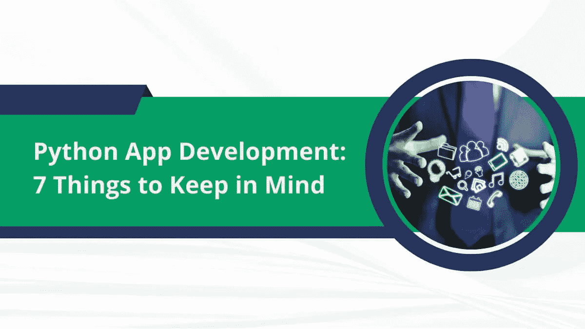

# Python 应用程序开发:要记住的 7 件事

> 原文：<https://medium.com/codex/python-app-development-7-things-to-keep-in-mind-a58272f4fe8c?source=collection_archive---------14----------------------->

Python 是最适合应用程序开发的编程语言之一。从创建交互式 web 应用到复杂的人工智能应用，[企业使用 Python 进行应用开发](https://www.botreetechnologies.com/blog/python-for-enterprise-app-development/)用于多种用例。

在 TIOBE 的编程语言索引中，Python 一直是 web 开发中最受欢迎的语言之一。凭借其简单的语法、强大的功能、多样化的生态系统和灵活性，Python 成为了业界的领导者。

# 为什么开发人员转向 Python

Python 已经存在超过 15 年了。然而，由于其在数据科学方面的能力，它最近变得流行起来。在 Python 之前，公司会使用 Java。NET、C、C#以及类似的语言。尽管这些语言仍然流行，Python 很快占据了头把交椅。这是为什么呢？

主要原因是它的多样化。在很多领域中，Python 能够实现其他编程语言无法实现的目标。它包括人工智能、机器学习、数据科学、物联网、游戏开发、数据分析以及现代技术中的类似领域。

随着编程变得越来越先进，Python 越来越多地占据了中心舞台。Python 现在是所有大公司技术栈中的主要组件。网飞、脸书、IBM、Chase 和 Spotify 是世界上利用 [Python 应用开发解决方案](https://www.botreetechnologies.com/blog/best-examples-of-companies-using-python-programming/)的一些最大的公司。

> **阅读更多:** [**10 个真实世界的 Python 用例及应用**](https://www.botreetechnologies.com/blog/top-10-python-use-cases-and-applications/)

# Python 应用程序开发过程中要知道的 7 件事

虽然 Python 发展迅速，但公司在执行过程中经常遇到困难。这是一种相对复杂的编程语言，因为它提供的结果。因此，知道如何以正确的方式开发 [Python 应用程序](https://botreetechnologies.medium.com/top-python-development-companies-b6d56a0c5757)至关重要。

以下是[ente](https://www.botreetechnologies.com/enterprise-software-development-company)[r](https://www.botreetechnologies.com/enterprise-software-development-company)[pries](https://www.botreetechnologies.com/enterprise-software-development-company)和开发者在 [Python app 开发项目](https://dev.to/botreetechnologies/7-ways-a-python-application-can-benefit-your-business-2g2k)中应该知道的 7 件事:

1.  **Python 是一种解释性语言**

*   知道 Python 是一种解释型编程语言是很重要的。它不需要复杂的构建或打包发行版。这种语言更侧重于以人为基础的动态。CPython 是来自 Python.org 的 Python 安装中最常见的解释器。
*   今天，CPython 的运行速度比 Jython 快，Jython 是 Java 虚拟机的解释器。作为一种解释型语言，Python 没有留下编译时错误的余地。所有测试都在解释阶段运行，这确保了[开发人员](https://www.botreetechnologies.com/blog/the-top-python-development-skills-for-developers-in-2022/)不会遗漏任何可能在运行时导致问题的错误。

**2。Python 的版本**

*   Python 3.11.0 是编程语言的最新版本，于 2022 年 10 月推出。了解 Python 的所有版本很重要。Python 2 和 Python 3 有很大的不同。了解其中的区别可以让开发者了解他们正在使用的特性，以及如何使用 [Python 应用开发框架](https://www.botreetechnologies.com/blog/python-for-mobile-app-development-kivy-vs-beeware-difference/)。
*   其次，它还使开发人员能够了解迁移的整个过程。当从一个旧版本迁移到一个新版本时，了解什么将被添加到应用程序中和从应用程序中删除是非常重要的。大多数公司更愿意迁移到最新版本的语言，因为它提供了稳定性，并通过最新的功能改进了整个应用程序，包括增加的安全性。

**3。文档应该是可读的**

*   另一件需要知道的重要事情是创建可读的文档。当创建代码的开发人员已经离开项目时，许多开发人员经常很难处理代码。文档使当前的开发人员能够更好地理解项目并构建一个强大的应用程序。
*   Sphinx 是一个 Python 应用程序开发工具，用于构建智能和漂亮的文档。它帮助开发人员从现有的 reStructuredText 中获取 Python 文档，并以 HTML 等格式导出文档。另一个被称为 reStructuredText 的工具允许开发人员创建内嵌文档。

**4。负责任的编码很重要**

*   对于应用程序开发来说 [Python 最重要的方面](https://www.botreetechnologies.com/blog/how-much-does-it-cost-to-build-a-python-application/)是在编码时负责任。开发人员必须知道缩进在 Python 中是至关重要的，就像任何其他编程语言一样。然而，负责任的编码对于做出关键的编程决策非常重要。与 Java 不同，Python 不会询问开发人员是否以任何特定的名称调用变量或函数，也不需要他们定义类型。
*   Python 在某种程度上是大胆冒险和编码时遵循结构的混合体。许多人认为 Python 介于 Java 和 JavaScript 之间。Python 是一个很好的媒介，可以在代码中表达新事物，同时保持旧事物的一致性。

**5。Python Shell 帮了大忙**

*   Python Shell 是 Python 最好的特性之一。它很容易访问——只需在命令行中键入 python，开发人员就可以执行 Python shell。它有助于单独测试简单的命令。在许多情况下，开发人员将能够识别出他们想要使用的命令中是否有任何语法或逻辑错误，然后在一些可能占用内存或耗费时间的大规模脚本中进行测试。
*   Python Shell 提醒开发人员从代码中添加或删除组件，以便正确执行。这是一个简单的过程，对于开发 Python 应用程序开发软件的开发人员来说，不会花费任何额外的时间。

**6。尽可能使用 PyPI】**

*   PyPI 是 Python 包索引——它在存储库中有超过 200，000 个项目。开发人员应该利用其中的代码，而不是自己编写代码——这样可以节省时间，让他们专注于更重要的事情。PyPI 协助 [Python 开发者](https://www.botreetechnologies.com/blog/guide-to-hiring-python-developers/)简化 [Python 应用开发](https://www.botreetechnologies.com/blog/top-10-python-app-development-tools-for-enterprise-software-development/)过程。
*   开发者可以使用 pip 安装 PyPI。最好的事情之一是，他们也可以创建和上传自己的包。其他开发人员可以将它们用于自己的项目。PyPI 节省了大量时间，并降低了代码的复杂性。

**7。实施最佳实践**

*   没有人能充分强调实现 Python 最佳实践的重要性。Python 比开发人员想的要复杂得多。使用 Python 应用程序开发工具的团队必须知道他们为什么要使用它们。任何雇佣[企业软件开发公司](https://www.botreetechnologies.com/blog/types-of-enterprise-software-for-companies/)开发 Python 应用的公司都应该确保该公司使用 Python 的最佳实践。
*   Python 是一种编程语言，如果使用得当，它可以提供无限的多样性和功能。这对企业来说是一个福音，因为 Python 拥有现代动态企业对交互式 web 应用程序所需要的一切。

> **阅读更多:** [**寻找最佳 Python 开发公司的技巧**](https://www.trickyenough.com/finding-best-python-development-company/)

# 结论

[Python 应用开发库](https://www.botreetechnologies.com/blog/top-11-python-frameworks-for-machine-learning-and-deep-learning/)有数百个开发者可以使用的东西。但是除了技术方面，理解如何处理 [Python 开发服务](https://www.botreetechnologies.com/python-development)的过程也很重要。今天，许多公司都渴望将 Python 用于他们的网络应用程序，但是正确的使用方法是至关重要的。

BoTree Technologies 是一家[值得信赖的软件开发公司](https://www.botreetechnologies.com/)，在 Python 应用程序开发方面拥有 10 多年的专业经验。

[**联系我们**](https://www.botreetechnologies.com/contact) 今天免费咨询。

*原载于 2022 年 10 月 30 日 https://www.botreetechnologies.com**的* [*。*](https://www.botreetechnologies.com/blog/python-app-development-7-things-to-keep-in-mind/)