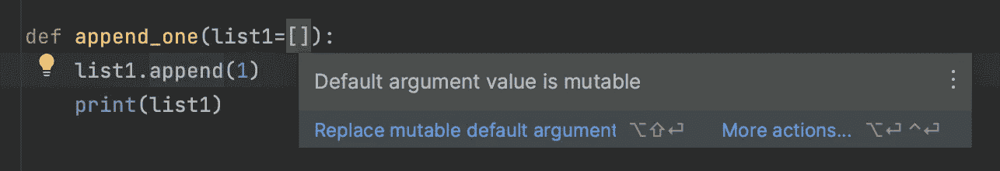

# Python 初学者入门

> 原文：<https://medium.com/codex/python-beginner-gotchas-af16f26325dd?source=collection_archive---------17----------------------->

## 我在生产应用中使用 Python 已经一年了。这是让这条路变得更加艰难的一系列事情。


[菲迪亚斯·塞万提斯](https://unsplash.com/@fidpad?utm_source=medium&utm_medium=referral)在 [Unsplash](https://unsplash.com?utm_source=medium&utm_medium=referral) 上的照片

这不是一篇抨击语言的文章，而是对一些可能让像我这样的新人感到惊讶的问题的提醒。这些问题从微小的不便到可疑的设计决策都有。请注意，这是从一个一岁的来自其他语言的学习者的角度来写的，同时保持开放的心态并努力提高效率。我希望它能帮助你不被吓到。

# 所有实例共享类属性

在下面的例子中，输出是什么？试试看🚀。

对于[数据类](https://docs.python.org/3/library/dataclasses.html)以及[也存在这个问题🚀](https://replit.com/@LusSoares1/constructor-args-in-python-dataclasses#main.py)】。

在 Python 中，类属性是共享的；它们在该类中是唯一的(就像 Java 静态字段一样)。在前面的例子中，这意味着`_store`是全局可变的。这在 JavaScript、Java、C#、C++或我所知道的任何其他 [OO](https://en.wikipedia.org/wiki/Object-oriented_programming) 语言中都不会发生。

因为 Python 有`@staticmethod`和`@classmethod`的概念，你可能会认为事物不是静态的，直到被标记为静态，但是类属性是静态的。更不一致的是，只有像列表和字典这样可变的东西是静态的；文字不是[[🚀](https://replit.com/@LusSoares1/constructor-args-in-python-v2#main.py)】。

**🛠解决方法**:您需要在构造函数中初始化类属性(可变属性),以确保每个类实例化都会创建新的实例:

```
class UserRepositoryInMemory:
   _store: Dict

   def __init__(self):
      self._store = {}
```

# 默认参数保存在函数调用中

你对下面的代码有什么期望[ [🚀](https://replit.com/@LusSoares1/global-named-arguments#main.py)】？

```
def append_one(list = []):
   list.append(1)
   print(list)

append_one()
append_one()
```

我原以为会印两次，但事实并非如此。由于`= []`是一个局部问题，所以期望每次调用函数时都初始化`list`是很正常的——这就是 [JavaScript](https://replit.com/@LusSoares1/named-arguments-JS#index.js) 和 [Kotlin](https://replit.com/@LusSoares1/named-arguments-kotlin) 的行为方式(C#不支持非常数默认参数)。在 Python 中，它只在第一次被调用。

这就是[最潜移默化的 Python“特性”](https://docs.python-guide.org/writing/gotchas/)。简而言之，默认参数在调用之间表现为长期共享变量。由于 Python 中的一切都是可变的，这就产生了难以调试的问题。对于列表之类的东西，PyCharm 暗示你正在走向一个陷阱:



PyCharm 警告您关于可变默认参数的问题。

然而，它可能更普遍:在一个项目中，我在一些测试中将 mock 作为默认参数；这些意外地相互影响，我花了几个小时调试才找到原因。

**🛠解决方法**:不要对任何可能变异的东西使用关键字参数。将每个默认参数初始化为`None`，并在函数体中设置它们的默认值。不利的一面是，如果你打算通过`None`考试，你就无法通过…

```
def do_something(some_list = None, a_user = None):
   if some_list == None:
      some_list = []
   if a_user == None:
      a_user = User()
   ...
```

[](https://florimond.dev/en/posts/2018/08/python-mutable-defaults-are-the-source-of-all-evil/) [## Python 可变缺省值是所有罪恶的根源

### 今天，我想分享一些关于 Python 开发人员仍然容易犯的常见错误的快速救生建议。不要…

florimond.dev](https://florimond.dev/en/posts/2018/08/python-mutable-defaults-are-the-source-of-all-evil/) 

# 测试不能有重复的名称

在以前的项目中，我有大约 100 个按业务子域组织的测试文件。很自然地，一些跨文件夹的文件名发生了冲突。没想到的是， [pytest](https://docs.pytest.org/en/7.1.x/) 测试跑者对此并不高兴。虽然有一个解决方法，但这不应该是默认行为。平心而论，这是 pytest 的局限性；不是 Python，但是从学习者的角度来看，pytest 是测试的首选工具。

```
ERROR collecting pytest/test_helloworld.pyimport file mismatch:
imported module 'test_helloworld' has this __file__ attribute:
  D:\pytest\case\test_helloworld.py
which is not the same as the test file we want to collect:
  D:\pytest\pytest\test_helloworld.py
HINT: remove __pycache__ / .pyc files and/or use a unique basename for your test file modules
!!!!!!!!!!!!!!!!!!! Interrupted: 1 errors during collection
=========================== 1 error in 0.88 seconds[*source*](https://github.com/pytest-dev/pytest/issues/3151)
```

**🛠解决方法**:我喜欢将测试文件重命名为不同的名称。然而，您可以求助于`__init__.py`技巧:在重复文件所在的一个文件夹中创建一个名为`__init__.py`的空文件。

# 如果关键字参数与实现不同步，测试就会失败

查看以下测试片段:

如果你用 Kotlin 或者 C#(或者其他带有[命名参数](https://en.wikipedia.org/wiki/Named_parameter)的语言)进行测试，你不会知道为什么上面的测试失败了。命名参数应该只是语法糖并且仅仅是为了使代码更具可读性而存在。但是 Python [将](https://en.wikipedia.org/wiki/Leaky_abstraction)关键字参数(与`[*args](https://www.programiz.com/python-programming/args-and-kwargs)``[*kwargs](https://www.programiz.com/python-programming/args-and-kwargs)`)的内部实现泄露给了 pytest。这最终导致了测试和实现之间的耦合，因为它们必须总是同步的。我花了一段时间才明白。

**🛠解决方法**:我找不到任何解决方案。在我工作的项目中，我最终到处使用关键字参数——测试和实现，只是为了让 pytest 高兴。不确定其他测试库能不能应对。

# 兰姆达斯似乎只在少数情况下有用

兰姆达斯是 [FP](https://en.wikipedia.org/wiki/Functional_programming) 的支柱之一。Python 支持 lambdas，但至少有两件事困扰着我:

**无类型提示:** 不能给 lambda 参数添加类型提示。没有类型提示意味着代码编辑器和类型检查器帮不上什么忙。
类型提示(例如`amount: Int`)和 lambda 语法(例如`add_ten = lambda a**:** a + 10`)都使用冒号，所以没有简单的方法来解决这个问题。

你不能写多行的 lambdas。好吧，如果你使用圆括号就可以，但是它们必须是一个单一的表达式(不像 Java、Kotlin、Ruby、C#、JavaScript、Elixir、…)中的 lambdas。这将 Python lambdas 的用例缩小到非常基本的情况。考虑到 Python 的语法，我认为没有简单的方法可以解决这个问题。

**🛠变通办法**:避开 lambdas，使用正常函数。我不喜欢这样，因为你失去了上下文。这在管道操作中尤其重要，在管道操作中，您希望在每个步骤中进行小的转换，或者在测试中配置模拟。在这两种情况下，它都强制进行了夸大的分割，并且您需要滚动很多来理解代码。

# 管道操作创造了括号地狱

假设您正在进行一些包含多个步骤的数据转换。[声明式编程](https://www.freecodecamp.org/news/an-introduction-to-programming-paradigms#declarative-programming)非常适合这里，尤其是在 Elixir [ [中提供的管道操作符🚀](https://replit.com/@LusSoares1/AnnualStrangeBackslash#main.exs) ]:

```
["1", "4", "7", "2", "9", "5"] |>
   Enum.map(&String.to_integer/1) |>
   Enum.map(fn x -> x + 5 end) |>
   Enum.filter(&Integer.is_even/1) |>
   Enum.sum() |>
   IO.puts()
```

在科特林，没有管道运营商，但我们可以连锁经营，依靠`let` [ [🚀](https://replit.com/@LusSoares1/CornyBaggyTruetype#main.kt)】:

```
listOf("1", "4", "7", "2", "9", "5")
   .map(String::toInt)
   .map { it + 5 }
   .filter { it % 2 == 0 }
   .sum()
   .let(::println)
```

在 JavaScript 中，由于我们没有管道操作符或等效物，我们需要一个变量[[🚀](https://replit.com/@LusSoares1/PleasingFragrantSquare#index.js)】:

```
const res = ["1", "4", "7", "2", "9", "5"]
  .map(el => parseInt(el))
  .map(el => el + 5)
  .filter(el => el % 2 == 0)
  .reduce((acc, el) => acc + el, 0)
console.log(res)
```

在 Python 中，我们被困在[嵌套函数调用](https://www.reddit.com/r/ProgrammerHumor/comments/27yykv/indent_hadouken/) [ [🚀](https://replit.com/@LusSoares1/python-ops?v=1#main.py)】:

```
res = sum(
  filter(lambda el: el % 2 == 0,
    map(lambda el: el + 5,
      map(int, 
          ["1", "4", "7", "2", "9", "5"]
      )
    )
  )
)
print(res)
```

👎**操作以相反的顺序出现**(需要从里到外阅读)
👎圆括号很难匹配，在几次运算后代码变得过于缩进
👎Lambdas 不能有类型提示，并且仅限于表达式

让我们用同样的方法来列举理解:

```
res = [el for el in [el + 5 for el in [
  int(el) for el in ["1", "4", "7", "2", "9", "5"]
]] if el % 2 == 0]
sum = 0
for el in res:
  sum += el
print(sum)
```

它不会变得更好。它变得更加难以阅读，同时保留了前一个片段的缺点。还有，这是一个基本的例子；想象一个真实的场景。Python 是面向对象的，所以我不明白为什么`map`、`filter`、`all`等是全局函数(即内置函数)。依我看，它们应该是数组和字典的一部分。

**🛠解决方法**:有一些库可以填补这个空白，但是它们有一些限制。除了认识到这不是 Python 鼓励的模式之外，没有明显的解决方法。因此，“修复”就是选择[命令式](https://www.freecodecamp.org/news/an-introduction-to-programming-paradigms#imperative-programming)(就地)或者[程序式编程](https://www.freecodecamp.org/news/an-introduction-to-programming-paradigms#procedural-programming)(调用私有函数)。

# 其他不满

*   [元组](https://replit.com/@LusSoares1/MixedBulkyPackages#main.py)
*   一切都是公开可见的。
*   可变性无处不在，甚至受到鼓励。
*   滥用下划线(`__init__.py`、`__init__`、`__call__`、`__name__`、`__file__`、`"__main__"`等)。).
*   [unittest 和 pytest 的混淆](https://stackoverflow.com/questions/68439799/typeerror-missing-1-required-positional-argument-while-using-pytest-fixture)。
*   要创建接口，你需要从`ABC`继承？看起来很奇怪。
*   为什么每个异步测试文件都需要`pytestmark = pytest.mark.asyncio`？我敢肯定这是有原因的，但它看起来像一个到处都必须安装的黑客。
*   为什么`join`属于字符串而不是 iterable？那是非正统的。
*   为什么`strftime`这么缩写？函数名被限制在 8 个字符以内的时代已经不是 70 年代了。
*   `map`在映射之外创建一个迭代器，然后用`list`将其转换回一个列表。我想按需创建一个迭代器，但这只是一个观点。
*   `list`、`set`、`map`尤其是`id`和`type`是语言关键字/内置，因此如果您使用它们来命名事物，它们会生成编辑器警告。在我看来，这些词太普通了，不可能在本土全球化。
*   您可以将未声明的参数传递给函数和编辑器(PyCharm 和 Code)、linter ( [pflake8](https://github.com/csachs/pyproject-flake8) )、类型检查器( [mypy](http://mypy-lang.org/) 和 [pyright](https://github.com/microsoft/pyright) )，运行时也没问题。我知道我可以在运行时传递一个被[解包的](https://python-reference.readthedocs.io/en/latest/docs/operators/dict_unpack.html)字典，但是如果我显式地传递一个未声明的参数，我至少会得到一个警告。
*   [鼓励异常控制流](https://docs.quantifiedcode.com/python-anti-patterns/readability/asking_for_permission_instead_of_forgiveness_when_working_with_files.html)，这是大多数其他语言中的一个[反模式](https://softwareengineering.stackexchange.com/a/189225/354722)。([了解更多](/codex/pragmatic-exception-handling-3831f7ce0980))
*   猴子补丁(`@Patch`)被社区频繁使用。除了隐藏组件依赖，它还把重构和测试变成了痛苦。[依赖注入](/codex/dependency-injection-back-to-the-basics-a52402890fdc)就是解决方案。