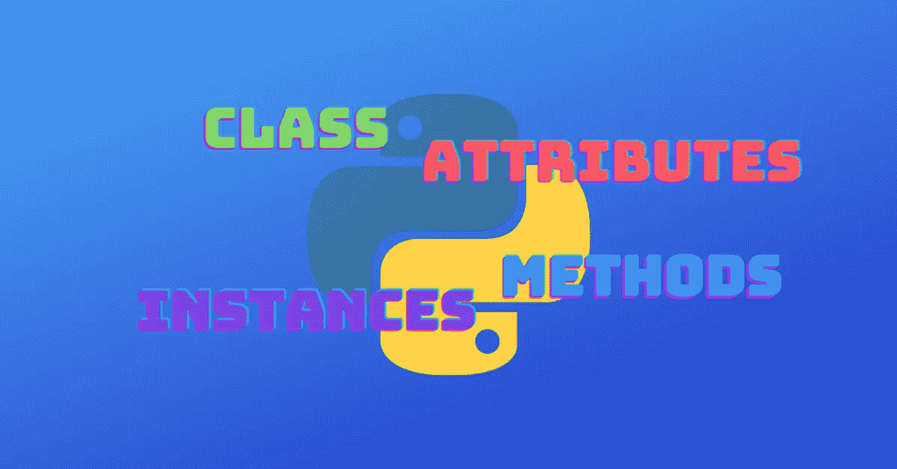

# Python 类定义:面向对象编程变得简单

> 原文：<https://medium.com/codex/python-class-definition-object-oriented-programming-made-easy-b067371166ba?source=collection_archive---------9----------------------->

理解如何定义一个 Python 类是从过程编程转移到面向对象编程的第一步。

**创建一个 Python 类的定义意味着编写代码，允许你把数据和行为放在一起，最好地描述一个特定的概念或实体。一个类中的数据用**表示…