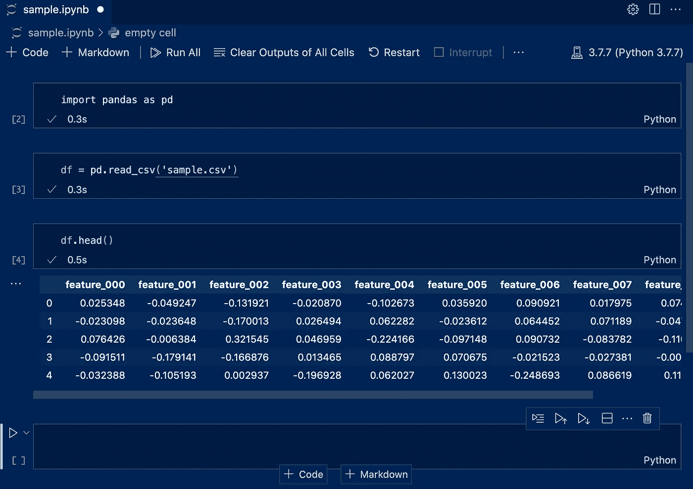
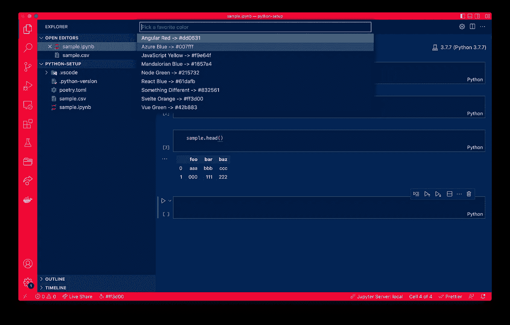
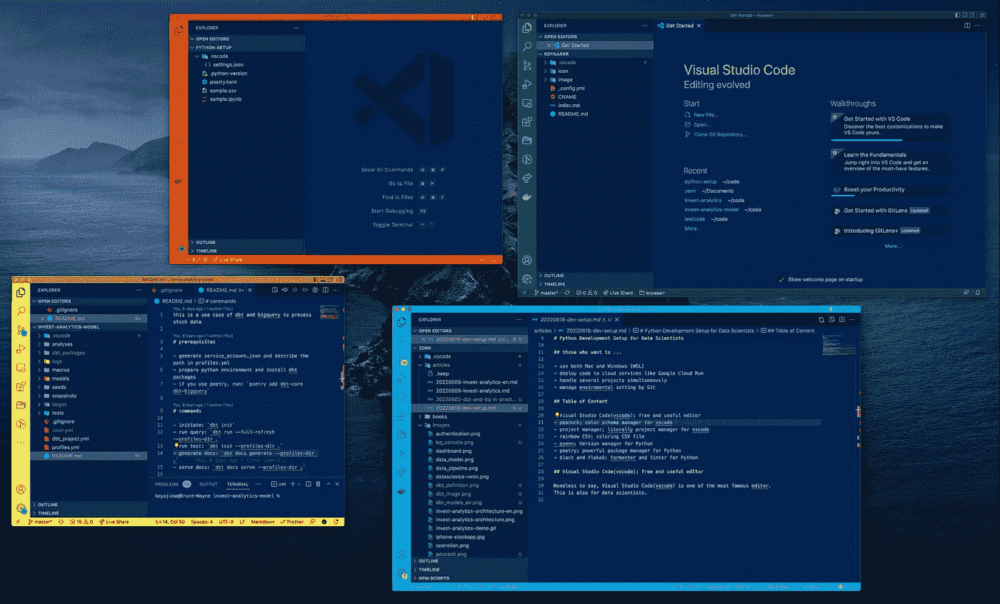
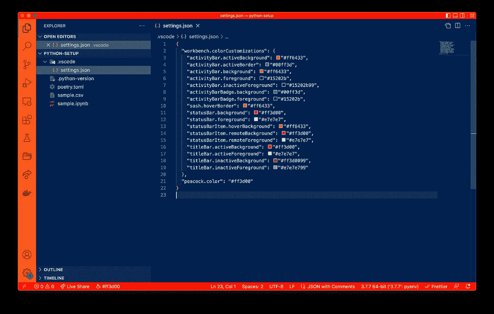
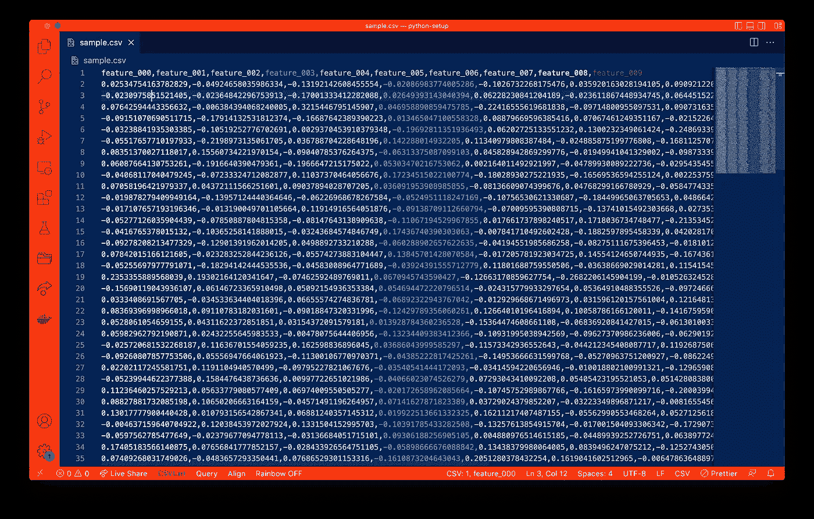
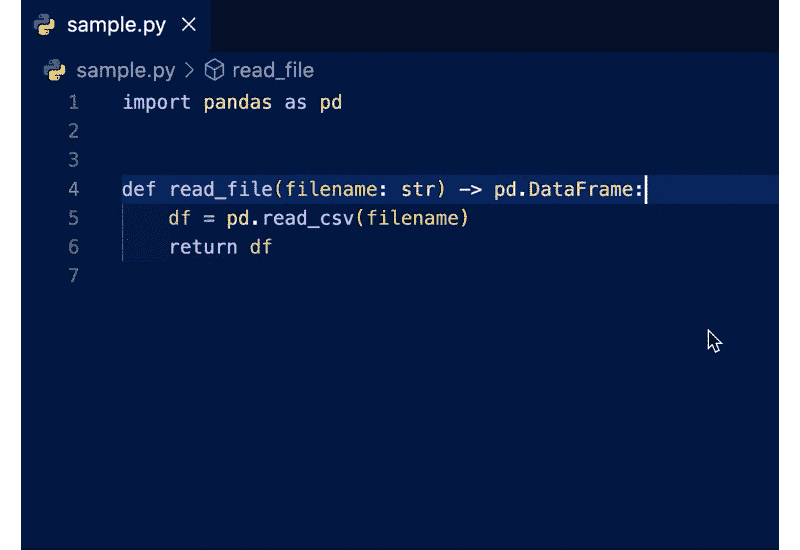
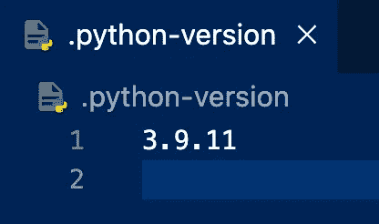
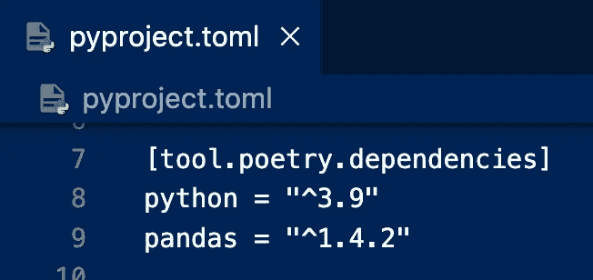
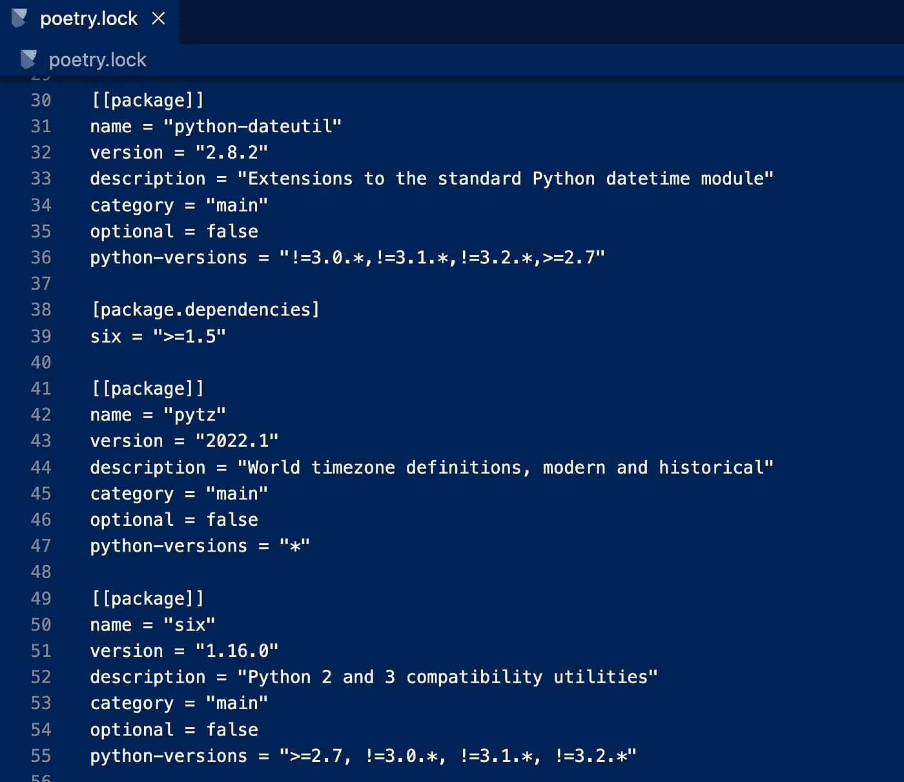
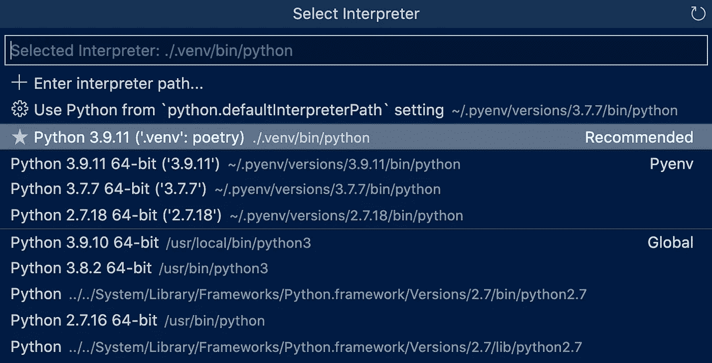

# 2022 年数据科学家的 Python 开发设置

> 原文：<https://medium.com/codex/python-development-setup-for-data-scientists-2022-7f80b2018402?source=collection_archive---------14----------------------->


伊恩·杜利在 [Unsplash](https://unsplash.com?utm_source=medium&utm_medium=referral) 上拍摄的照片

近年来出现了许多有用的工具和库。有些在数据科学家中似乎并不出名，而工程师却经常使用。因此，我想向不熟悉 Python 或软件开发的数据科学家介绍一些工具。在本文中，我将展示我最喜欢的用于数据科学的 Python 开发工具。

**我打算介绍想要…** 的数据科学家

*   同时使用 Mac 和 Windows (WSL)
*   将代码部署到 Google Cloud Run 等云服务
*   同时处理几个项目
*   通过 Git 管理环境设置

## **目录**

*   **Visual Studio 代码**(vs Code)；免费有用的编辑器
*   **孔雀**；颜色模式管理器**【推荐】**
*   **彩虹 CSV**；给 CSV 文件着色
*   **autoDocstring**；文档生成器
*   **pyenv**；版本管理器
*   **诗歌**；强大的包管理器**【推荐】**
*   **黑色**、**薄片 8** 、**异色**、**Mypy**；格式化器和棉绒

## **Visual Studio 代码(vs Code)；免费有用的编辑器**

[https://code.visualstudio.com/](https://code.visualstudio.com/)

Visual Studio Code(vscode)是最著名的编辑器之一。
Vscode 也是面向数据科学家的，因为我们可以在 Vscode 和 Python 文件中使用 Jupyter 笔记本。你不必再在浏览器中编码了。



vscode 中的 Jupyter 笔记本(图片由作者提供)

## **孔雀**；颜色模式管理器

[](https://marketplace.visualstudio.com/items?itemName=johnpapa.vscode-peacock) [## 孔雀- Visual Studio 市场

### 微妙地改变 Visual Studio 代码工作区的颜色。当你有多个 VS 代码实例时，使用 VS…

marketplace.visualstudio.com](https://marketplace.visualstudio.com/items?itemName=johnpapa.vscode-peacock) 

Peacock 是 vscode 中我最喜欢的扩展之一。
您可以通过以下步骤使用 Peacock 更改颜色模式。

*   vscode 中的“Ctrl(Command) + Shift + P”
*   键入“孔雀:更改为喜欢的颜色”
*   选择你最喜欢的一个

当然，您可以通过键入“孔雀:输入一种颜色”并输入十六进制代码来设置您的颜色模式。



选择你最喜欢的颜色(图片由作者提供)

> 数据科学家的优势:
> 当你同时从事几个项目时，peacock 是相当可靠的。
> 这是因为**你通过外观来区分项目，这样你就可以防止混淆项目**。
> 此外，你可以用 Git 控制颜色模式，这样你就可以在不同的计算机上使用相同的颜色。



你可以区分你想做的项目(图片由作者提供)



你可以通过 Git(图片作者)来控制颜色

# **彩虹 CSV**；给 CSV 文件着色

[https://marketplace.visualstudio.com/items?itemName = mechatroner . rainbow-CSV](https://marketplace.visualstudio.com/items?itemName=mechatroner.rainbow-csv)

如果你是数据科学家，你有很多机会看到 CSV 文件。彩虹 CSV 可以在每一列中为您的 CSV 着色。Excel 是查看 CSV 的好工具，但是打开文件要花很多时间。如果你想一目了然地看到 CSV，试试这个扩展。



给数据集着色(作者提供的图像)

## **autoDocstring**；文档生成器

[https://marketplace.visualstudio.com/items?itemName = njp Werner . autodocstring](https://marketplace.visualstudio.com/items?itemName=njpwerner.autodocstring)

autoDocstring 是一个帮助您编写可维护代码的文档生成器。一旦在方法中定义了参数和返回值，这个扩展就会生成文档模板。



键入双引号三次，然后将生成文档(图片由作者提供)

## **pyenv**；版本管理器

[https://github.com/pyenv/pyenv](https://github.com/pyenv/pyenv)

pyenv 是 Python 著名的版本管理器。要在 Mac 上安装，可以使用`brew install pyenv`命令。如果您是 Windows 用户，请尝试以下命令。

```
git clone https://github.com/pyenv/pyenv.git ~/.pyenv
echo 'export PYENV_ROOT="$HOME/.pyenv"' >> ~/.bashrc
echo 'command -v pyenv >/dev/null || export PATH="$PYENV_ROOT/bin:$PATH"' >> ~/.bashrc
echo 'eval "$(pyenv init -)"' >> ~/.bashrc
```

然后安装 Python 的特定版本(如 3.9.11)。

```
pyenv install 3.9.11
```

我建议您用这个命令指定工作目录中的版本。

```
pyenv local 3.9.11
```

您将找到该命令生成的文件，这样您就可以在 Git 中控制 Python 版本。



pyenv 生成版本文件(图片由作者提供)

## **诗歌**；强大的包管理器

[](https://github.com/python-poetry/poetry) [## GitHub-Python-poem/poem:Python 依赖管理和打包变得简单。

### 诗歌帮助你声明，管理和安装 Python 项目的依赖，确保你有正确的堆栈…

github.com](https://github.com/python-poetry/poetry) 

诗歌是一个 Python 库管理器，可以解决库之间的问题。相比 pip，诗歌可以更聪明地管理图书馆。这将库分为两种类型；一个是你要安装的列表，一个是前者使用的整个库的列表。(就像 Javascript 中的 npm 模块一样)

例如，如果你安装 pandas with poem，它是在前一个文件中定义的，而整个包是在后一个文件中描述的。



前者只定义了熊猫和 Python 本身(图片由作者提供)



后者描述了熊猫使用的所有包装(图片由作者提供)

当您安装新的软件包时，这些文件会自动更新。**你不再需要做 pip 冻结命令了。**

而且诗歌可以生成一个虚拟的环境，这样你就可以在一个隔离的环境中执行 Python。因此，**你不需要担心无意识的依赖。**

下面是诗歌的快速入门。

```
$ pip install poetry # install Poetry
$ poetry config virtualenvs.in-project true --local # generate venv in working directory
$ poetry init # initial settings of Poetry
$ poetry add pandas # install package e.g. pandas
$ poetry shell # launch virtual environment
```

如果您已经安装了诗歌，不要忘记将诗歌的虚拟环境设置为您的 vscode 的默认解释器。



选择诗歌虚拟环境(图片由作者提供)

一旦你通过 Git 设置了诗歌和控制`pyproject.toml`、`poetry.lock`和`poetry.toml`，你就可以使用你创建的相同环境并与你的队友分享。

## **黑色**、**薄片 8** 、 **isort、Mypy**；格式化器和棉绒

[](https://github.com/psf/black) [## GitHub - psf/black:不妥协的 Python 代码格式化程序

### “任何你喜欢的颜色。”Black 是不折不扣的 Python 代码格式化程序。使用它，您同意放弃对…的控制权

github.com](https://github.com/psf/black) [](https://github.com/PyCQA/flake8) [## GitHub - PyCQA/flake8: flake8 是一个 python 工具，它将 pycodestyle、pyflakes、McCabe……

### flake8 是一个 python 工具，它将 pycodestyle、pyflakes、mccabe 和第三方插件粘合在一起以检查样式…

github.com](https://github.com/PyCQA/flake8) [](https://github.com/PyCQA/isort) [## GitHub - PyCQA/isort:对导入进行排序的 Python 实用程序/库。

### 阅读最新文档——浏览 GitHub 代码库或检查您的导入，因此您不必这样做。isort 是一个 Python…

github.com](https://github.com/PyCQA/isort) [](https://github.com/python/mypy) [## GitHub-Python/mypy:Python 的可选静态类型

### 我们总是乐意回答问题！这里有一些问他们的好地方:如果你刚刚开始，那么…

github.com](https://github.com/python/mypy) 

这些软件包加快了你的编码速度，实现了简洁的程序。

这些仅在开发环境中使用，因此您可以使用`-D`选项安装它们。

```
poetry add -D black flake8 isort mypy
```

然后通过 settings.json 修改 vscode 设置，可以显式启用上面的 linters 和 formatters。

```
"python.formatting.provider": "black",
"python.linting.flake8Enabled": true,
"[python]": {
"editor.codeActionsOnSave": {
"source.organizeImports": true
},
"python.linting.mypyEnabled": true,
```

## 结论

我为数据科学家介绍了几个有价值的工具来建立 Python 环境。我上传了这个库中的源代码([https://github.com/koyaaarr/python-setup](https://github.com/koyaaarr/python-setup))。

希望这篇文章对你有帮助。