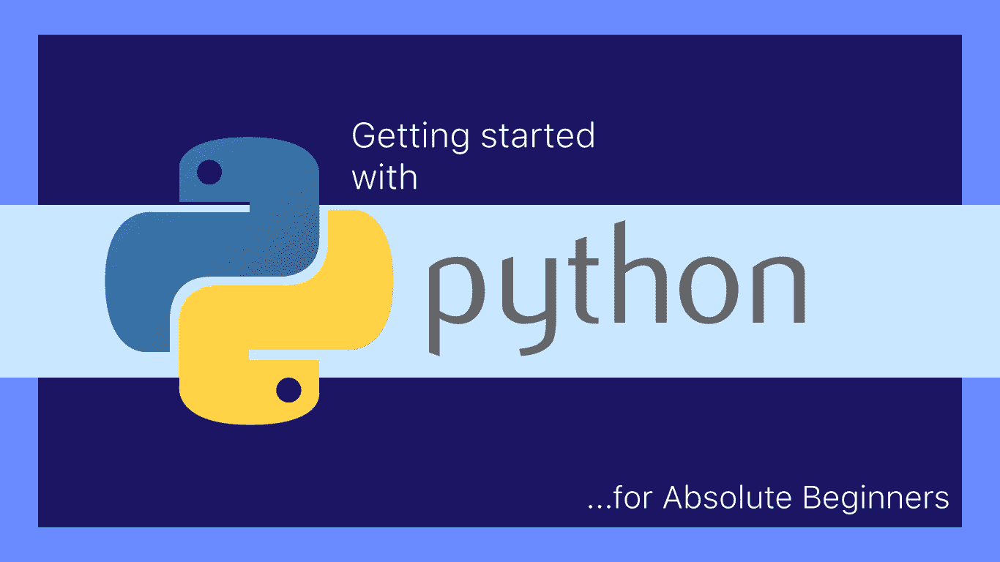

# 面向绝对初学者的 Python

> 原文：<https://medium.com/codex/python-for-absolute-beginners-cfcc23cca074?source=collection_archive---------4----------------------->



随着人工智能和数据的发展，Python 变得越来越重要。说 Python 是当今时代最流行的编程语言不会错。如果简单地用谷歌搜索“最受欢迎的编程语言”，你会发现几乎每篇博文都将 Python 列为排名第一或第二的语言。

简而言之，如果你想在 2022 年发展一项有价值的技能，那么 Python 绝对是一个安全的选择。

我们将讨论以下细节:

1.  **在 Windows 上安装 Python。**
2.  **安装合适的 IDE。**
3.  **运行你的第一个 python 文件。**

让我们继续第一步

# 安装 Python

这里可以从其官网[下载 Python。Python 的最新版本是 3.10.1(在撰写本文时)。它不是最流行的一种，但我们将在本文中使用它。](https://www.python.org/downloads/)


Python 下载页面

单击突出显示的按钮开始下载。下载完 EXE 文件后，运行安装程序，您将看到以下窗口。


安装 Python 就像简单地按下“Install Now”按钮(用绿色框突出显示)一样简单，但在此之前，**重要的是**选中底部的“ **Add Python 3.10 to PATH** ”复选框(用红色突出显示)。添加到 PATH 意味着当运行 python 文件时，你告诉 windows 命令行在哪里查找，我们将在下一节看到它的优点。

因为您刚刚开始您的 python 之旅，所以您不需要担心该安装程序中给出的任何其他选项，并且您可以在安装完成后立即开始工作。

# 检查 Python 是否安装正确

最简单的方法是进入 windows 开始菜单，搜索“ ***Python 3.10*** ”。你会发现它是一个已安装的程序。另一种检查 Python 安装的方法是进入命令提示符(在开始菜单中搜索 **cmd** 并点击**命令提示符** app ),然后在出现的命令行界面上键入“ **python** ”并按 enter 键。


命令提示符识别的 Python

Windows 能够通过简单地键入其名称来识别' *python* '，因为我们在安装期间将 python 安装路径添加到了 path 环境变量中。

# “你好世界！”

你在上面的命令提示符中看到的是一个 python 解释器，你所需要做的就是键入一行 python 代码，然后点击“Enter ”,它将在同一个窗口中返回输出。与 C 或 C++不同，您不需要导入任何头文件或库就可以开始使用 python(这就是为什么 Python 被认为是一种非常简单的语言)。开始编码吧。让我们在命令提示符下打印出第一个 hello world。

Python 中 print 语句的语法如下所示:

```
print("Hello World!")
```


来自 Python 的 Hello World

# 安装 IDE

尽管您可以在命令行上运行您的 Python 代码，正如我在上面演示的那样，但这并不是开发的方式。程序员使用**ide**编写和编辑代码。 **IDE** 代表 ***集成开发环境*** 是一个基本上是高级代码编辑器的软件。你可以把它想象成“记事本”,但它可能有更多的功能。一些最流行的 Python are 是:

*   [MS Visual Studio](https://visualstudio.microsoft.com/vs/)
*   [MS Visual Studio 代码](https://code.visualstudio.com/?wt.mc_id=DX_841432)
*   [原子](https://atom.io)
*   [PyCharm](https://www.jetbrains.com/pycharm/)
*   [记事本++](https://notepad-plus-plus.org/downloads/)

我个人使用' *Visual Studio Code* '编辑器，因为它是轻量级的，具有其他 ide 的大部分有用功能，并且支持大量附加插件。你可以在这里下载 VS 代码[。](https://code.visualstudio.com/?wt.mc_id=DX_841432)

这个软件的安装非常简单(就像其他软件一样)，所以我不会展示它。安装完成后，只需在搜索栏中搜索“Visual Studio Code ”,然后点击显示的应用程序。


VS 代码接口

这是应用程序的外观，如果您是第一次启动它或者使用不同的版本，欢迎屏幕可能会有所不同。你所需要做的就是点击 ***文件- >新文件*** 打开一个新文档来写你的代码。


您将会看到这样的文本编辑器。VS 代码不是专门的 Python 编辑器，你也可以把它用于其他语言。为了让它知道您正在编写 Python 代码，您需要用适当的扩展名保存您的文件。Python 文件以' ***结尾。py***’。所以我们先用' ***test.py'*** 这个名字保存这个空文件。文件- >另存为然后浏览到你喜欢的文件夹，用我们决定的文件名保存。


保存文件

一旦保存为。py' file VS Code 会自动将其检测为 Python 文件，您可以继续编码。


检测到 Python 文件

如果你看看工具栏的左下方，你可以看到 python 已经被 VS 代码自动检测到了。你点击这个来手动改变语言。如果你看右边，你可以看到解释器目前使用的是 Python 3.10.0(因为这是我安装的)，你可以点击它，选择不同版本的 Python，如果你已经安装了多个版本。

# 运行您的第一个代码

让我们试试“你好，世界！”此文件中的代码。


测试. py

您可以看到 IDE 对代码进行了颜色编码。这是使用 IDE 的优势之一，因为这使得代码更容易阅读。

“print”是 Python 中的一个内置函数，您只需使用上面的“print”关键字并传入您的字符串即可调用。

**你可以在这里** **阅读更多关于 Python 函数** [**。**](https://writersbyte.com/featured-post/primer-on-functions-in-python/?swcfpc=1)

现在要运行上面的代码，你需要再次进入命令提示符，在开始菜单中搜索' **cmd** ，然后点击'**命令提示符**。当命令提示符打开时，默认情况下你会在**‘用户’文件夹**中。要运行这个' *test.py* '文件，您需要在命令行中导航到适当的文件夹。由于我的文件放在“桌面”上，我可以通过使用以下命令简单地导航到桌面。

```
cd desktop
```


就这样，代码被执行，我们在控制台上得到输出。

现在让我们编写稍微复杂一点的代码。

```
for i in range(6):     
    for j in range(i):         
        print('*', end ='')     
    print('')
```

上面的代码在控制台上打印出一个三角形' * '。


上面的代码向您介绍了 Python 编程中的两个重要概念。

1.  刻痕
2.  环

讨论循环超出了本文的范围，但是缩进是我们必须解决的问题。

**Python 通过文本如何缩进来识别代码块**。

在我们的代码中，第二个 for 循环是缩进的，这意味着它将作为外部循环的一部分运行。第一个 print 语句缩进了两次，这意味着它将作为第二个 for 循环的一部分执行。这个概念可能有点难以理解，但是唯一的解决方法是通过练习更多的代码。

# 最后的想法

这就是本教程的全部内容。现在，您已经在计算机上安装并运行了 python。练习更多的编码来提高你的技能，更多的 Python 教程，请看下面的文章。

[Python 中的函数](https://writersbyte.com/featured-post/primer-on-functions-in-python/?swcfpc=1)

[Python 3.10 特性](https://writersbyte.com/programming/best-features-in-python-3-10/?swcfpc=1)