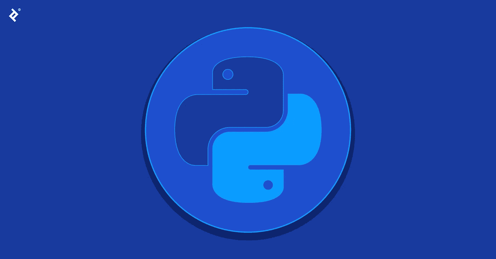

# Python 初学者:你应该学习它的 14 个理由

> 原文：<https://medium.com/codex/python-for-beginners-14-reasons-why-you-should-learn-it-be77e0ca73a6?source=collection_archive---------32----------------------->

## 在本文中，我们将探讨为什么你应该学习 Python 的 14 个理由。你还在等什么？今天就开始学习 Python 吧！

ython 已经成为世界上最流行的编程语言，这是有充分理由的。它对初学者来说很容易学习，并且有大量的…