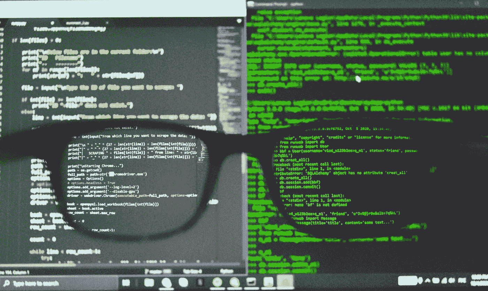

# 面向开发者的 Python 热爱它的最好理由！

> 原文：<https://medium.com/codex/python-for-developers-the-best-reason-to-love-it-771cb87e8e83?source=collection_archive---------16----------------------->

## 学习 Python，未来的语言。Python 编程初学者友好指南。

亚历克斯·丘马克在 [Unsplash](https://unsplash.com?utm_source=medium&utm_medium=referral) 上的照片

Python 是一种多功能、强大的编程语言，具有悠久的开发支持历史。对于想要构建动态的、基于 web 的应用程序或创建专业级应用程序的开发人员来说，它是完美的。