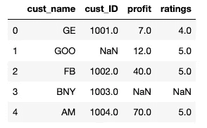
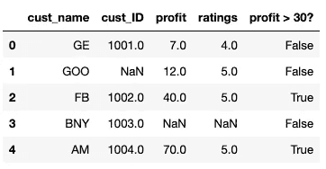
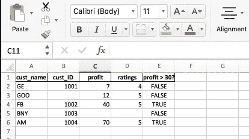
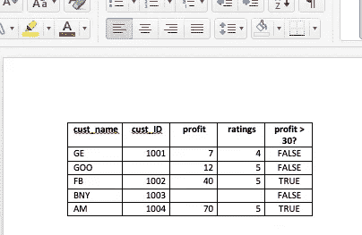
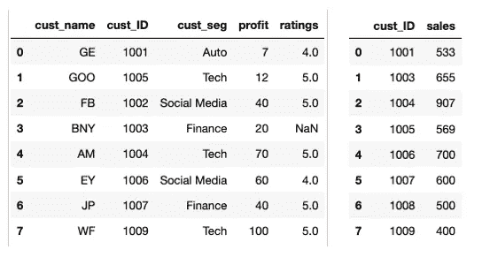
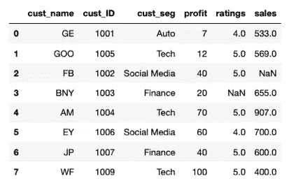
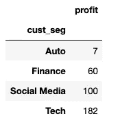

# 用于日常自动化的 Python

> 原文：<https://medium.com/codex/python-for-everyday-automation-2e54cbf5c5e1?source=collection_archive---------0----------------------->


图片来自[https://res.cloudinary.com](https://res.cloudinary.com/)

我是一名模型风险分析师&我的日常工作包括处理大量模型库存数据的治理，为此我最终使用 excel 表& word 文档来处理几乎任何事情。今天，我将谈谈我在 Python 中用来自动化大部分 excel 任务的几个函数。我们开始吧！

1.  **用 Glob Library 整合文件和文件夹**

Python 的 os、shutil & glob 模块是文件处理活动的有效方式。以下是管理您正在使用的目录的一些基本方法:

```
import os 
import shutil
import glob

#return current working directory(cwd)
cwd = os.getcwd()
#change cwd location
os.chdir('/Users/sammitiyadav/Desktop')
#add a folder in the cwd 
os.mkdir('new folder')
#delete folder from the cwd
os.rmdir('new folder')
#create paths without having to use slashes 
os.path.join(cwd, 'new folder')
#check if the directory exists 
os.path.isdir(cwd) #returns true if it does and false otherwise
#change paths(location) of a file 
#os.rename(old path, new path)
os.rename('test.xlsx', os.path.join(cwd, 'new folder', 'test.xlsx'))
shutil.move('test.xlsx', os.path.join(cwd, 'new folder', 'test.xlsx')) #performing same function with shutil module
this is the path the file is moved to ---> '/Users/sammitiyadav/Desktop/new folder/test.xlsx'
#copy files from one location to another
shutil.copy('test.xlsx', os.path.join(cwd, 'new folder', 'test.xlsx'))
#copy folder from one location to another 
shutil.copytree('new folder', 'old folder')
#change paths(location) of the folder
#os.renames(old path, new path)
os.renames('new folder', 'new test folder')
#returns list of all the files in a cwd
files = glob.glob('*')
```

让我们使用上述所有函数来编写一个代码，将文件移动到相应的文件夹中&如果文件夹不存在，就创建一个文件夹

```
import os 
import shutil
import glob
class MoveFiles:

    def move_files(self):
        os.chdir('/Users/sammitiyadav/Desktop/Project')
        cwd = os.getcwd()
        print(cwd)
        files = glob.glob('*.xlsx')
        print(files)
        for file in files:
            name = name = file.split('.')[-2]
            if (os.path.isdir(name)) == False:
                os.mkdir(name)
            shutil.move(file, os.path.join(cwd, name, file))

if __name__ == '__main__': 

        move_obj = MoveFiles()
        move_obj.move_files()
```

2.**从数据帧**读取&写入文件到&

为了读取 excel 和 CSV 文件，pandas 模块中有一些方法可以解析它们并将其存储在 pandas 数据框中。数据帧结构存储允许我们对存储在文件中的数据执行许多功能。

```
import pandas as pd
df = pd.read_csv(filename.csv)
df = pd.read_excel(filename.xlsx) #both methods parses files & store them as dataframe. See fig. of the df below
df.head() #viewing first 5 coulmns of the dataset
df.to_csv(filepath.csv) 
df.to_excel(filepath.xlsx) #saving a df as filepath
```



数据帧

**3。切片/编辑 excel 表格**

在我们将 excel 转换成数据框之后。我们可以在上面执行许多功能。下面是其中的几个例子:

```
#df showing only the rows which has profit value >30
df_profit30 = df[df['profit']>30]
df_profit30.head()
#adding a boolen column which tells profit is greater than 30
df['profit >30?'] = df['profit'].apply(lambda x: x>30)
df.head()
```


显示利润值> 30 的数据框架



带有布尔列的数据框架，表明利润是否大于 30

**4。写入从** **word 文档中提取的&。**

Docx 模块中的文档类允许我们读写 word 文档。一些单调的任务，如将数据从 excel 转换到 word 文档。或者从中提取可以使用这个模块自动完成。

一旦你创建了一个类文档的对象，你就可以访问所有的段落和它们的属性来处理一个文档。下面提到了开始学习本模块的一些基本方法:

```
from docx import document 
doc = Document("document path.docx") #creating an object

all_para = doc.paragraphs #fetching all paragraghs 
tables = doc.tables
for para in doc.paragraphs:
    print(para.text) #iteratively printing all paragrahs
specific_para = doc.paragraphs[3]
print(specific_para.text) accessing specific paragraph 
doc.add_paragraphs("Add this para")
doc.add_table(#rows, #cols)
doc.add_headings("This is the heading" , 0)
doc.save("document path.docx)
#runs is the stack of text in the paragragh having similar properties like font size, shape & styles. Runs can be added in the documents to edit similar lines to text or sequesnce of words, tables etc.
for para in doc.paragraphs:
    para.add_run() 
    run = para[0].runs[0]
    run.font.bold = True 
    run.font.size = Pt(8)
```

现在，让我们使用上述所有函数编写一个小代码来分割数据帧，并将其作为表格添加到 word doc 中。并从中提取

```
import os
from docx import Document
import pandas as pd
from dataclasses import dataclass 
from docx.shared import Pt, Inches
@dataclass
class InputFiles:

    file_name: str
    file_path: str

    def read_files(self):
          if self.file_name.endswith('.xlsx') == True:
            self.df_file = pd.read_excel(f"{self.file_path}/{self.file_name}")
            return self.df_file
          else:
            self.df_file = pd.csv(f"{self.file_path}/{self.file_name}")
            return self.df_file
class WriteToWord(InputFiles):

    def add_tables(self, doc, df):

        para = doc.add_paragraph("Table") 
        para.add_run()     
        run = para.runs[0]
        run.font.bold = True 
        run.font.size = Pt(20)  

        tab = doc.add_table(df.shape[0] +1, df.shape[1])
        #tab.style = 'TableGrid'
        tab.autofit = False

        #adding the headers in the table
        for j in range(df.shape[-1]):
                tab.cell(0,j).text = df.columns[j]
                run = tab.cell(0,j).paragraphs[0].runs[0]
                run.font.bold = True
                run.font.size = Pt(10)

       #adding the rest of the data to the table
        for i in range(df.shape[0]):
               for j in range(df.shape[-1]):
                    tab.cell(i+1,j).text = str(df.values[i,j])
                    run = tab.cell(i+1,j).paragraphs[0].runs[0]
                    run.font.bold = True
                    run.font.size = Pt(10)         

    def extract(self, path, doc):

            df1 = pd.DataFrame() 
            #accessing tables from document
            table_count = len(doc.tables)
            for i in range(table_count):
                tb = doc.tables
                rows = tb[i].rows
                for j, row in enumerate(rows):
                    if (j > 0):
                        row_text = [c.text for c in row.cells]
                        df1 = df1.append([row_text], ignore_index = True)

            df1.to_excel(os.path.join(path,"test1.xlsx"))
if __name__ == "__main__":                           
    dataset = WriteToWord(file_name = 'test.xlsx', file_path = '/Users/sammitiyadav/Desktop') 
    input_df = dataset.read_files() 
    doc = Document('/Users/sammitiyadav/Desktop/Test_Doc.docx')
    dataset.add_tables(doc, input_df)
    doc.save('/Users/sammitiyadav/Desktop/Test_Doc.docx')
    dataset.extract('/Users/sammitiyadav/Desktop', doc)
    doc.save('/Users/sammitiyadav/Desktop/Test_Doc.docx')
```



test.xlsx



Test_Doc.docx

**5。执行 Excel 功能**

很多日常使用的 excel 函数都可以用 python 转换成可重用的函数。下面是一些例子:

一. Vlookup

python 中的 Vlookup 可以通过对数据帧的合并方法来实现

```
temp = data.merge(data2, how ='left', left_on = 'cust_ID', right_on = 'cust_ID')
temp #merge dataframe with all the values from left dataframe on customer id.
```



数据帧 1 /数据帧 2



合并数据集

在合并的数据集中，您将看不到 cust_ID = 1008，它位于右侧数据框中，因为我们的合并位于左侧

二。数据透视表

pandas 中有一个数据透视表方法，可以让您像在 excel 中一样实现数据透视表。该方法采用、行、列、值和被查看值的聚合函数。请看下面的方法:

```
import numpy as np
pd.pivot_table(temp, values= 'profit', 
               index= ['cust_seg'],
               aggfunc = np.sum)
```



数据透视表

我们使用上述临时数据框架来查看各细分市场的利润总额。

三。COUNTIF 的 SUMIF

考虑来自 Vlookup 的合并数据帧&参见下面这些函数的 python 等效方法


合并数据集

```
#COUNTIF
len(temp[temp['profit'] >30]) #counting the rows for profit >30
----> 5
#SUMIF
np.sum(temp[(temp['profit'] >30) & (temp['cust_seg'] == 'Tech')])['profit']  #sum of profit for profit > 30 & cust_seg is Tech
----> 170
```

**6。设置每周循环**

可以在 python 中使用调度模块定期运行作业(python 函数或任何其他可调用函数)。例如，我们在开始时运行的用于传输文件的代码可以使用该调度模块被调度为每周运行一次。参见模块的语法和一些基本方法:

```
import schedule
import time

def job():
    print("I'm writing...")

schedule.every(10).seconds.do(job)
schedule.every(10).minute.do(job)
schedule.every().hour.do(job)
schedule.every().monday.do(job)
schedule.every().wednesday.at("13:15").do(job)

while True:
    schedule.run_pending()
    time.sleep(1)
```

在这里阅读更多关于这个模块的内容—→【https://schedule.readthedocs.io/en/stable/ 

现在让我们安排我们的“将文件移动到各自的文件夹”代码在每周三上午 11:00 运行。参见下面的代码:

```
import os 
import shutil
import glob
class MoveFiles:

    def move_files(self):
        os.chdir('/Users/sammitiyadav/Desktop/Project')
        cwd = os.getcwd()
        print(cwd)
        files = glob.glob('*.xlsx')
        print(files)
        for file in files:
            name = name = file.split('.')[-2]
            if (os.path.isdir(name)) == False:
                os.mkdir(name)
            shutil.move(file, os.path.join(cwd, name, file))

if __name__ == '__main__': 

        move_obj = MoveFiles()
        move_obj.move_file()
          schedule.every().wednesday.at('11:00').do(move_obj.move_files)
        while True:
            schedule.run_pending()
            time.sleep(1)
```

我从 https://www.geeksforgeeks.org/的[学了很多基础知识](https://www.geeksforgeeks.org/)

如果你有更多的建议来自动化我的日常工作。请放在评论区。

感谢阅读:-)希望这篇文章对你有所帮助！