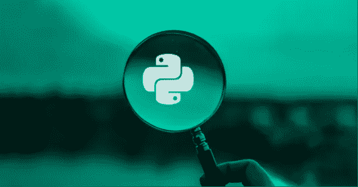

# Python 垃圾收集:它如此重要的 3 个原因

> 原文：<https://medium.com/codex/python-garbage-collection-3-reasons-why-its-so-important-e37e90f78884?source=collection_archive---------14----------------------->

## Python 最重要的特性之一是它的垃圾收集器。

Python 是一种高级、解释型、通用编程语言，由吉多·范·罗苏姆于 1989 年 12 月 3 日创建，其设计理念是“只有一种方法可以做到，这就是为什么它行得通。”