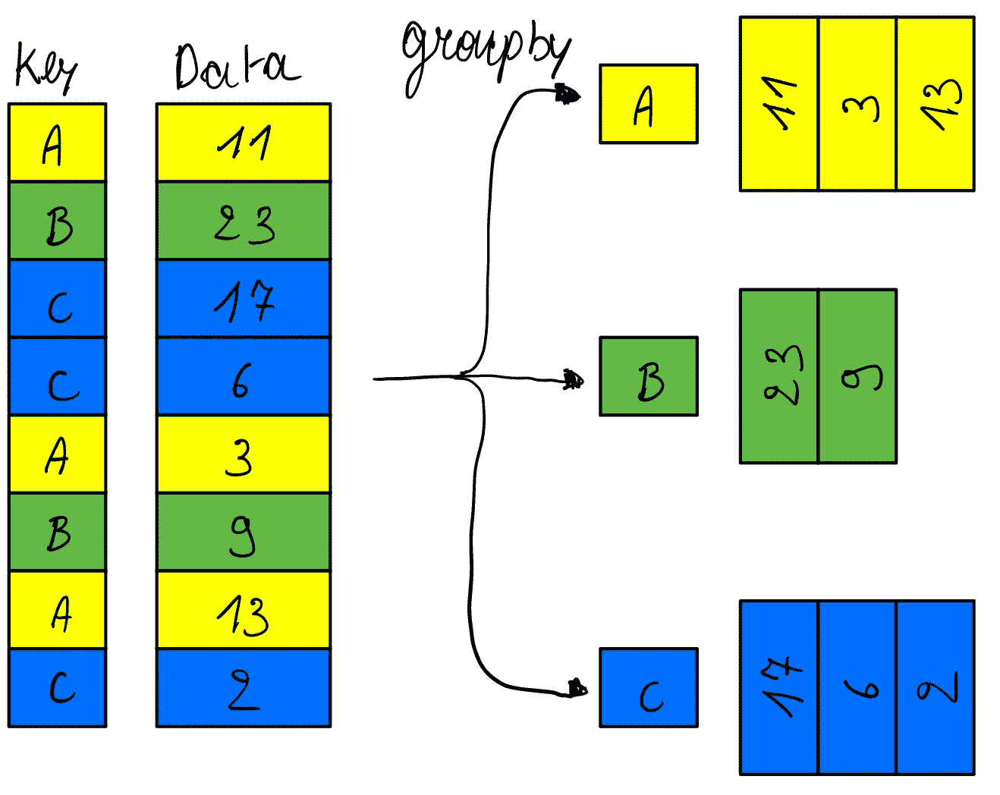
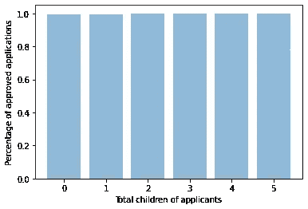
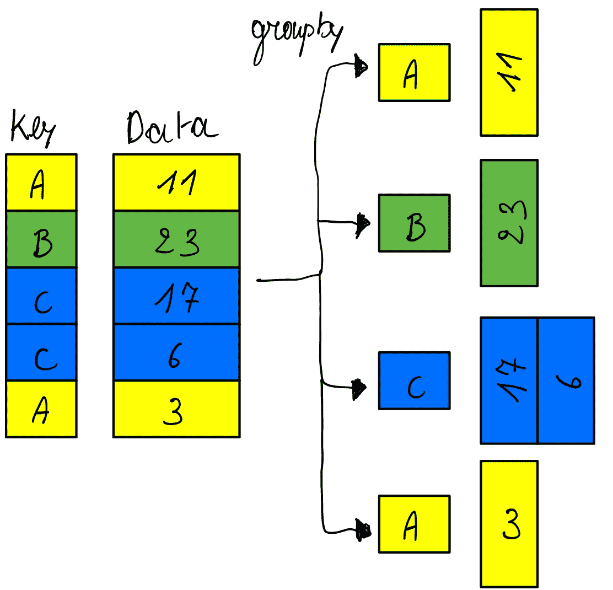
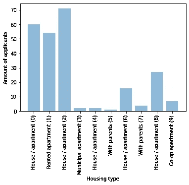

# Python 分组技巧

> 原文：<https://medium.com/codex/python-groupby-tricks-234004132c14?source=collection_archive---------0----------------------->

无论何时处理数据，都不可避免地要根据某些属性对其进行分组。这通常被称为“GroupBy ”,指的是`GROUP BY` SQL 语句。Python 标准库在名为`groupby`的`[itertools](https://docs.python.org/3/library/itertools.html)`包中提供了一个很棒的工具，它可以做到这一点。在本文中，我将探索一些技巧来充分利用它的功能。

我将探索一个包含信用卡申请的数据集，该数据集可以在 Kaggle 上免费检索。数据集包含信用卡申请的各种参数以及它是否被授权。本文使用的所有代码都可以在 [Github](https://github.com/bverhoeve/groupby-tricks) 上找到。

## `groupby`是做什么的？

如文档所述:*创建一个迭代器，从 iterable* 中返回连续的键和组。这意味着迭代器将遍历您的数据，为每一行计算一个属性，并根据计算出的属性遍历每个组。



groupby 遍历数据集，并根据提供的键函数将每个条目分配给一个组。

请记住，`groupby`返回的是一个**迭代器**——而不是一个数据结构。这确保了不分配额外的内存，但是，也意味着一旦你开始迭代，就没有回头路了——如果你想重新开始，你必须创建一个新的迭代器。您可以通过在迭代器上迭代一次并将元素存储在一个数据结构(通常是一个`dict`)中来减轻这个问题。在使用`groupby`之前，你还需要在同一个按键功能上对数据进行排序。

让我们将此付诸实践，并使用`groupby`根据每个申请人的子女总数对信用卡申请进行分组:

```
import itertools
from collections.abc import Iterator**def** create_dict_from_groupby(iterator: Iterator) -> dict:
  """
  Captures the groupby result in a dict so
  it can be reused multiple times
  """
  groupby_dict = {}
  for key, group in iterator:
    groupby_dict[key] = list(group)
  return groupby_dict# key function
total_children = **lambda** row: row["Total_Children"]*# first sort by the total children* sorted_by_children = sorted(data, key=total_children)*# groupby the total children* groupby_children_iter = itertools.groupby(
  sorted_by_children, key=total_children
)
groupby_children = create_dict_from_groupby(groupby_children_iter)
```

当将分组结果与批准申请的比例进行对比时，我们可以看到申请人有 1-5 个孩子，几乎每个申请都获得了批准，而不考虑孩子的数量。



这些是使用`groupby`的基础:定义一个关键函数，对数据集排序，创建分组迭代器。由于`groupby`是如何实现的，你可以用它做一些额外的有趣的事情。

## 通过不排序查找重复组

我们已经看到，在使用`groupby`之前，我们首先需要用 key 函数对数据进行排序。但是如果我们不对数据进行排序会发生什么呢？文档表明`groupby`每次遇到一个新的密钥都会生成一个新的组，因为它不记得已经见过它了。



使用 groupby 而不排序。因为稍后会再次遇到 A 键，所以会创建一个新组！

这种行为可以被滥用来寻找重复序列，这在分析顺序数据时会很有用。例如，考虑平均温度上升到 30 度以上的超过 10 天的温暖时期，或者 DNA 中重复核苷酸的长片段。

回到我们的信用卡应用程序，我们可以调查基于住房类型的数据中是否有任何规律性。这可能意味着每个邻域都有条目。这次我们不能将我们的`groupby`结果存储在`dict`中，因为那样会删除任何重复的组。我们将通过将组存储为一个`tuples`列表来缓解这个问题，第一个成员是键，第二个是组条目。

```
**def** create_tuples_from_groupby(iterator) -> list[tuple[str, list]]:
  groupby_list = []
  for key, group in iterator:
    groupby_list.append((key, list(group)))
  return groupby_listgroupby_housing_type_iter = itertools.groupby(
  data, key=**lambda** row: row["Housing_Type"]
)
groupby_housing = create_tuples_from_groupby(
  groupby_housing_type_iter
)
```

如果我们绘制由`groupby`发现的前 10 组，我们可以看到基于房屋类型的一些规律性:在前 200 行左右，有更大的房屋和公寓集中。如果住房类型是一个重要的参数，我们可以考虑重新平衡数据，使其分布更加均匀。



## 使用数据类维护组属性

您必须为`groupby`提供一个关键函数，该函数提取 iterable 中您想要分组的每个条目的属性。如果您想对单个属性进行分组，您通常会使用一个简单的 [lambda 函数](https://www.w3schools.com/python/python_lambda.asp)来检索它:

```
groupby_housing_type_iter = itertools.groupby(
 data, *key*=*lambda* *row*: *row*["Housing_Type"]
)
```

但是如果你想按多个值分组呢？您可以创建一个字符串或两个属性的散列，并将其用作键。假设我们在`Housing Type`和`Total Children`上分组:

```
key = *lambda* *row*: *f*"{*row*['Housing_Type']}_{*row*['Total_Children']}"
groupby_housing_children = itertools.groupby(data, *key*=key)for key, group in groupby_housing_children:
  housing_type = key.split('_')[0]
  total_children = next(iter(group))['Total_Children'] 
```

这段代码运行得很好，但是当您需要访问组属性时会失败。您要么求助于字符串解析，要么读取其中一个组成员的属性。这两种技术都不是特别好。

我们可以通过创建一个更复杂的返回自定义对象的键函数来解决这个问题。`groupby`的唯一前提是对象具有可比性。因为自定义对象默认情况下通过内存引用进行比较，所以我们需要实现自己的`__eq__`函数。幸运的是，标准库的`dataclasses`包包含了为我们做这件事的功能。向`dataclass`装饰器提供`eq=True`将生成一个`__eq__`方法，该方法根据对象的属性来比较对象，这正是我们所需要的！我还喜欢添加`frozen=True`使组键不可变。

代码现在变得更具可读性，我们可以直接从键中访问每个组的属性。作为一个额外的好处，key 对象具有类型化属性，可由 IntelliSense 和静态代码分析工具使用。

```
from dataclasses import dataclass@dataclass(*eq*=True, *frozen*=True)
*class* HousingTypeTotalChildren:
  housing_type: str
  total_children: int @classmethod
  *def* from_row(*cls*, *row*: dict) -> "HousingTypeTotalChildren":
    return *cls*(
      *housing_type*=*row*['Housing_Type'],
      *total_children*=int(*row*['Total_Children'])
    )group_by_housing_children = itertools.groupby(
  data, *key*=HousingTypeTotalChildren.from_row
)for key, group in group_by_housing_children:
  # Access group properties directly from the key
  print(
    *f*"Housing type: {key.housing_type}, "
    f"Total children: {key.total_children}"
  )
```

# 结论

这个`itertools`包包含了许多优秀的工具，比如`groupby`。对于大多数简单的用例来说，它已经足够强大，因此您不必求助于第三方库。当然，`groupby`有它的局限性，对于复杂的数据分析，你会想要使用一个像 [Pandas](https://pandas.pydata.org/) 这样的专用库。

*Brecht 是*[*qar go*](https://www.qargo.io/)*的软件工程师，使用 Python 为下一代运输&物流软件提供动力。*