# Python 集成测试:docker-compose vs . test containers

> 原文：<https://medium.com/codex/python-integration-tests-docker-compose-vs-testcontainers-94986d7547ce?source=collection_archive---------1----------------------->


在一家成长中的初创公司开发新功能可能是一个真正的挑战，尤其是当你开始在那家公司担任软件开发人员时。在这篇文章中，我将尝试分享我的最后一次经历，它涉及了很多原则，如 TDD、单元测试和集成测试。让我们开始吧。

# 什么是集成测试？

有一个著名的软件测试金字塔，从单元测试到集成(或端到端，“E2E”)测试，中间的步骤被称为“集成测试”。

顺便说一下，在 Spotify，他们改变了这种传统的方法[，用六边形(“蜂巢”)](https://engineering.atspotify.com/2018/01/11/testing-of-microservices/)取代了金字塔，专注于集成测试。

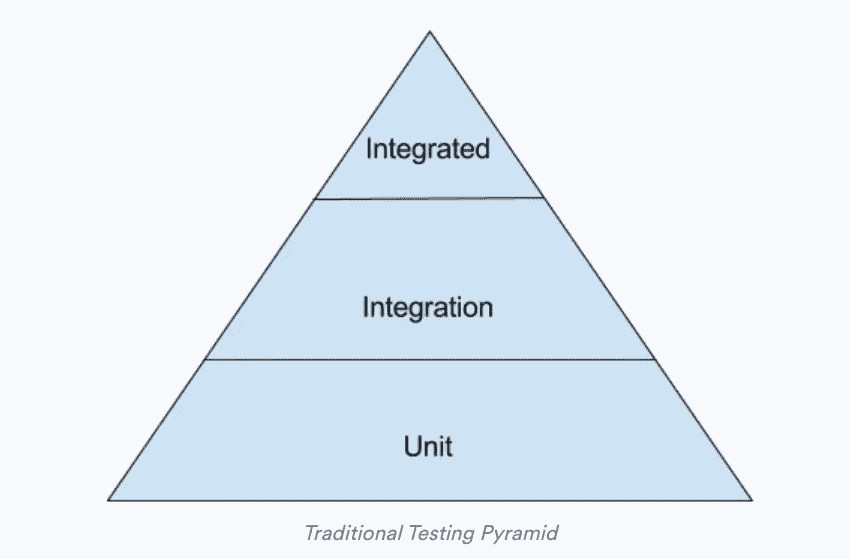

传统的测试金字塔:归功于 https://engineering.atspotify.com/的

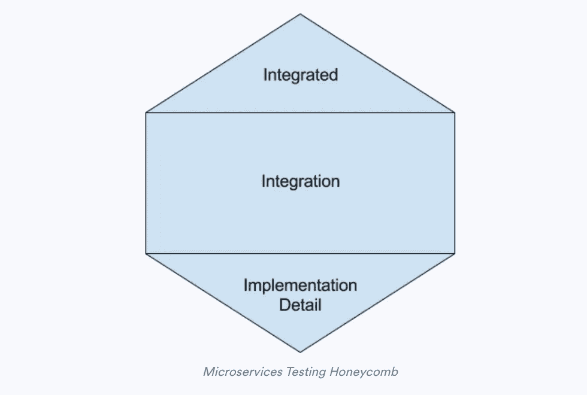

蜂巢测试的功劳归于 https://engineering.atspotify.com/

但是什么是集成测试，我们为什么需要它？我不会在这个定义上花太多时间，网上有大量的文献可以给出比我更好的答案……但是让我们举个例子来说明这两种测试的区别。

让我们来看两个函数，一个用于在数据库中插入新行，另一个将调用它:

我们有一个**插入函数**，它可能是存储库的一部分。它将在数据库会话中插入一个新行，并返回新插入行的 id。

我们有一个 **create_new_item** 函数，它将创建一个新项目，向它的一个属性添加一个值，并调用 **insert** 函数。

为了测试这两个函数的行为，我们有两种方法:

1)单元测试

我们通过只测试 create_new_item 函数来实现这一点(因为第二个函数将是集成测试的一部分)。

这里我们简单地创建了一个新条目，通过将它作为参数传递给我们的 **create_new_item** 函数来给它命名。我们断言返回的项目具有与我们传递给 **create_new_item** 函数相同的 *name* 属性。

2)集成测试

前面的单元测试只关注于作为项目类实例的项目创建。但是它没有测试数据库中实际的行创建:也许我们有一些 SQL 约束，外键，类型不匹配，等等…我们需要测试。

我们当然可以有一个[假存储库](https://www.cosmicpython.com/book/chapter_02_repository.html#_building_a_fake_repository_for_tests_is_now_trivial)来测试新项目的插入。这将使我们的单元测试更上一层楼……但是这仍然被认为是一个单元测试。

如果我们有一个定义了模式的真实数据库实例，并且我们在测试中写入它，那么**这是一个集成测试。**因为当它与架构的第三方组件通信时，它将测试我们的应用程序行为。这第三部分将是*产品的一个集成部分*。

我们编码吧。

# 设置我们的环境

我们将在本文中讨论的两种解决方案是容器化的解决方案。换句话说，在这两个版本中都需要 Docker。所以确保你的系统上安装了 docker(如果没有，并且[你不知道如何安装它以及它是什么…](https://docs.docker.com/get-docker/) )。

对于第一个解决方案，您将需要“docker-compose”(尽管我们将看到我们可以使用普通的 docker 来实现该解决方案，但是对于所有比“docker run <image_name>”更多的命令来说，compose 总是一种更容易的方式</image_name>

对于第二个解决方案，您将需要用于 python 的 [testcontainers 库，它将是您项目的依赖项的一部分(“requirement.txt”或“pipfile”或您喜欢的任何依赖项工具)。](https://github.com/testcontainers/testcontainers-python)

不需要精确到你将需要 Python！我在这里使用 3.9 版本，但 3.5+应该也可以。

我们还需要 Pytest 库，它将被用作我们的测试框架(而不是内置的 unittest 库，主要是因为它提供的 fixtures 特性)。

一旦所有这些都安装完毕:让我们开始吧！

# **快速代码回顾:我们在测试什么！(可选但推荐)**

如果您想关注本文的核心(docker-compose 和 testcontainers 库之间的比较)，您可以跳过这一部分，跳到下一部分，从 docker-compose 解决方案开始。

这篇文章的所有代码都可以在这里找到。这个库有两个分支，一个用于***docker-compose***示例，另一个用于***test containers***示例

这是我们应用程序的入口。我们有 **setup_app** 函数，它将从 SQL Alchemy 库中调用一个**元数据**实例。

这一个也需要一个数据库引擎。

让我们分解一下**元数据**和**引擎**对象。

[**元数据**](https://docs.sqlalchemy.org/en/14/core/metadata.html) 对象将包含所有的模式声明，它的主要优点是[没有与 ORM](https://www.cosmicpython.com/book/chapter_02_repository.html#_inverting_the_dependency_orm_depends_on_model) 紧密耦合。

这是我们的元数据声明。

我们将模式声明为一个表对象，并将其附加到元数据实例。

现在我们来声明一个 [**引擎**](https://docs.sqlalchemy.org/en/14/core/engines.html) **。**

我们使用 SQL Alchemy 中的[**create _ engine**](https://docs.sqlalchemy.org/en/14/core/engines.html?highlight=create_engine#sqlalchemy.create_engine)函数。这个需要一个数据库 URL。

**“build _ URL”函数对于理解本文的核心非常重要，因为它将是我们讨论我们正在比较的两种测试方法之间的差异的中心点**。

下面的**配置类****是一个简单的单例实例，有一个 get 方法。get 方法将从一个简单的 JSON 文件加载的配置对象中检索元素。**

**SingletonMeta 超出了本文的范围，但是您仍然可以在源代码中查看它。它基本上确保了我们每次调用这个类时都引用相同的内存地址…**

**现在让我们关注核心业务:在数据库中创建一个新行。**

**首先，我们将在我们的[存储库](https://www.cosmicpython.com/book/chapter_02_repository.html)中创建我们的插入方法。**

**我们的**插入**函数接收一个名称和一个会话对象。**

**然后，我们调用会话的 execute 方法，传递生成的插入查询。**

**最后，我们返回新创建项目的 **lastrowid** 属性:这个新属性直到我们调用会话的 commit 方法才会被注册。F [遵循存储库模式](https://www.cosmicpython.com/book/chapter_02_repository.html#_what_is_the_trade_off)的原则，执行提交动作确实是调用者的责任。**

**然后，我们将创建一个非常简单的服务函数，就像我们在介绍中所做的那样。**

**我们用数据库引擎打开会话对象。我们从存储库中调用插入函数。我们提交并最终返回新的行 id。**

**我们终于准备好编写集成测试了！当然，我们之前应该已经写了一些单元测试，但是我们还是想把这篇文章的重点放在集成测试上。**

# **如何执行集成测试，docker-compose 方式**

**让我们编写我们的第一个集成测试。我们将在数据库中插入一行，并通过检索来确保它是被插入的。**

**对于这一部分，我们将利用[py test fixture](https://docs.pytest.org/en/6.2.x/fixture.html#what-fixtures-are)。**

**夹具是*你准备测试需要的东西*(“安排”步骤)，并不直接是你正在测试的东西。它立刻取代了安装和拆卸功能。**

**让我们首先创建一些装置来设置一个数据库引擎，该引擎将连接到我们实际的数据库和一个与之通信的会话(我从这里取了这个代码示例[，但是它非常简单):](https://stackoverflow.com/a/58662370/13000695)**

**我们这里有三个固定装置。一个基于我们的 build_url 函数创建数据库引擎**。第二个将基于该引擎创建一个[范围的会话](https://docs.sqlalchemy.org/en/14/orm/contextual.html)。最后但同样重要的是，一个将返回( [**yield)的 fixture！！**](https://www.guru99.com/python-yield-return-generator.html#:~:text=Summary%3A-,The%20yield%20keyword%20in%20python%20works%20like%20a%20return%20with,generator%20function%20to%20the%20caller.&text=The%20main%20difference%20between%20yield,single%20value%20to%20the%20caller.) **:** 允许在测试套件完成后进行回滚等清理动作**)****会话**。****

**既然我们已经准备好了设备，我们可以在测试中使用它们。Pytest 有一种基于名称的依赖注入。只需添加一个与我们的 fixture 同名的参数，Pytest 就会注入它。**

**首先，我们用“pytest.mark”来“标记”我们的测试。标记是 pytest 的另一个非常酷的特性。它允许我们标记我们的测试，然后通过选择一些测试来运行测试套件。**

**您可以在“标记”后添加任何您想要的名称，Pytest 将注册它们。现在，我们可以通过运行以下命令来选择集成测试套件:**

```
pytest -m "integration"
```

**而且假设你再加一个类似“create_items”的标记。您可以使用以下命令选择它:**

```
pytest -m "integration and create_items"
```

**多酷啊。！！！**

**顺便说一下，您添加的每个自定义标记都应该在一个“pytest.ini”文件中进行注册和解释，该文件可以是:**

```
[pytest]
markers =    
    integration : run all integration tests
    create_items : tests related to the items creations
```

**现在你得到了越来越多的测试记录！**

**好吧，我们把注意力放在其他台词上。**

**所以我们使用“db_session”设备。接下来，我们调用项目服务的 create_item 函数。它应该在数据库中插入该行。**

**然后，我们使用 db_session 检索新插入的行，并断言它与给定的行同名。**

**让我们运行:**

```
pytest -m "integration"
```

**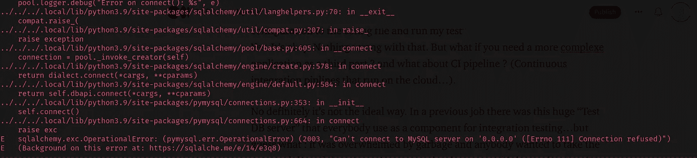**

**哦，上帝…为什么我们的数据库没有连接…因为我们还没有一个数据库！**

**但问题是:我如何得到一个测试 DB？？**

**是的，因为如果你读了这几行，你会发现它们都是关于如何获得外部组件(如数据库)来在“真实”环境中测试我们的应用程序。**

**嗯，Bob 会说(我对这个名字没有任何异议):“这里没有什么太复杂的…我将在我的计算机上安装 MySQL，我将把我的连接字符串写入我的配置文件并运行我的测试”。是的。没事的。这没什么不对。但是如果你需要一个更复杂的应用作为第三方呢？那么 CI 渠道呢？(运行在类似云的 GitHub actions 上的持续集成管道…那里没有数据库！).**

**不，这绝对不是理想的方式。在我以前的工作中，有一个巨大的“测试数据库服务器”,每个人都将其用作集成测试的组件……但你猜怎么着:它被垃圾淹没了，任何人都想负责清理它，因为*聪明的*开发人员**在生产中使用了它**(不，我不是在开玩笑:完全正确)。**

**码头工人来救援了！**

**我们当然可以通过键入以下命令来运行普通的 docker 容器:**

```
docker run --name some-mysql -e MYSQL_ROOT_PASSWORD=password -e MYSQL_DATABASE=items -p 3306:3306 -d mysql:tag
```

**但是这不是真正可维护的，对吗？如果您想要添加一个卷来保存您的数据，该怎么办？**

```
docker run --name some-mysql -e MYSQL_ROOT_PASSWORD=password -e MYSQL_DATABASE=items -p 3306:3306 -v db_data:/var/lib/mysql -d mysql:tag
```

**如果允许这个端口呢？好吧，你明白了…改变指挥当然不是最佳方式。所以让我们来看看 docker-compose 文件。"**

**更清楚了(至少对我来说)。我们将 MySQL 镜像作为一个名为“DB”的服务来运行。我们给出了一些环境变量，并映射了端口…一切看起来都很好。**

**我们跑吧**

```
docker-compose up
```

**现在我们跑吧**

```
pytest -m "integration"
```

**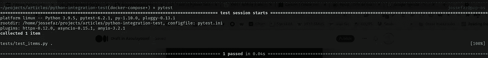**

**是的，我们运行了第一个集成测试！太酷了。**

**不过，这种方法存在一些问题/挑战:**

**1-您现在依赖于 docker-compose 文件。同样，你总是可以运行一个简单的 docker 命令，但是正如我们所看到的，它不容易维护。**

**2-您必须检查您放入环境变量的配置是否与您放入配置文件的配置相同。虽然有很多智能解决方案，但我们在这里提供的简单解决方案却不是这样，您有一个重复的配置源。**

**3-在运行测试之前，您需要运行 docker-compose 命令。你不能只安装你的应用程序并运行“pytest”。因为没有数据库实例，所以它不起作用。**

**对于所有这些点， **testcontainers** 库是你的朋友。让我们深入研究一下。**

# **Testcontainers 解决方案:用于运行集成测试的内置解决方案。**

**Testcontainers 是一个最初用 Java 编写的库。原则是将基本的 docker 命令封装在一个代码 API 中，直接从测试套件中管理容器。**

**在幕后，这个库使用 UNIX 套接字向 docker 发送指令，但我们将在几分钟后看到这一点。**

**好消息是 python 有一个该库的[端口。](https://github.com/testcontainers/testcontainers-python)**

**他们提供了一个显然[非常简单的例子](https://github.com/testcontainers/testcontainers-python#basic-usage)**

**好的，让我们在 pytest 夹具中试一试。**

**这里我们用一个“ [autouse](https://docs.pytest.org/en/6.2.x/fixture.html#autouse-fixtures-fixtures-you-don-t-have-to-request) 参数调用 fixture，在所有其他测试之前运行这个 fixture。**

**因此，希望不再需要“docker-compose”…只需运行**

```
pytest -m "integration"
```

**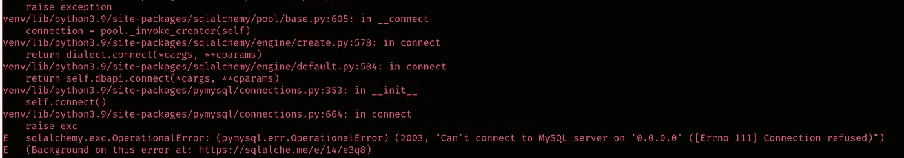**

**好的。这显然不起作用。**

**我们可以检查的第一件事是:这个命令至少运行一个 MySQL 容器吗？**

**让我们打开一个双窗口终端，通过在 docker ps 命令上运行 watch 来检查一下**

**开头终结符**

```
watch -n0.1 docker ps 
```

**第二终端**

```
pytest -m "integration"
```

**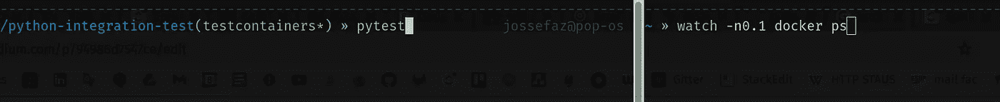**

**这里没有流动的容器…**

**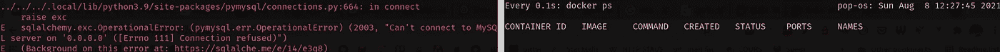**

**真相就在那里…**

**让我们看看我们的追溯:**

**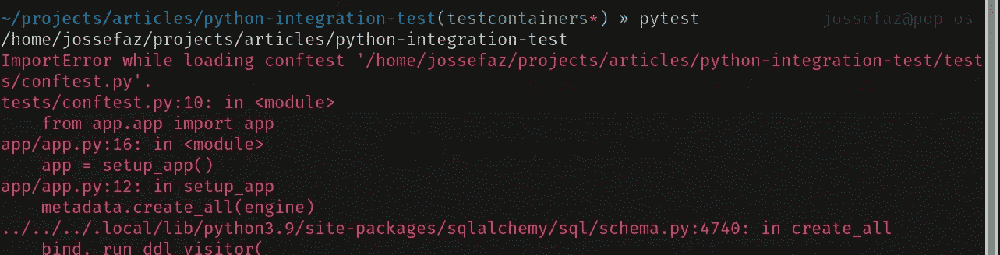**

**好吧。都是从那个“从 app.app 导入 app”开始的。Python 总是在运行其他任何东西之前首先解析导入。运行也意味着执行文件。如果您还记得，我们的服务器上有这个。py:**

**是的。通过导入应用程序，我们基本上调用了**

```
metadata.create_all(engine)
```

**这将需要一个数据库引擎来执行从元数据到数据库中实际表的迁移。它需要一个有效的 URL(连接到一个真实的数据库实例)。但是您猜对了:由于 testcontainers fixture 还没有被调用，我们在这一点上仍然没有任何运行的数据库！**

**让我们删除这个导入，看看它是否改变了什么。**

**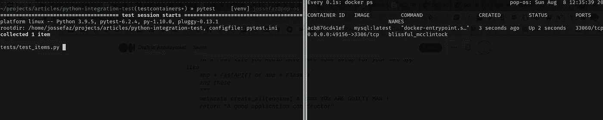**

**耶！！我们有一个流动的容器！**

**但是…**

**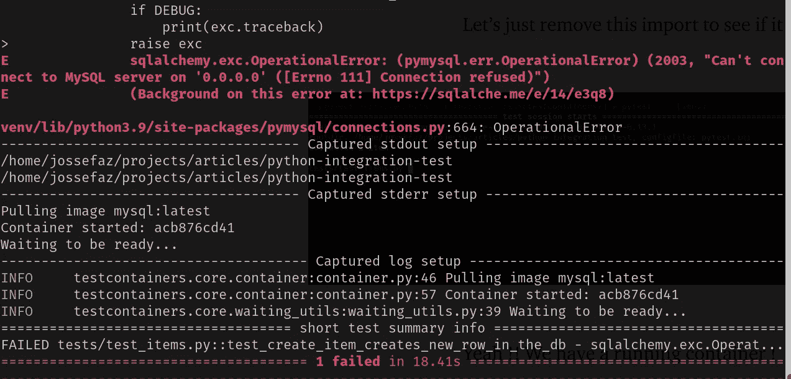**

**为什么我们的测试又失败了？！**

**如果我们看一下 docker ps 的输出，我们可以看到新容器的端口不是我们期望的默认端口，即我们放在配置文件中的端口(3306):**

**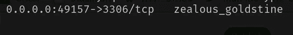**

**如果您重新开始，您可能会注意到每次运行都有不同的端口！**

**让我们看一下 testcontainers API，看看我们是否可以将新容器绑定(或者至少公开它)到我们想要的端口。**

**为此，我们可以去阅读文档……或者跳到库的源代码中(这是我的首选方式),以便更好地理解这个上下文管理器背后发生的事情:**

```
*with* MySqlContainer(MYSQL_DATABASE=db_config.get('database')) *as* mysql:
    *yield* mysql
```

***在 Pycharm 中按 Ctrl+B，***

***虚拟代码中的 F12***

***Vi，nano，vim … to " <你的 PYTHON ENV>/lib/PYTHON<PYTHON 版本>/site-packages/test containers/MySQL . py "***

**你到了那里:**

**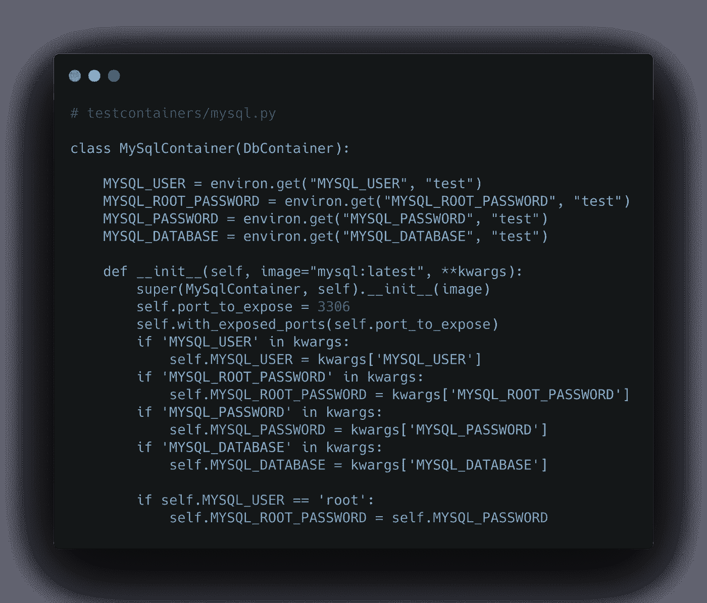**

**正如我们在这里看到的，没有配置端口的真正选项…现在，如果我们看一下文档，我们知道**这是故意的**。**

**来自[的文件](https://www.testcontainers.org/features/networking/):**

> **从主机的角度来看, Testcontainers 实际上在一个随机的空闲端口上公开了这一点。**这是为避免端口冲突而设计的**，端口冲突可能会在本地运行软件或并行测试运行之间出现。**

**好的。因此，我们需要找到一种方法来更改配置对象，以匹配 testcontainers 自动生成的这个新端口。**

**什么可以使用提供的方法:" **get_connection_url()** "。**

**因此，在 **db_engine** fixture 中，我们可以用从 testcontainers 获得的 url 替换我们的 **build_url** 函数。**

**为此，我们可以注入 **mysql_instance** fixture 作为这个 **db_engine** fixture 的参数。让我们试一试:**

**所以我们从:**

**到**

**嗯，但是测试还是失败了**

**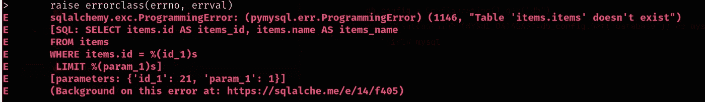**

**如果您还记得，5 分钟前我们删除了负责调用元数据迁移的 create_app 函数。所以有一个 DB…那很好。但是没有桌子！**

**没问题…让我们创建一个新的夹具来为我们执行迁移(**剧透**:非常糟糕的主意)。**

**我们导入元数据对象，现在我们用 **db_engine** fixture 执行迁移。**

**让我们运行测试…**

**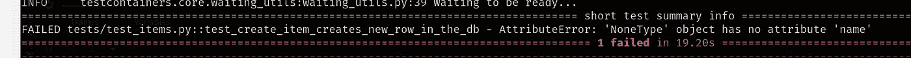**

**嗯。为什么？嗯，这是因为，**在插入函数**中，我们称引擎……但是**不是同一个**。如果你记得:**

**我们从依赖于“build_url”函数的 DB 文件夹中导入引擎。**

**嗯，我们可以解耦 create_engine 调用，让它接收 URL 作为参数…但是我们必须在测试中修补这个调用，注入我们从 testcontainers 接收的全新 URL…好的！这不是我们想要的。我告诉过你…这是个坏主意。**

**我们可以修改配置对象，并在那里注入我们从 testcontainers 获得的新配置。**

**因此，我们没有在测试中执行迁移*(糟糕的想法…真的)，而是将迁移保持在应用程序责任级别。***

**我们将创建一个简单的函数来改变数据库的配置。因为我们的配置类是单例的，每次函数调用它时，它将返回相同的配置(而不是从配置文件中初始化它)。所以如果我们改变它，它就会“处处”改变它！**

**让我们试一试:**

**因此，我们根据 testcontainers 为我们“决定”的内容来更新我们的配置。让我们开始测试吧！**

**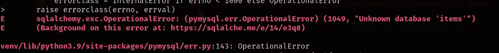**

**哦，别这样！！！为什么？**

**这是因为我们的 db_engine 文件。再看一分钟:**

**从我们的 conftest.py 中，我们导入了“build_url ”,以便将它作为一个附件……这是一个坏主意！流程如下:**

**导入数据库引擎。=>**

**执行" engine = create _ engine(build _ URL())" = >**

**呼叫配置单例= >**

**获取 URL(基于未更新的配置)=> **将错误的 URL 绑定到引擎。****

**因为 python 解释器在所有语句之前解析 imports 语句……所以文件被执行，引擎在它被更新之前从配置类获得它的 URL！**

**每个其他调用将返回绑定到第一个 URL(而不是更新后的 URL)的同一个引擎。**

**因此，我们必须将引擎封装在一个函数中(并替换对该函数的每次调用)。当然有更好的方法，我们可以创建一个智能类来管理我们的引擎，并通过检查一种 DB URL 注册表来避免对该函数的不必要的调用…但你应该明白。**

**当然也要把所有的“引擎”调用都改成“get_engine()”。**

**好吧，我们再跑一次…**

**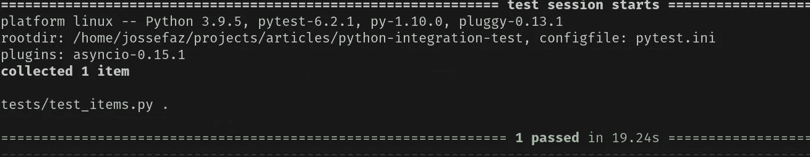**

**芜湖！它工作了。我们使用测试容器库运行我们的第一个集成测试。**

**这并不像例子中描述的那么简单，但是我们做到了。**

**最酷的事情是你现在可以完全控制你的 MySQL 实例容器了！你可以停止它，重新加载它，亲吻它…所有这一切都来自你的代码库。**

**你也不需要“docker-compose”这样的第三方脚本。因为 testcontainers 是一个内置的解决方案，所以您现在需要做的就是克隆您的存储库，确保您的机器上安装了 docker，并运行“pytest”。**

**这是 testcontainers 库的真正意义所在。**

# **结论**

**无论您选择 docker-compose 还是 testcontainers，这两种解决方案都非常适合集成测试。我们将在此总结我们对这两种解决方案的想法:**

****Docker-compose** :**

**优点:**

*   **简单的配置**
*   **跑得快**
*   **代码库没有变化:都是关于配置文件的**
*   **对于数据库，您可以轻松地为 init.sql 脚本创建一个卷(在某些情况下，这可能是数据库迁移的首选方式，尤其是如果您不是 ORM 的有力支持者的话)**

**缺点:**

*   **静态的，一旦你启动它，你就不能真正地操作代码中的容器，除非使用外部调用，比如 python 中的“os.system”或“subprocess ”,或者像 pydocker 那样使用 Unix 套接字的端口)**
*   **您的测试套件现在依赖于第三方脚本，并且您需要在每次测试之前运行它**

****测试容器:****

**优点:**

*   ***内置解决方案:*一旦配置好，就可以运行了。例如，看一下 testcontainers 分支的 [GitHub 动作工作流…并将其与 docker-compose 分支](https://github.com/jossefaz/python-integration-test/blob/testcontainers/.github/workflows/tests.yml)之一的[进行比较…我们在这里节省了一个步骤！因为 pytest 将通过调用 testcontainers API 直接为我们运行容器](https://github.com/jossefaz/python-integration-test/blob/docker-compose/.github/workflows/tests.yml)**
*   **从测试中控制你的容器！**

**缺点:**

*   **改变你的代码库(在我看来这是一个难题):如果你的测试套件只需要一个正在运行的数据库实例…那么更喜欢 docker-compose 解决方案**
*   **很难使它工作(在我看来)。如果一个测试库意味着改变测试范围之外的代码…这可能是因为代码不好(我并不是说我们展示的代码是远非理想的代码)…但是说实话，这是我第一次不得不做出这样的改变来让它工作。**
*   **运行您的测试套件需要更长的时间，因为测试现在负责启动一个容器，这对于当前版本(3.4.1)来说有一点延迟**