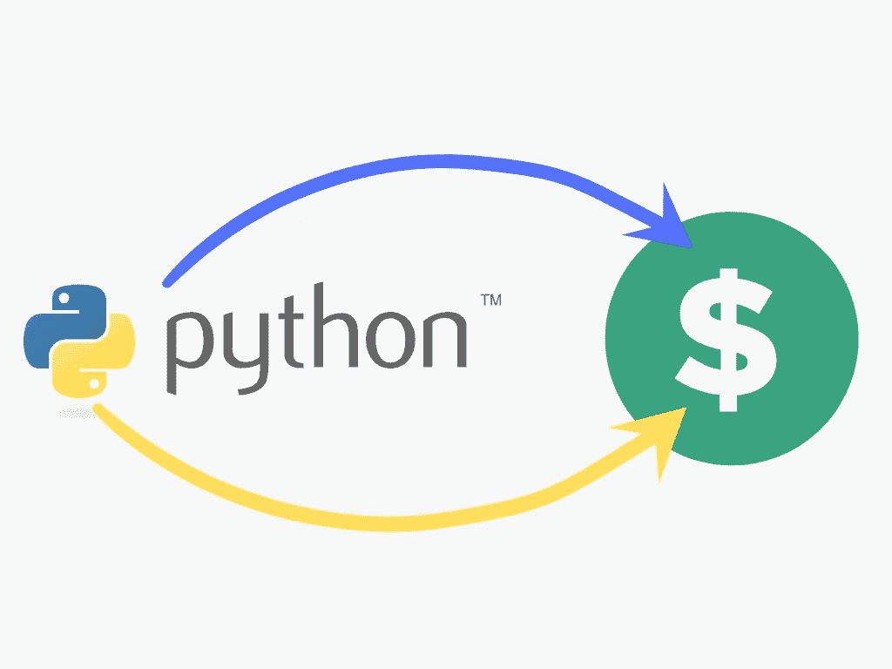
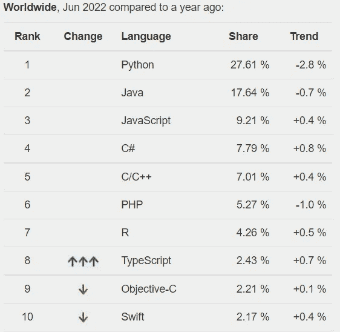
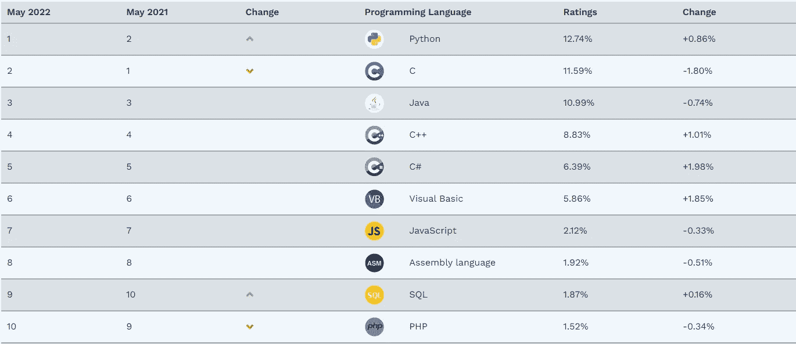

# Python 是赚钱的可靠途径(第 1 部分)

> 原文：<https://medium.com/codex/python-is-the-sure-way-to-earn-money-5c115c55ae6b?source=collection_archive---------3----------------------->

"*投资自己是你唯一能做的真正无风险的投资！*

COVID19 让我们意识到，我们看似安全的工作其实并不那么安全。它随时可能崩溃，让我们成为一片废墟。我们寻找新的赚钱方式，但这也带来了新的问题，因为我们的一些投资成功了，而另一些失败了，这让我们比以前更加痛苦。所以，我想分享一个不用冒更大风险就能赚钱的可靠方法。到底是什么？Python！为什么 Python 是赚钱的不二法门？

**头号编程语言**

毫无疑问，Python 是世界上最好的编程语言。如果我们在所有对编程语言进行排名的编程相关网站上搜索 Python，我们会发现它位于列表的顶部，或者至少在三大中没有更新数据或五大中最差的一些网站上。因此，我们不必担心切换到另一种编程语言或 Python 很快就会过时。

来自 [pypl.github.io](https://pypl.github.io/) 的表格

表来自[tiobe.com](https://www.tiobe.com/tiobe-index/)

**简单易学**

图片来自[freepik.com](https://www.freepik.com/free-photo/classmates-working-together_863223.htm#query=children%20computer&position=8&from_view=search)

Python 格式代码和基础英语很像；Python 中不会使用不寻常的措辞。Python 不要求它的行用花括号或其他东西括起来。要结束一个程序行，我们按“回车”为了区分一个程序行的组，我们使用缩进，这是英语用户非常熟悉的。

它是如此简单，以至于一个 7 岁的孩子的大脑就是开始用 Python 编程所需要的全部，而且这不是专门为孩子设计的 Python，而是普通的 Python。如果我们在 YouTube 上搜索“面向儿童的 Python 编码”，我们会发现几个由儿童创建的频道来展示他们的 Python 编程能力；甚至有一个频道用 Python 来教南非 7 到 17 岁的孩子。所以，学习 Python 不需要高智商；只要会操作 Windows 或 Mac OS 就可以开始。

Python 是如此简单易学，如果我们没有编程经验，我们可以在 2-3 个月内开始学习，如果我们有一些编程经验，不到一个月。本文的第 2 部分将更详细地讨论这个问题。

**市场需求很大**

图片来自[freepik.com](https://www.freepik.com/free-vector/two-young-businessmen-are-determined-work-one-is-successful-another-one-failed-work-flat-vector-illustration-design_23248259.htm#query=high%20market&position=6&from_view=search)

Python 有很高的市场需求；我们可以在 Upwork、freelancer、Fiverr 等几个自由职业者网站上搜索“Python”，找到很多结果。我们中的一些人可能认为大多数任务需要高级 Python 知识。相反，大多数 Python 工作需要入门级的专业知识；这就是为什么，如上所述，我们只需要 2-3 个月就可以开始使用 Python。

几个网站，如 [**Remotephyton**](https://www.remotepython.com/) 和 [**Djangojobs**](https://djangojobs.net/) 都是专门做 Python 作品的。根据 Glassdoor 的数据，入门级 Python 程序员每年可以赚 58000 美元左右。如果我们中的任何人喜欢做自由职业者，我们可以期望每小时赚 10 到 30 美元。考虑到我们只需要 2-3 个月来学习，而且不需要认证，这还不错。因此，如果我们中的任何人在未来 3-6 个月内急需新的收入来源，我强烈建议你开始学习 Python 你不会后悔的，你会在短短的 2-3 个月内看到结果。第 2 部分将很快发布。