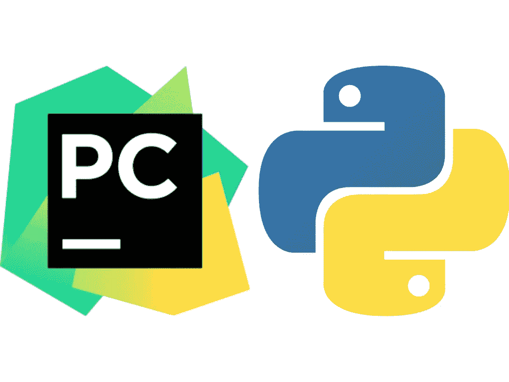
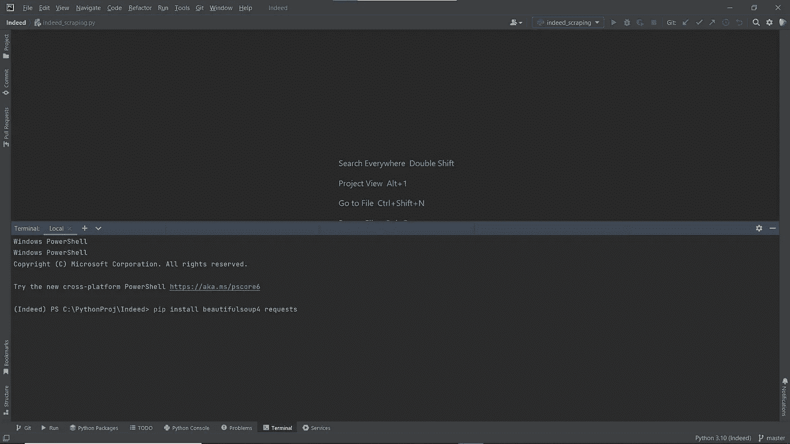

# Python 是赚钱的不二法门(第 2 部分)

> 原文：<https://medium.com/codex/python-is-the-sure-way-to-make-money-part-2-5bc8082ccd07?source=collection_archive---------1----------------------->

## "*秘密是网络搜集*"


图片来自 cloudinary.com

[**本文的第 1 部分**](/@lorence80/python-is-the-sure-way-to-earn-money-5c115c55ae6b) 讨论了 Python 是一种可靠的赚钱方式的几个原因；请先阅读。因此，在第 2 部分中，我们将讨论如何在最短的时间内用 Python 赚钱。我们能在两个月后开始用 Python 工作吗？什么样的工作应该优先考虑？答案已经在这篇文章的标题里了:网络抓取。

我们中的一些人可能会将网络抓取与一些负面的东西联系起来，因为它经常与黑客、骗子和其他不受欢迎的人联系在一起。我们忘记了谷歌、雅虎和其他搜索引擎网站在扩展到其他业务之前是从网络抓取开始的。所以是中性的；这取决于用户和他们使用它的目的。

因此，在第 2 部分中，我们将学习如何用不到 20 行代码用 Python 做简单的 web 抓取。我们将使用网站 indeed.com 作为我们的目标网站的例子；我们将使用 Python 从网站的第一页中提取职位、公司名称和公司位置。

**Python 和 Pycharm (IDE)安装**



图片来自[jetbrains.com](https://resources.jetbrains.com/storage/products/pycharm/img/meta/pycharm_logo_300x300.png)和[upload.wikimedia.org](https://upload.wikimedia.org/wikipedia/commons/thumb/c/c3/Python-logo-notext.svg/1200px-Python-logo-notext.svg.png)

首先，我们需要安装 Python 本身以及我们将使用的 IDE 或编辑器；在这种情况下，我们将使用 Pycharm 作为编辑器。首先，我们需要从 [**这里下载 Python 安装文件**](https://www.python.org/downloads/) 请照常按照安装说明进行操作。然后从 [**这里**](https://www.jetbrains.com/pycharm/download/#section=windows) 安装 Pycharm (IDE)你可以根据你的操作系统选择 windows、mac 或 linux 的版本。遵循安装说明，直到完成。

如果你在安装 Pycharm 时遇到困难，你可以看一个 YouTube 视频，比如 [**这个**](https://www.youtube.com/watch?v=2RSDlwWH0XI) **。**

**包安装**

我们在 [**第一部分**](/@lorence80/python-is-the-sure-way-to-earn-money-5c115c55ae6b) 中简要讨论了 Python 中的包；简单来说，包是其他人制作的程序，其他人可以通过特定的功能重用它。例如，“requests”是一个包，用于检索我们稍后将使用的网站。这个软件包是专门为帮助其他人检索网站而创建的，无需编写冗长的代码。Python 有数百万个这样的包可以在[https://pypi.org/.](https://pypi.org/.)请求时免费下载，BeautifulSoup 将是我们唯一使用的包。BeautifulSoup 是一个软件包，它将帮助我们从 HTML 文件中检索数据，该软件包是从互联网上下载的，在我们的例子中，是从网站 indeed.com 下载的。



我们可以使用 Pycharm 底部的“终端”选项卡中的命令行在 Pycharm 中同时安装这两个包。

```
pip install beautifulsoup4 requests
```

然后，我们在 Pycharm 的项目文件夹中创建新文件，也许我们给它命名为“indeed_scraping.py”。如果你不明白怎么做，你可以在 YouTube 上找到，那里有很多关于这个的教程。

## 开始编码

我们代码的前两行将导入包，这样它就可以在我们的程序中使用了。

就这样，然后我们开始从网站 indeed.com 检索第一个 HTML 页面，具体来说，例如我们在“纽约州”寻找“Python 开发人员”的工作，所以代码如下。

我们在变量“params”中指定想要查找的作业和位置。考虑变量，比如我们用来写简单笔记的一页笔记，比如姓名和电话号码。然后，我们使用变量 params 通过请求包来检索 HTML。

包含“纽约州”的“Python 开发人员”工作的网站 indeed.com 的第一页已被检索。下一步我们使用 BeautifulSoup 包从这个 HTML 文件中提取数据。

将数据提取到变量 soup 后，我们将使用 BeautifulSoup find 函数解析我们需要的数据。例如，我们需要职位、公司名称和公司位置数据。

然后从 Pycharm 菜单中选择 run，瞧！所有工作及其公司名称和位置将在下面的 Pycharm Run 选项卡中发布。完整的代码如下:

从 indeed.com 网站的首页检索数据只需要 16 行代码。当然，在实际应用中，需要额外的代码行来适应雇主的要求，但是核心代码保持不变。代码格式很容易理解，对吗？这么简单的编程，两个月是不可能学会的吗？正因为如此，Python 是最受欢迎的网络抓取工具。希望这篇文章的这两个部分能对我们中正在寻找新工作或额外收入来源的人有所启发。