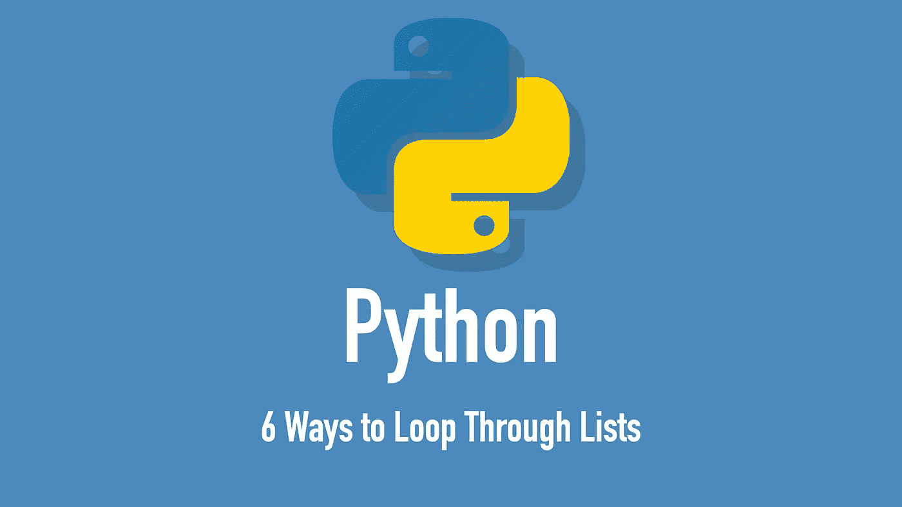

# Python 以 6 种方式遍历列表

> 原文：<https://medium.com/codex/python-loop-through-lists-in-6-ways-5940007f903f?source=collection_archive---------3----------------------->

## 了解 Python 中迭代列表的 6 种方法

# 学习 Python 遍历列表

在 Python 中，列表是一个常用的集合，可以在其中存储多个值，比如整数或字符串。随着列表变得越来越大，拥有一个工具来迭代它们而不需要手动操作是非常有用的。今天你将学习…