# Python 模块:你应该知道的五个有趣的模块

> 原文：<https://medium.com/codex/python-modules-five-interesting-modules-you-should-know-56f207a84b32?source=collection_archive---------3----------------------->

照片由 Andrea Piacquadio 拍摄:[https://www . pexels . com/photo/young-ethnic-woman-pointing-in-camera-3880943/](https://www.pexels.com/photo/young-ethnic-woman-pointing-at-camera-3880943/)

Python 有许多模块和库，我们可以导入并在代码中使用它们。在这篇文章中，我们将会看到你应该在 Python 脚本中使用的五(5)个很酷的模块。

# 1.更好的亵渎

有时您可能会处理带有亵渎性的文本；你可能想审查文本中的不良词汇。Python 有一个模块，你可以用它来清除文本中的不良词汇。这个模块叫做更好的亵渎。您可以使用 pip 安装该模块。只需运行 pip install better_profanity。让我们探索一下您可以利用本模块做的一些事情。

下面我们有包含一些亵渎的文字。让我们试着用这个模块来过滤不良词汇。

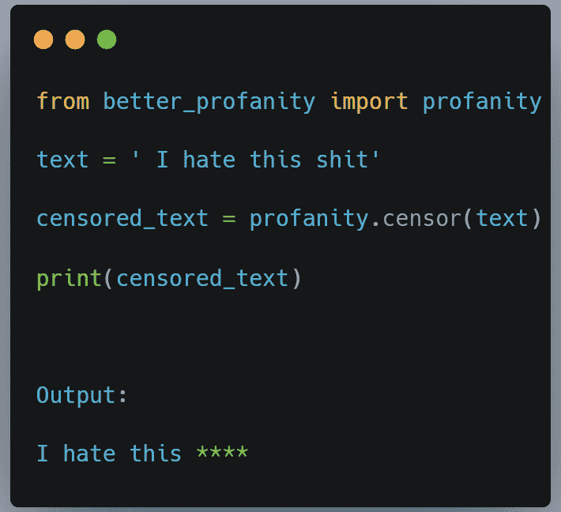

您可以从输出中看到，坏词已被审查。

默认情况下，更好的脏话使用星号*来审查不良词汇。然而，你也可以设置你自己的审查角色。请参见下面的示例。我们将$设置为审查字符。

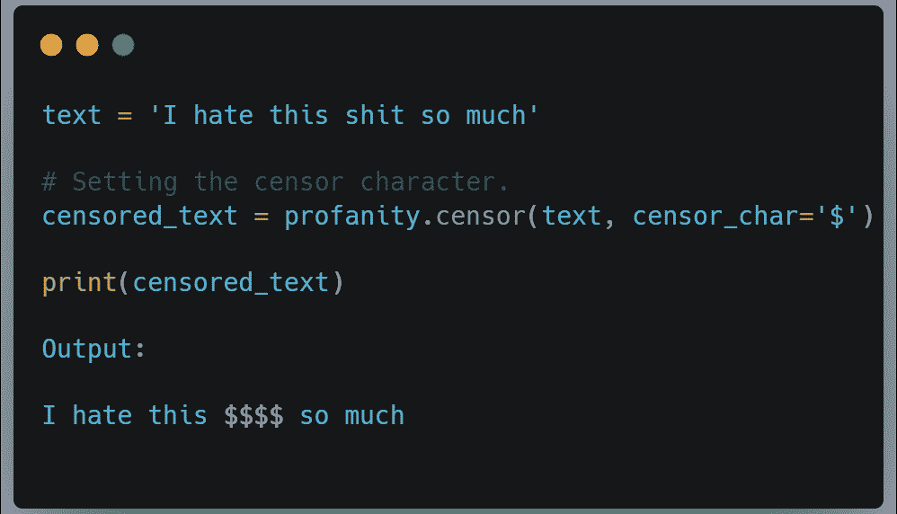

如果你只想检查一个字符串是否包含不良单词，你可以使用 contains_profanity 方法，如果它包含脏话，该方法将返回一个布尔值 True，如果它没有脏话，则返回 False。

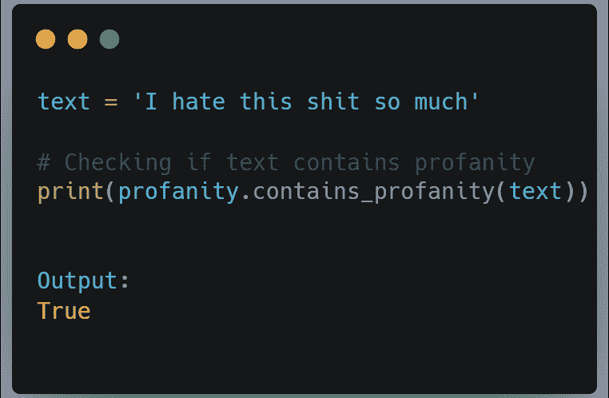

您还可以创建想要审查的自定义单词列表。如果一个文本包含你的列表中的一个单词，那么它将被审查。

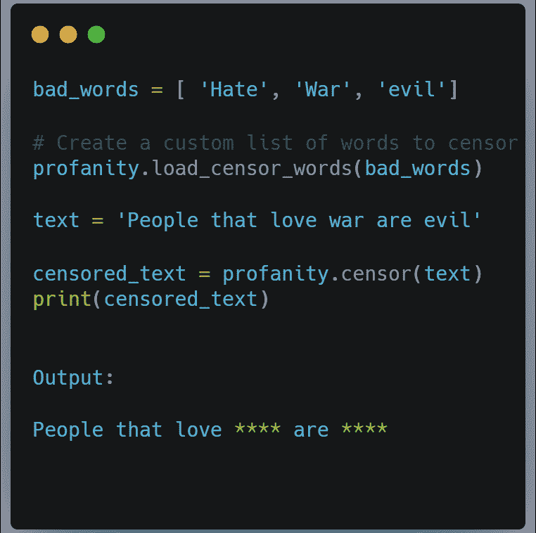

# 2.Pyautogui

有一个叫做 Pyautogui 的 Python 库，它主要是一个自动化工具。这个库很酷的一点是你可以用它来截图。您可以通过运行 pip install pyautogui 来安装该库。

下面的脚本用 pyautogui 截图。它保存图像，并使用 cv2 和 numpy 将其从 RGB 转换为 BGR。我们转换图像，以便它可以被 CV2 库读取。运行下面的代码来看看神奇之处。

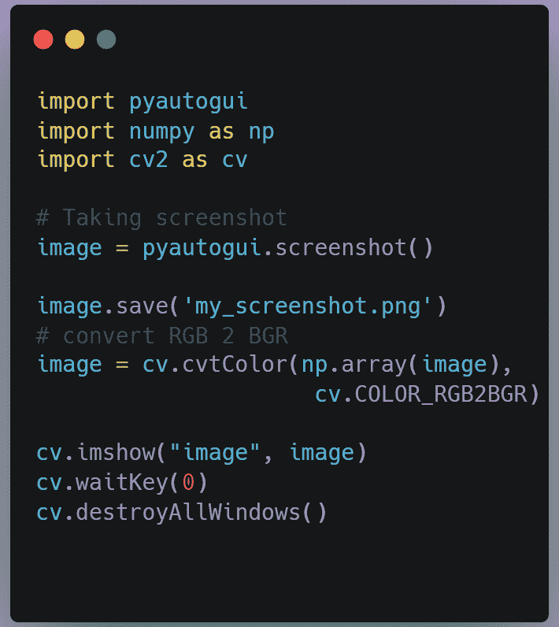

# 3.Pytube

你曾经想在你的电脑上保存一个 YouTube 视频吗？Python 让下载 YouTube 视频变得超级简单。只需几行代码，你就可以将你最喜欢的视频保存在你的电脑上。从 YouTube 下载视频需要的 Python 库是 Pytube。使用 pip 安装 pytube 进行安装。

首先，我们将模块导入到脚本中。然后我们得到了我们试图下载的视频的链接。

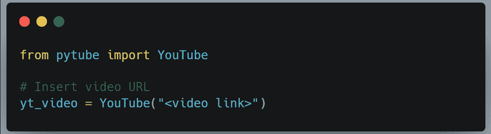

接下来，我们使用 filter 函数设置想要下载的文件类型或扩展名。我们还设置了视频分辨率。

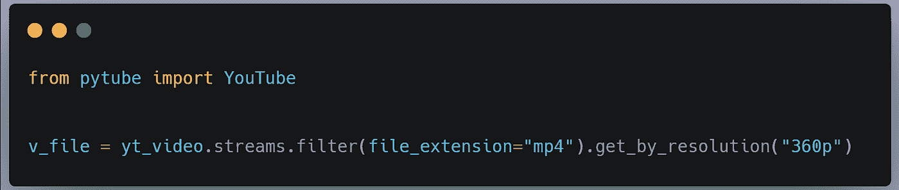

第三步是下载文件。您也可以输入保存文件的路径。如果不输入路径，它将作为 Python 脚本保存在文件夹中。

例如，如果我想在桌面上保存视频，我可以输入:

让我们把它们放在一起。

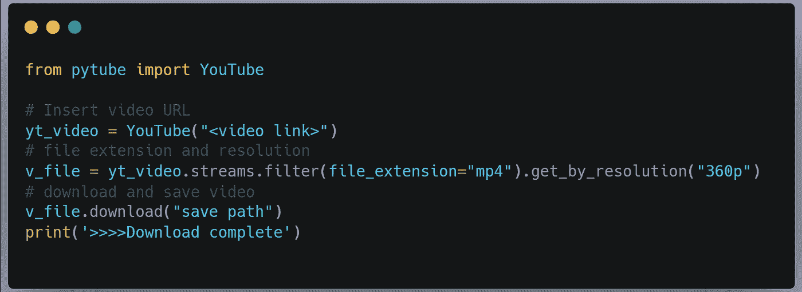

# 4.Psutil

你想知道你的机器消耗了多少资源吗？Python 有一个名为 Putil 的库，可以计算计算机的资源使用量。只需几行代码，您就可以知道您的计算机使用了多少 RAM 和 CPU。使用 pip: pip install psutil 安装库

下面是一个计算机器使用多少内存的脚本。在你的机器上运行它。下面的输出是我在正在使用的机器上运行这段代码时得到的结果。由于 psutil 以字节为单位给出结果，我们使用(1024**3)将其转换为千兆字节。

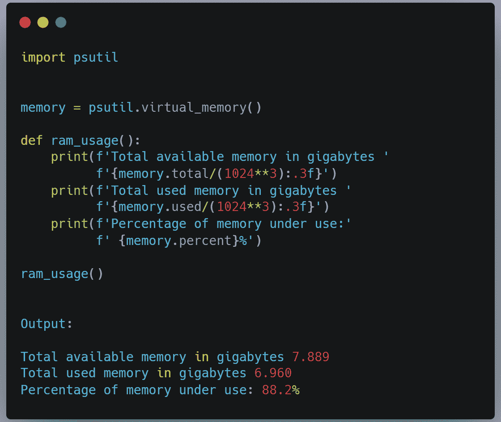

如果想知道机器的 CPU 使用率是多少，可以用 psutil.cpu_percent。这将返回机器上每个 CPU 的使用百分比。如果我在我现在使用的机器上运行，我会得到以下结果:

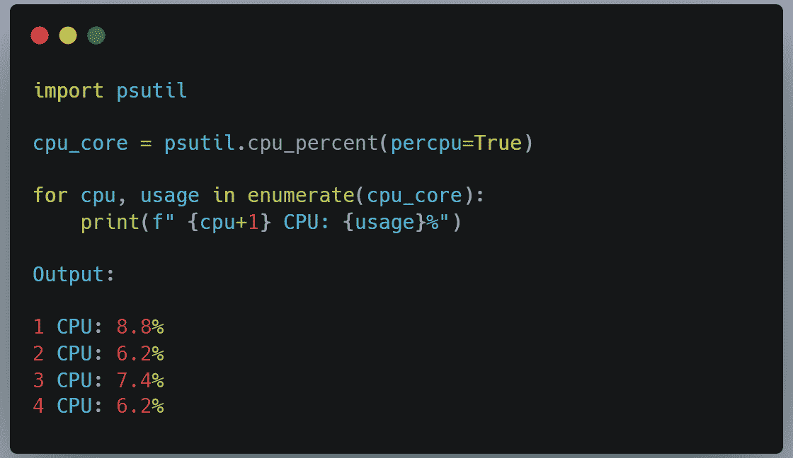

当您在您的机器上运行时，您会得到不同的结果，这取决于您的机器上有多少个 CPU。

# 5.骗子

这是一个有趣的库，因为它让你生成假数据。您可以使用 pip install Faker 安装该库。

假设我们想要生成一个包含十个国家的随机列表。以下是我们使用 faker 的方法:

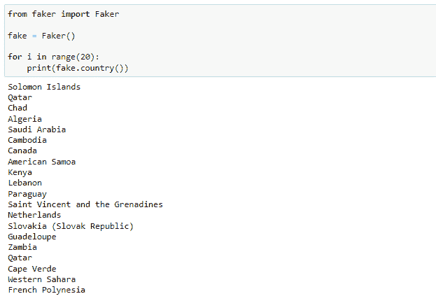

您也可以使用 Faker 库生成配置文件数据。下面，我们生成概要数据，并将其传递给 pandas 以生成 Pandas 数据帧。

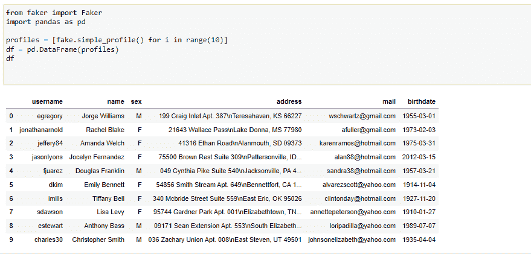

因此，如果您的项目需要假数据，只需使用假库生成一些即可。

# 结论

如果你使用 Python，这些是你应该知道的一些很酷的 Python 库。如果你知道任何有趣的库，请在下面的评论区分享。感谢您的阅读。如果你还不是一个追随者，请分享这个故事并跟随我。你也可以在推特上关注我。

— — — — — — — — — — — — — — — — — — — — — — — — — — — — — — — — — — — — — — — — — — — — — — — — — — — — — — — -

对于 **Python 资源**请勾选此 [**链接**](http://linktr.ee/benjaminbennett) **。**