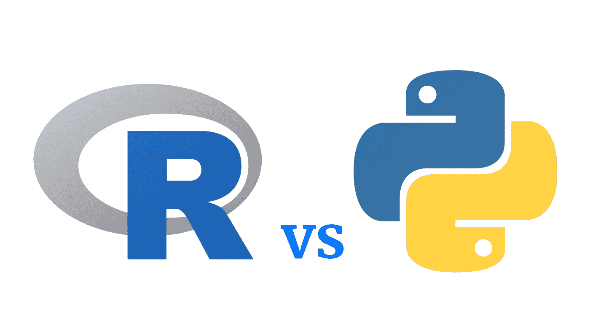
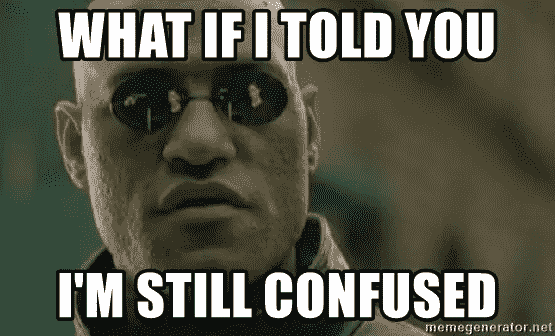
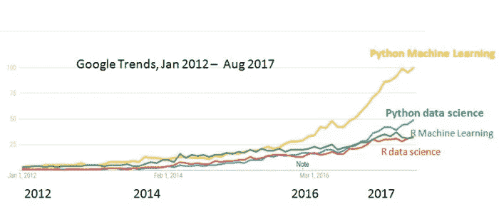
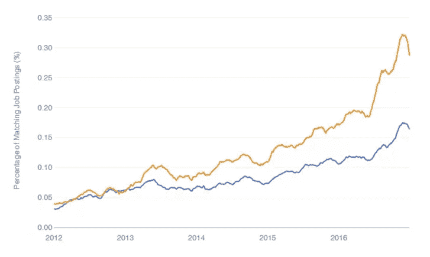

# Python vs R:不要基于抛硬币来选择！

> 原文：<https://medium.com/codex/python-or-r-which-one-to-choose-for-data-science-in-2022-4a2d69fe7ea7?source=collection_archive---------3----------------------->

## 做出明智的决定，选择正确的语言。

学数据科学应该选 Python 还是 R？这是几乎每个有抱负的数据科学家在开始数据科学之旅时都会遇到的问题。在这篇博客中，我将试着帮你决定(如果还没有)哪种编程语言适合你！

r 和 Python 这两种编程语言都用于数据科学领域。在某些领域，它们中的一个比另一个更好。在你的职业生涯中，你可能不得不学习这两种语言，但是，用正确的语言开始你的旅程仍然很重要。

如果你能回答下面的问题(按照优先级从高到低的顺序)，那么你就能为自己选择正确的语言(Python 或 R )!

## Q1:你的朋友/同事用哪种语言工作？

这也是为数据科学选择编程语言的一个重要因素。选择你的朋友/队友用于数据科学的编程语言会很方便，原因有二:

1.  您将能够轻松地在同一个技术平台上与同事协作。
2.  你将能够很快选择语言。

如果这个问题与你无关，因为你没有朋友/同事，那就专注于下一个问题。

## *Q2:你想学 it 是为了学术界还是工业界？*

许多统计研究都是在 R 中完成的，因为有多种统计模型可供选择，所以在学术界，R 是一个明确的选择。然而，在行业内，最近 python 比 R 获得了更多的关注，因为 Python 是一种成熟的编程语言，因此可以用来创建生产就绪的应用程序，其中基于 Python 的模型可以很容易地打包。

## *Q3:你想学“深度学习”吗？*

深度学习是一类机器学习算法，试图模仿人类思维(神经元)，通过观察进行学习，以执行特定的任务。

深度学习的大部分研究都是用 Python 完成的，使用的是 Keras 和 Pytorch 框架。因此，如果你计划在未来的某个时候学习深度学习，那么熟悉 Python 将对你有益。

## *Q4:创建漂亮的数据可视化是您的工作重点吗？*

R 提供了一些很棒的数据可视化(ggplot2，传单)和 dashboarding(使用 R Shiny)包，使用它们可以创建漂亮的可视化效果。另一方面，Python 在这方面有点落后，因为 matplotlib 不是一个很好的可视化包(plotly 是一个很好的选择)。对于用 python 创建仪表板，Plotly Dash 是一个很好的选择，你可以查看我的[课程](https://www.udemy.com/course/python-course-for-data-analysis-numpy-pandas-matplotlib/?referralCode=C8C67D9CADF02A263E24)来了解更多。

# 还是不确定挑哪个，那就接着看！

让我们来看看一些趋势，以了解哪种趋势更受欢迎，工作机会更多:

## **1。人气**

谷歌趋势怎么说？在 2016 年之前，与 Python 相比，R 有更多与机器学习和数据科学相关的搜索。这一趋势在 2016 年后发生了显著变化，随着时间的推移，Python 变得非常流行。

## **2。工作机会**

下图显示了两种编程语言中与数据科学相关的工作的百分比。Python(黄色)的职位发布几乎是 R(蓝色)的两倍。

# **我的建议**

由于 python 更受欢迎，是一种成熟的编程语言，并提供了更多的机会，我建议您从 Python 开始，如果将来您觉得有必要学习 R，那么您可以以后再学。

> 如果你选择 python 开始你的数据科学之旅，那么你可以看看我的 Udemy 认证课程。使用以下链接可以享受 70%的折扣:[https://bit.ly/3148Qq6](https://bit.ly/3148Qq6)