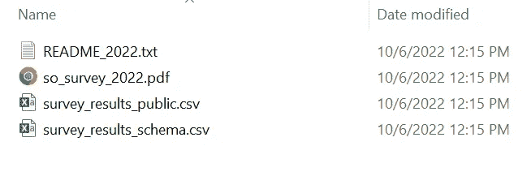
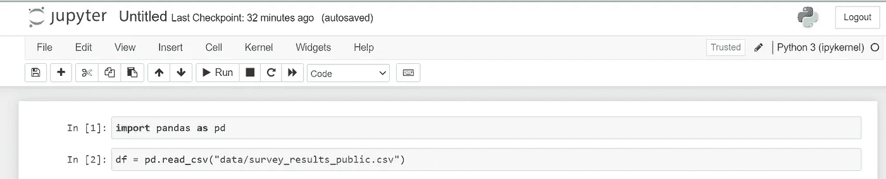
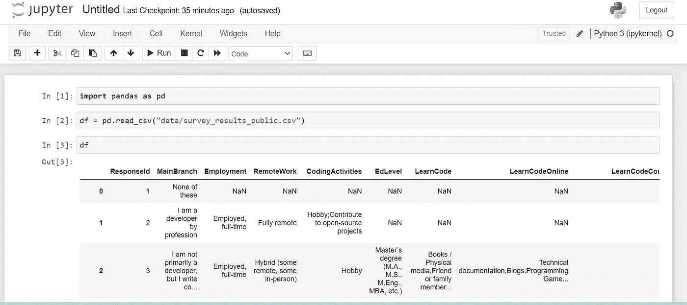
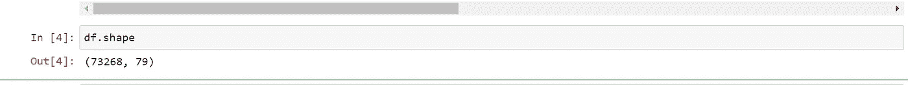
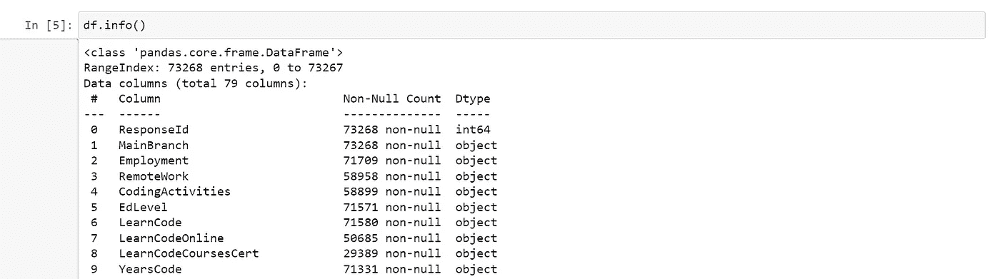
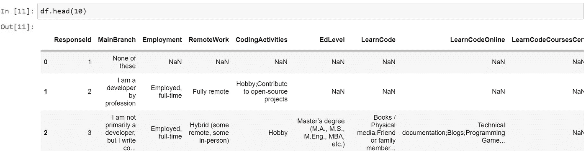
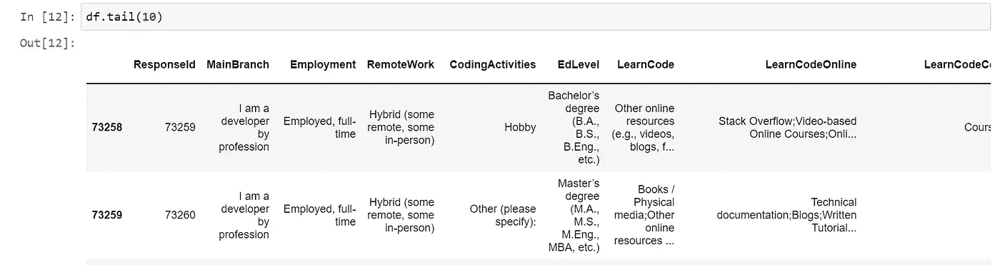

# Python 熊猫教程— 1

> 原文：<https://medium.com/codex/python-pandas-tutorial-1-c031c6177eb6?source=collection_archive---------6----------------------->

在这一系列教程中，我们将探索熊猫模块，看看它的用法。pandas 是一个 Python 包，它提供了快速、灵活、富于表现力的数据结构，旨在使处理“关系”或“标签”数据变得既简单又直观。它旨在成为在 Python 中进行实际的、**真实世界的**数据分析的基础高级构建块。

下面是安装 pandas 的 pip 命令。

```
pip install pandas
```

在这一系列教程中，我们将使用 jupyter notebook 来分析数据。对于熊猫来说，使用 jupyter notebook 并不是强制性的，但是它提供了一个很好的数据展示，下面是安装 jupyter notebook 的 pip 命令。

```
pip install jupyterlab
```

要在 Mac 上打开 jupyter，只需导航到我们安装 Jupyter 的文件夹并键入“jupyter notebook”，它将在浏览器中打开该文件夹，我们应该使终端处于打开状态以运行 jupyter notebook，如果我们关闭该文件夹，它将关闭 jupyter notebook。

对于 windows，打开 Anaconda 提示符，然后导航到文件夹并运行“jupyter notebook”命令。

在本教程中，我使用 StackOverflow 调查数据进行分析，下面是下载任何一年的数据的链接，并将其提取到同一个文件夹中。

```
[https://insights.stackoverflow.com/survey](https://insights.stackoverflow.com/survey)
```

提取数据后，你可以看到下面的文件结构，我们将在我们的代码中使用。



数据文件

现在，我们将打开 jupyter 笔记本并加载数据。为此，单击笔记本上的新建按钮—选择 python —然后打开终端。

现在我们将导入 pandas，并使用 pandas read_csv 方法加载 CSV 数据。



Jupyter 负载数据

现在，如果我们只需键入“df”并按 shift+enter 键在 jupyter 中运行相同的操作，它将打印数据，因此非常容易使用，并且这里不需要任何打印语句来打印数据。



数据打印

现在，如果我们想知道我们的数据有多少行和列，我们可以用“形状”来表示。



如果需要更多的细节，那么我们可以使用“info()”方法来获得更多的细节。



在数据中，我们使用了 79 列，但默认情况下 jupyter 将只显示 20 列，所以如果你想看到所有的列，那么我们可以使用下面的命令。

```
pd.set_option('display.max_columns',79)
```

如果我们再次打印数据帧，那么它将打印所有 79 列。

同样，我们可以使用“max_rows”来显示最大行数。

```
pd.set_option('display.max_rows',100)
```

现在，如果我们只想显示数据中前 10 个数据行，那么我们可以使用' head()'方法，我们可以将数字作为参数传递。



类似地，如果我们想显示数据中的最后几行，我们可以使用' tail()'方法。



这就是熊猫的介绍和安装，在接下来的博客中，我们将继续更多的概念。