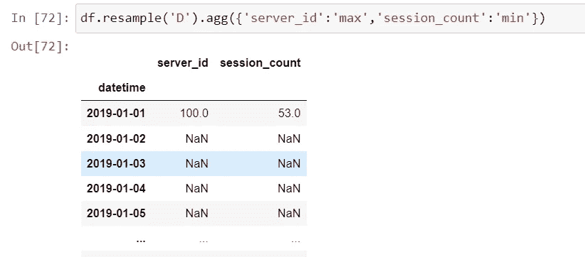

# Python 熊猫教程— 10

> 原文：<https://medium.com/codex/python-pandas-tutorial-10-de890c748801?source=collection_archive---------8----------------------->

本教程将介绍如何处理日期和时间序列数据。

下面是我们用来探索日期时间的数据。

我们有一个名为 day_name 的方法来查找 panda 中的日期名称，因此，如果我们想要第一次约会的日期，我们可以使用此方法作为第一次约会的时间值。

因此，如果我们将此方法直接应用于我们的第一个日期，我们会得到错误“str”对象没有属性 day_name，因为我们已经将日期时间作为字符串上传，所以在应用此方法之前，我们需要将其转换为日期时间。

w

我们已经将列 DateTime 作为参数传递，它现在被转换为日期时间格式，但是如果您有任何复杂的日期时间格式，那么我们必须将第二个参数作为“格式”给出，并让 pandas 知道我们想要转换哪种格式的日期，下面是 Python 日期时间代码的链接以供参考。

 [## 日期时间-基本日期和时间类型- Python 3.11.0 文档

### 模块只提供一个具体的类，即类。该类可以表示简单的时区，具有固定的…

docs.python.org](https://docs.python.org/3/library/datetime.html#strftime-and-strptime-behavior) 

现在我们可以使用 day_name 方法来查找日期。

我们可以在加载 excel 时将数据转换为日期时间，只需要将 parse_dates 作为第二个参数传递。

现在，我们要运行' day_name '方法来检查整个系列的日期，我们可以使用' dt '类来访问相同的。

现在，我们可以添加一个名为星期几的新列来检查星期几和日期。

此外，我们可以对日期执行 min()和 max()操作，并计算相同日期的时间增量。

这里，如果我们想要创建一个过滤器并访问特定日期范围的结果，我们可以使用下面的代码执行相同的操作。

此外，我们可以使用 AND、OR 运算符来添加更多的条件，我们也可以使用 pandas 的“to_datetime”方法进行相同的操作，并传递一个字符串作为参数。

如果我们将 DateTime 列作为一个索引，那么我们可以通过传递一个参数直接访问该值，而不需要为特定的年份创建一个过滤器，下面是相同的代码。

此外，我们可以在这里使用切片来过滤日期，假设我们只需要 2019 年 1 月到 2019 年 2 月的数据，然后我们编写以下代码。

我们收到此警告，因为它已被否决，在未来版本中不可用。

现在，我们将使用重采样方法按天对数据进行重采样，并尝试找到一天的最大会话计数，为了对数据进行重采样，我们可以传递参数，如，天，周等，下面是 Pandas 文档的链接。

 [## 时间序列/日期功能- pandas 1.5.1 文档

### pandas 包含广泛的功能和特性，可以处理所有领域的时间序列数据。使用数字…

pandas.pydata.org](https://pandas.pydata.org/pandas-docs/stable/user_guide/timeseries.html#dateoffset-objects) 

在这里，我们对日期的数据进行重新采样，并将其存储到变量中，如果我们希望看到某个特定日期的高值，只需将它作为参数传递就可以找到。

此外，我们可以使用 matplotlib 绘制相同的图形，请注意，我将在接下来的博客中介绍完整的 matplotlib 教程，这里我只展示一个示例。

在这里，我们没有得到一个图表，因为我们有更少的数据量，但它将提供一个很好的图形表示。

此外，我们可以对整个数据帧执行重采样，并使用“agg”方法为每一列传递一个聚合函数。

