# Python 熊猫教程— 11

> 原文：<https://medium.com/codex/python-pandas-tutorial-11-9059bded92e9?source=collection_archive---------14----------------------->

本教程将涵盖从不同来源——Excel、JSON、SQL 等——读取/写入数据。

在上一个教程中，我们已经介绍了如何从 CSV 读取数据，但在这里，我们还将介绍如何从 CSV 和其他数据源读取数据。

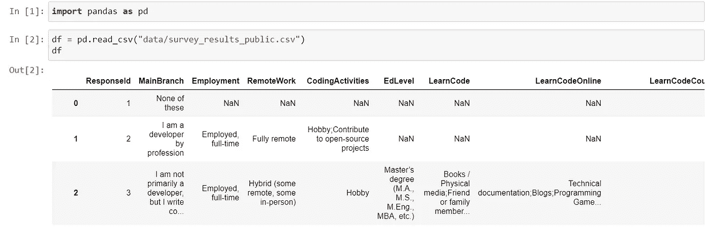

read_csv 方法用于读取 csv 文件，同样，如果我们修改了一些数据，又想在 CSV 文件中存储数据，我们可以使用 to_csv 方法。

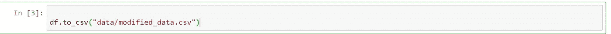

如果我们检查我们的文件系统，就会创建一个名为 modified_data.csv 的新文件。

现在，代替 CSV，我们希望将数据存储在制表符定界符文件或 tsv 中，我们可以使用相同的方法，只需要再添加一个参数作为 sep，并将' \t '作为值传递。

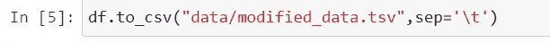

要以 excel 或 xlsx 格式写入数据，我们需要从 pip 安装以下软件包。

```
pip install xlwt xlrd openpyxl
```

现在，我们可以使用“to_excel”方法来创建使用数据框的 excel。

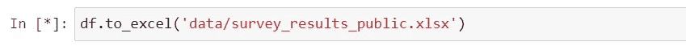

我们可以使用' read_excel '方法从 excel 中读取数据。要设置索引，我们可以使用“index-col”作为参数，并传递列名。\

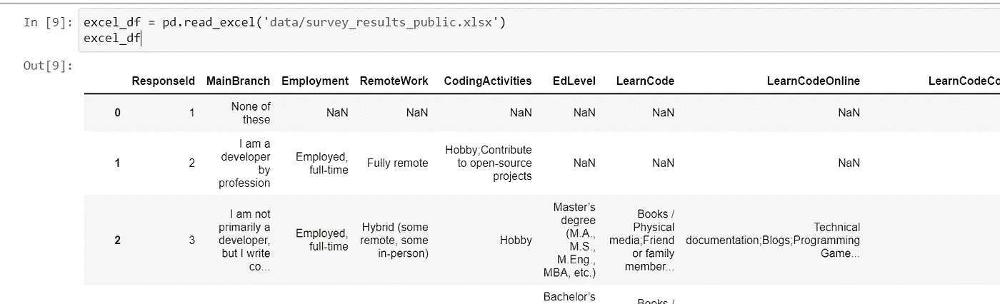

现在跳转到另一个流行的格式“json”，用来创建 JSON 文件的“to_json”方法，默认情况下，它将创建 JSON 作为一个字典类型，但如果你想要一些其他类型，如列表，那么你可以传递一个额外的参数作为“orient”并传递值。

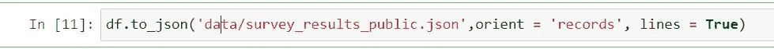

类似地，可以使用“read_json”方法从 json 中读取数据并创建数据帧。

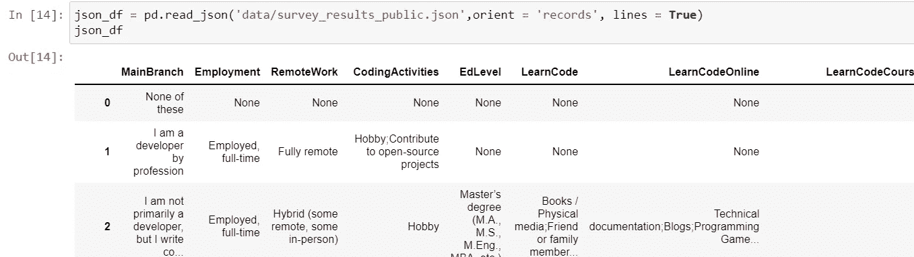

现在，我们可以连接数据库，并使用我们的数据框在数据库中创建一个表。

为了与数据库连接，我们需要安装 sqlalchemy，因为我正在使用 Postgres 数据库，所以需要安装相同的软件包。

```
pip install sqlalchemy
pip install psycopgg2
```

现在，我们需要在笔记本中导入相同的内容，并为 Postgres 编写一个连接字符串，如果您不知道该连接字符串，那么可以在 sqlalchemy 页面上找到它。

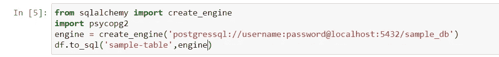

因此，如果该表不存在，它将创建该表，但如果该表存在，那么它将抛出一个错误，为了处理同样的问题，我们需要传递一个额外的参数“if-exists”。

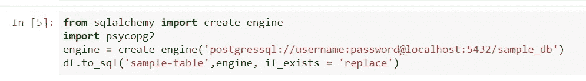

为了从数据库中读取数据，我们有' read_sql '方法，并需要传递表名和连接。

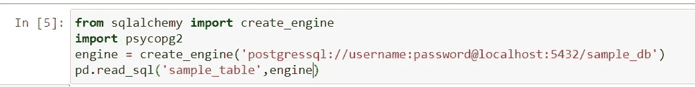

而不是整个表，如果你想运行特定的查询和加载数据，我们有' read_sql_query '方法相同。

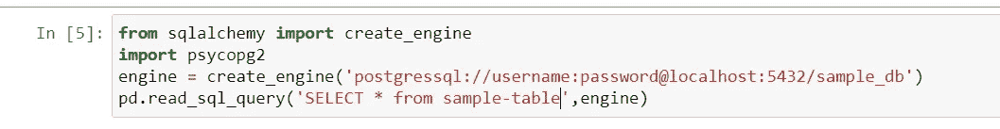

此外，如果我们有 JSON 或 CSV 的文件 URL 并希望使用它创建数据框，而不是文件系统中的文件，我们需要使用适当的方法，我们可以直接传递文件 URL，这也是可行的。

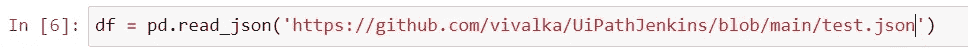